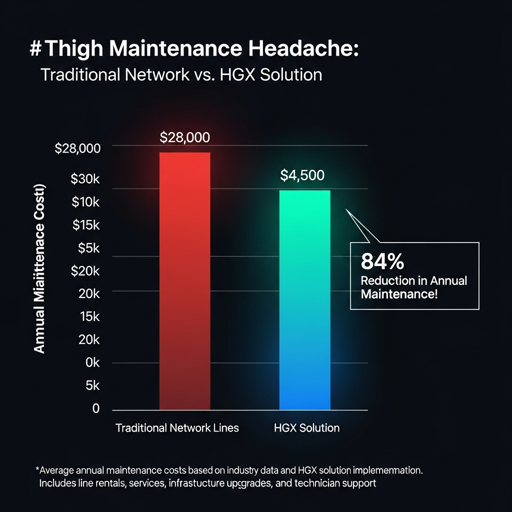
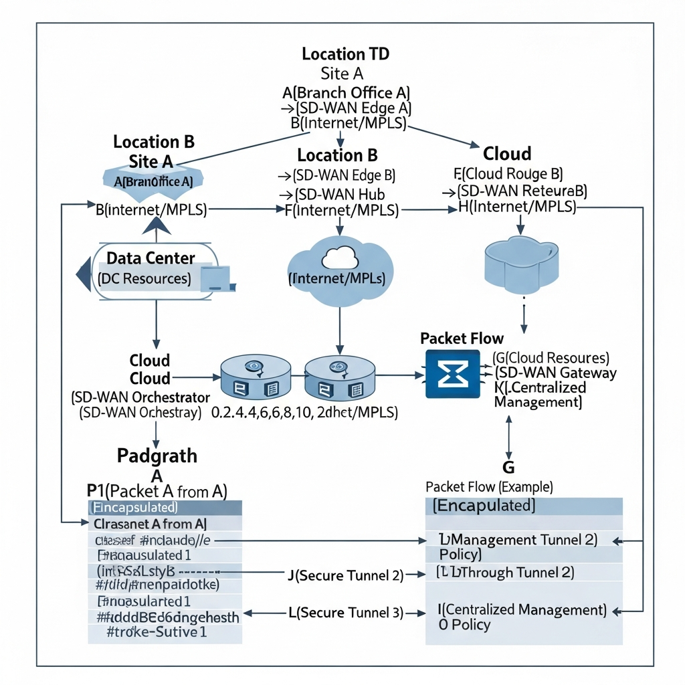
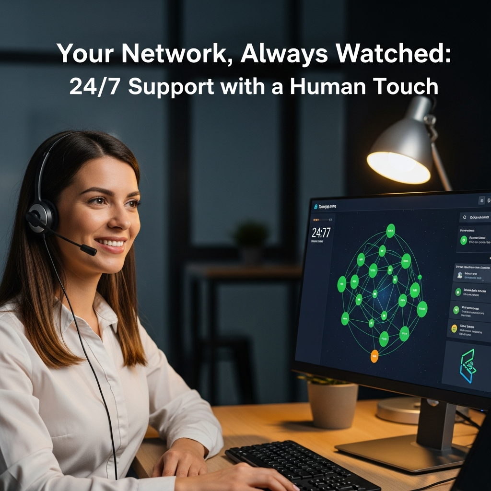

중국이나 베트남, 필리핀 등 동남아 지역에 현지 법인을 둔 기업들에 있어 네트워크 안정성은 업무 효율과 직결되는 문제입니다. 하이온넷의 **국제전용회선 HGX**는 기존 IPLC(국제전용회선)의 높은 비용 부담을 줄이면서도, 독립된 회선을 통해 24시간 끊김 없는 데이터 송수신과 보안성을 유지하는 기업 전용 네트워크 솔루션입니다.

---

## 글로벌 비즈니스의 걸림돌: 해외 네트워크 속도와 비용

해외 지사를 운영하다 보면 그룹웨어, ERP, 화상회의 시스템 접속 시 발생하는 잦은 끊김이나 속도 저하로 골머리를 앓는 경우가 많습니다. 이는 단순히 업무가 느려지는 것을 넘어 보안 사고의 단초가 되기도 하죠. 하지만 품질이 검증된 표준 국제전용회선(IPLC)을 쓰자니 월 수백만 원에 달하는 비용이 큰 부담입니다.

하이온넷 HGX는 이러한 현장의 고민을 해결하기 위해 개발되었습니다. 공중망(Internet)의 불안정성을 보완할 수 있는 해외 직결망을 활용해, 전용회선급의 품질을 유지하면서도 훨씬 합리적인 가격 구조를 제안합니다.

---

## HGX 솔루션의 주요 특징과 경제성

하이온넷 HGX는 도입 비용과 운영 편의성 측면에서 명확한 장점을 가집니다.

1.  **현실적인 비용 절감**: 일반적인 국제전용회선 대비 약 **75% 낮은 비용**으로 운영할 수 있습니다.
2.  **빠른 품질 검증**: 번거로운 물리적 공사 없이, 프로그램 설치만으로 5분 이내에 데모 테스트가 가능합니다.
3.  **기존 인프라 활용**: 현재 사용 중인 고정 IP, 보안 장비, 인터넷 회선을 그대로 유지하며 도입할 수 있어 호환성이 높습니다.
4.  **24/7 전담 관제**: 전문 운영팀이 365일 실시간 모니터링을 진행하며 장애 없는 환경을 지원합니다.

### 서비스별 비용 비교 (5M 기준 예시)

| 구분 | 타사 국제전용회선 | 하이온넷 HGX | 절감 효과 |
| :--- | :--- | :--- | :--- |
| **월 이용료** | 약 270만 원 | **65만 원** | **약 205만 원 절감** |
| **연간 총액** | 약 3,240만 원 | **780만 원** | **연간 2,460만 원 절감** |

---

## SD-WAN과 하이브리드 VPN을 활용한 기술적 최적화

HGX는 **SD-WAN(Software-Defined WAN)**과 **하이브리드 VPN** 기술을 결합하여 지능적인 경로 관리를 구현했습니다.

*   **지능형 트래픽 분산**: ERP나 MES 같은 핵심 데이터는 전용망으로, 일반 웹 트래픽은 공중망으로 분산하여 회선 효율을 높입니다.
*   **데이터 보안 강화**: Blowfish 알고리즘 기반의 암호화와 AI 안티멀웨어 엔진을 적용해 외부 침입으로부터 사내 데이터를 보호합니다.
*   **비즈니스 연속성 보장**: 회선 다원화와 로드밸런싱 기능을 통해 특정 회선에 문제가 생기더라도 서비스 중단 없이 즉각적인 우회 경로를 확보합니다.

---

## 비즈니스 현장에서 체감하는 도입 효과

하이온넷은 그동안 2,500여 기업의 인프라를 구축하며 쌓은 노하우로 각 업종에 맞는 최적의 환경을 컨설팅합니다.

*   **안정적인 화상회의 환경**: 국가 간 지연 시간(Latency)을 최소화하여 해외 지사와의 소통이 대면 미팅만큼 매끄러워집니다.
*   **클라우드 페일오버**: 예상치 못한 장애 상황에서도 클라우드 복구 시스템을 통해 데이터 손실 리스크를 관리할 수 있습니다.
*   **통합 IP 관리**: 깨끗한 이력의 클린 IP를 제공하며, 자동화된 관리 시스템을 통해 업무 및 마케팅용 IP의 신뢰도를 관리합니다.

---

## 안정적인 네트워크, 글로벌 비즈니스의 필수 조건

글로벌 시장에서 네트워크는 단순한 인프라가 아니라 기업의 경쟁력 그 자체입니다. 비용 부담 때문에 품질을 포기하거나, 낮은 품질 때문에 업무에 차질을 빚고 있다면 하이온넷 HGX가 실질적인 대안이 될 것입니다.

지금 바로 전문가와의 상담을 통해 5분 무료 품질 테스트를 진행해 보시기 바랍니다. 귀사의 비즈니스에 가장 적합한 네트워크 환경을 확인하실 수 있습니다.

## ✅ 자주 묻는 질문 (FAQ)

  
하이온넷의 HGX 솔루션이란 무엇인가요?

  

HGX는 기존 국제전용회선(IPLC)의 높은 비용 부담을 해결하기 위해 개발된 기업 전용 네트워크 솔루션입니다. 해외 직결망을 활용해 전용회선급의 안정성과 보안성을 유지하면서도 도입 비용을 획기적으로 낮춘 것이 특징입니다.

  

  
HGX 솔루션의 주요 특징은 무엇인가요?

  

기존 전용회선 대비 약 75% 저렴한 비용으로 이용 가능하며, 별도의 물리적 공사 없이 5분 만에 품질 테스트를 진행할 수 있습니다. 또한 24시간 실시간 모니터링을 통해 장애 없는 안정적인 네트워크 환경을 제공합니다.

  

  
왜 해외 지사 운영 시 HGX 같은 전용 솔루션이 필요한가요?

  

공중망(Internet)을 이용할 경우 국가 간 데이터 송수신 시 끊김이나 속도 저하가 빈번하여 업무 효율이 떨어지기 때문입니다. HGX는 그룹웨어, ERP, 화상회의 등 핵심 업무 시스템의 안정적인 접속을 보장합니다.

  

  
HGX 솔루션 도입으로 얻을 수 있는 구체적인 비용 절감 효과는 어느 정도인가요?

  

5M 회선 기준으로 타사 국제전용회선이 월 약 270만 원일 때, HGX는 약 65만 원으로 운영 가능합니다. 이를 연간으로 환산하면 약 2,460만 원 이상의 비용을 절감할 수 있는 경제적인 솔루션입니다.

  

  
HGX는 주로 어떤 국가와 비즈니스를 하는 기업에 적합한가요?

  

중국, 베트남, 필리핀 등 동남아 지역에 현지 법인이나 공장을 둔 기업들에 최적화되어 있습니다. 해당 지역의 불안정한 네트워크 환경을 개선하여 본사와 지사 간의 원활한 소통을 지원합니다.

  

  
HGX 솔루션에 적용된 SD-WAN과 하이브리드 VPN 기술은 어떤 역할을 하나요?

  

지능형 트래픽 분산을 통해 ERP와 같은 중요 데이터는 전용망으로, 일반 웹 트래픽은 공중망으로 효율적으로 관리합니다. 이를 통해 회선 사용의 효율성을 극대화하고 비즈니스 연속성을 보장합니다.

  

  
기존에 사용하던 네트워크 인프라나 보안 장비를 그대로 사용할 수 있나요?

  

네, 기존에 사용 중인 고정 IP, 보안 장비, 인터넷 회선을 변경하지 않고 그대로 유지하며 도입할 수 있습니다. 높은 호환성 덕분에 추가적인 인프라 교체 비용 없이 간편하게 설치가 가능합니다.

  

  
데이터 보안을 위해 어떤 기술적인 보호 조치가 이루어지나요?

  

Blowfish 알고리즘 기반의 강력한 데이터 암호화와 AI 안티멀웨어 엔진을 적용하여 외부 침입을 차단합니다. 이를 통해 국가 간 데이터 전송 시 발생할 수 있는 보안 사고를 미연에 방지합니다.

  

  
회선 장애가 발생했을 때 비즈니스 중단을 막기 위한 대책이 있나요?

  

회선 다원화와 로드밸런싱 기능을 통해 특정 회선에 문제가 생겨도 즉각적인 우회 경로를 확보합니다. 또한 클라우드 페일오버 시스템을 갖추고 있어 예상치 못한 장애 상황에서도 데이터 손실 리스크를 최소화합니다.

  

  
도입 전 품질을 미리 확인해 볼 수 있는 방법이 있을까요?

  

하이온넷은 번거로운 절차 없이 프로그램 설치만으로 5분 이내에 가능한 무료 품질 테스트를 제공합니다. 전문가와의 상담을 통해 귀사의 업무 환경에 맞는 최적의 컨설팅을 미리 받아보실 수 있습니다.

  

