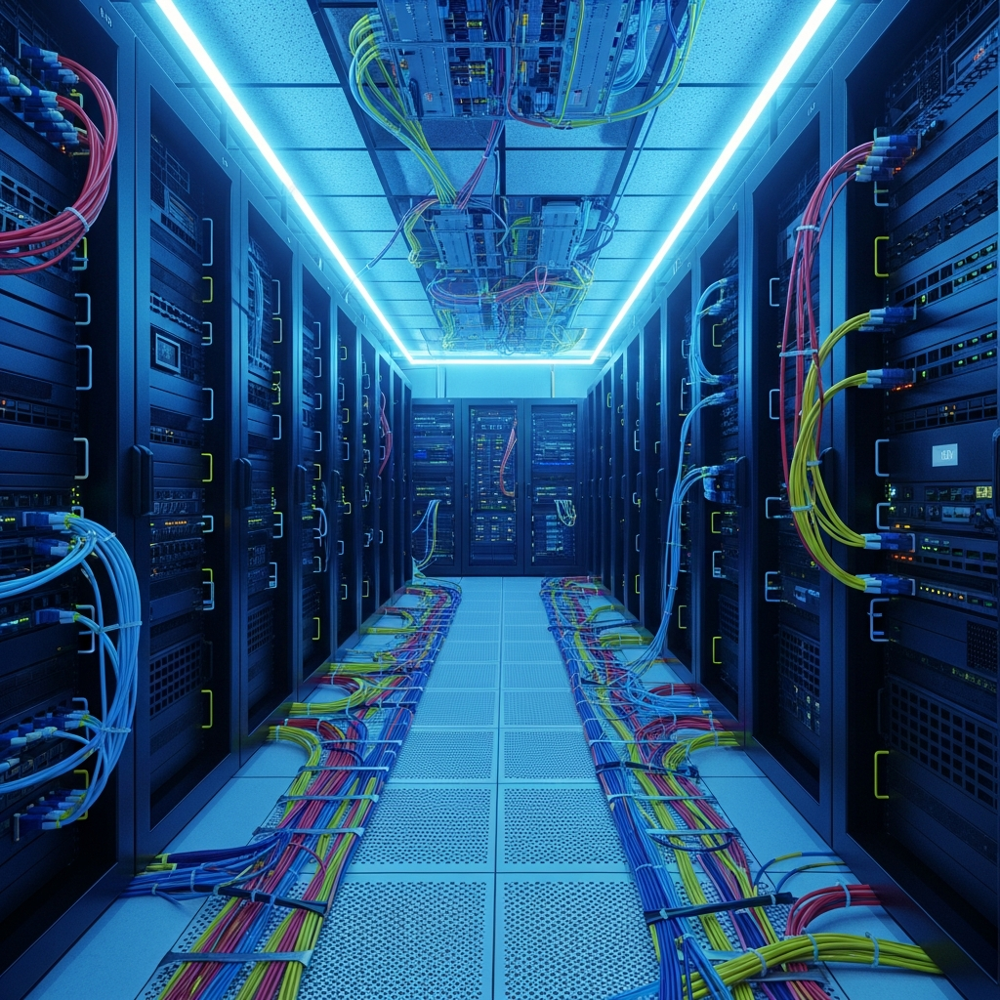
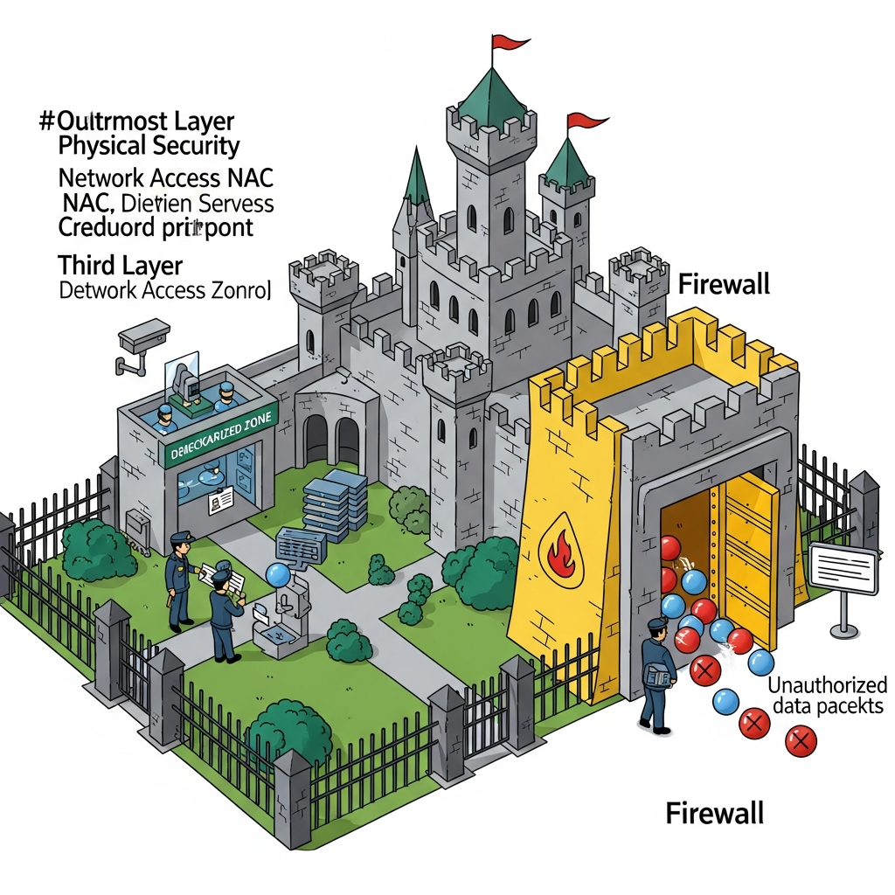
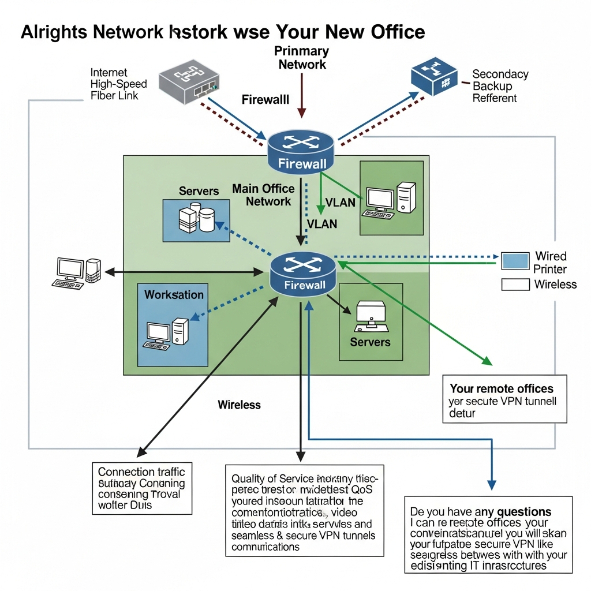

### 전용선 수준의 품질을 합리적인 비용으로 구현하는 법
VPN 전용회선은 공중망에 가상 사설망 기술을 더해, 기존 전용선 대비 **비용을 최대 75%까지 절감**하면서도 기가급 속도와 보안성을 동시에 확보할 수 있는 대안입니다. 하이온넷의 **HAI(High Availability Integrated)** 시스템은 고가용성 설계를 바탕으로 365일 중단 없는 네트워크 환경을 지원하는데요. 마케팅, 게임 서비스, 원격 근무 등 기업의 비즈니스 목적에 맞춰 최적화된 IP와 보안 환경을 제안합니다.

---

### 기업용 VPN 전용회선의 기술적 구성과 강점
본사와 지사 간에 데이터를 안전하게 주고받거나 외부의 위협을 차단해야 하는 기업 입장에서 일반 인터넷 회선은 보안과 안정성 면에서 한계가 뚜렷합니다. 하이온넷의 VPN 전용회선은 이를 보완하기 위해 세 가지 핵심 기술을 적용하고 있습니다.

*   **고가용성 통합(HAI) 시스템:** 장애 발생 시에도 서비스가 중단되지 않도록 시스템 연속성을 유지하는 기술입니다. 24시간 실시간 모니터링을 통해 네트워크 리스크를 관리합니다.
*   **다중 회선 병합(MAT):** 최대 4개의 인터넷 회선을 하나로 결합해 로드밸런싱을 구현합니다. 속도 향상은 물론, 특정 회선에 장애가 생겨도 나머지 회선으로 연결을 유지해 끊김 없는 환경을 만듭니다.
*   **보안 암호화 알고리즘:** Blowfish 알고리즘 기반의 강력한 데이터 암호화와 NAT(Network Address Translation) 기술을 적용해 외부로부터의 비정상적인 접근을 차단합니다.

---

### 비즈니스 효율을 높이는 주요 기능
기업별 요구사항에 맞춰 유연하게 대응할 수 있도록 설계된 하이온넷 솔루션의 핵심 기능들입니다.

| 주요 기능 | 상세 설명 | 기대 효과 |
| :--- | :--- | :--- |
| **QoS 트래픽 제어** | 업무 중요도에 따라 데이터 대역폭 우선 할당 | 병목 현상 방지 및 안정적인 서비스 유지 |
| **클린 고정 IP 제공** | 1~6개월간 사용 이력이 없는 50만 대규모 IP 풀 관리 | 바이럴 마케팅 및 게임 서비스 품질 확보 |
| **통합 관제 서비스** | 전문 엔지니어의 24/365 실시간 모니터링 | 장애 징후 사전 탐지 및 즉각적인 기술 지원 |

---

### 실무 현장에서의 도입 사례별 해결책
기업들이 현장에서 겪는 네트워크 관련 문제들을 하이온넷 VPN 전용회선으로 해결한 구체적인 사례들입니다.

#### 1. 지사 간 네트워크 통합과 보안 관리
여러 층을 사용하는 사무실이나 물리적으로 떨어진 지사가 있는 경우, 공유 폴더 접근이나 프린터 연결 문제로 업무 흐름이 끊기기 쉽습니다. 하이온넷의 **Hai-Link** 서비스는 서로 떨어진 네트워크를 하나의 가상 내역으로 묶어 원활한 업무 공유 환경을 제공하며, 부서별로 접근 권한을 세분화해 개인정보 보호 수준을 높입니다.

#### 2. 원격 근무 환경과 망분리 보안
재택근무를 위해 고가의 장비를 새로 들이거나 공사를 할 필요가 없습니다. **하이링크위드홈(Hi-Link with Home)** 솔루션을 활용하면 간단한 소프트웨어 설치나 소형 장비 연결만으로 사무실과 동일한 보안 환경에서 업무가 가능해집니다. 이를 통해 논리적 망분리를 구현하고 악성코드 유입 경로를 원천적으로 차단할 수 있죠.

#### 3. 마케팅 및 게임 서비스를 위한 전용 IP 관리
동일 IP 접속 제한으로 인해 업무에 제약을 받는 경우를 위해 **IMS(IP Management System)**를 운영합니다. 원클릭으로 IP를 변경하거나 이력을 관리할 수 있는 전용 프로그램을 제공하며, 사용 이력이 없는 깨끗한 고정 IP를 대량으로 할당해 안정적인 영업 및 서비스 환경을 지원합니다.

---

### 검증된 보안 장비 라인업
하이온넷은 네트워크 특성에 맞춰 글로벌 시장에서 검증된 차세대 방화벽 장비를 제안합니다.

*   **Fortinet (포티넷):** 방화벽, IPS, VPN 기능을 통합 제공하며, 보안 패브릭 기술로 정교한 패킷 필터링을 수행합니다.
*   **Sophos (소포스):** 차세대 UTM 솔루션을 통해 안티바이러스부터 통합 보안 관리까지 원스톱으로 처리합니다.
*   **Hai-NFW (자체 기술):** 하이온넷의 운영 노하우가 담긴 보안 장비로, 실무에 꼭 필요한 핵심 보안 기능을 합리적인 비용에 제공합니다.

---

### 비즈니스 연속성을 위한 선택
기업의 안정적인 네트워크 구축은 단순히 빠른 속도를 넘어, 어떤 상황에서도 업무가 중단되지 않는 기반을 다지는 일입니다. 기가급 광케이블 인입과 회선 이중화 구성을 통해 리스크를 최소화하고 비즈니스 효율을 높여보시기 바랍니다. 

회사의 규모와 업무 특성에 맞는 최적의 설계가 필요하다면, 전문 관제 서비스와 결합된 VPN 솔루션이 실질적인 해답이 될 수 있습니다. 하이온넷은 24시간 끊기지 않는 기술 지원으로 기업의 소중한 데이터와 네트워크 자산을 관리하고 있습니다.

https://haion.net/vpn/

## ✅ 자주 묻는 질문 (FAQ)

  
VPN 전용회선이란 무엇인가요?

  

공중망에 가상 사설망 기술을 결합하여, 일반 인터넷 회선보다 보안성과 안정성이 뛰어난 네트워크 환경을 구축하는 서비스입니다. 기존 전용선 대비 비용을 최대 75%까지 절감하면서도 기가급 속도의 품질을 제공하는 것이 특징입니다.

  

  
하이온넷 VPN 솔루션의 주요 기술적 특징은 무엇인가요?

  

장애 없는 네트워크를 위한 고가용성 통합(HAI) 시스템과 최대 4개의 회선을 하나로 묶는 다중 회선 병합(MAT) 기술이 핵심입니다. 이를 통해 특정 회선에 장애가 발생해도 끊김 없는 연결을 유지하고 데이터 처리 속도를 극대화합니다.

  

  
보안은 어떤 방식으로 강화되나요?

  

강력한 Blowfish 암호화 알고리즘과 NAT 기술을 적용하여 데이터 전송 시 외부의 가로채기나 비정상적인 접근을 차단합니다. 또한 포티넷, 소포스 등 글로벌 검증을 마친 차세대 방화벽 장비를 통해 네트워크 경계 보안을 더욱 튼튼히 합니다.

  

  
마케팅이나 게임 서비스에 특화된 기능이 있나요?

  

1~6개월간 사용 이력이 없는 50만 대 규모의 '클린 고정 IP' 풀을 관리하여 제공합니다. 이를 통해 IP 접속 제한 등의 제약 없이 안정적인 마케팅 영업과 고품질의 게임 서비스 환경을 확보할 수 있습니다.

  

  
통합 관제 서비스는 어떻게 운영되나요?

  

전문 엔지니어가 365일 24시간 내내 실시간으로 네트워크 상태를 모니터링합니다. 장애 징후를 사전에 탐지하여 대응하며, 문제 발생 시 즉각적인 기술 지원을 통해 비즈니스 중단을 최소화합니다.

  

  
기존 전용선과 비교했을 때 비용 외에 어떤 장점이 있나요?

  

전용선은 구축 비용과 시간이 많이 소요되지만, VPN 전용회선은 기존 인프라를 활용해 빠른 도입이 가능합니다. 또한 고정 IP 할당, 트래픽 제어(QoS) 등 기업의 업무 특성에 맞춘 유연한 설정과 관리가 훨씬 용이합니다.

  

  
물리적으로 떨어진 지사 간의 네트워크 통합은 어떻게 이루어지나요?

  

'하이링크(Hai-Link)' 서비스를 통해 서로 다른 위치의 네트워크를 하나의 가상 내역으로 통합합니다. 이를 통해 지사 간의 공유 폴더 접근이나 장비 연결을 본사와 동일하게 원활하게 사용할 수 있습니다.

  

  
재택근무 시 보안 문제를 어떻게 해결할 수 있나요?

  

'하이링크위드홈' 솔루션을 활용하면 별도의 공사 없이 소프트웨어 설치나 소형 장비 연결만으로 사무실과 동일한 보안망에 접속할 수 있습니다. 이는 논리적 망분리 효과를 주어 외부로부터의 악성코드 유입을 원천 차단합니다.

  

  
업무 중요도에 따라 인터넷 속도를 조절할 수 있나요?

  

네, QoS(Quality of Service) 트래픽 제어 기능을 통해 가능합니다. 중요 업무에 대역폭을 우선적으로 할당함으로써 병목 현상을 방지하고, 핵심 비즈니스 서비스가 안정적으로 유지되도록 관리할 수 있습니다.

  

  
우리 기업에 맞는 보안 장비는 어떻게 선택해야 하나요?

  

정교한 패킷 필터링이 필요하다면 포티넷을, 안티바이러스부터 통합 관리를 원스톱으로 처리하려면 소포스를 추천합니다. 합리적인 비용으로 핵심 보안 기능만 실속 있게 챙기고 싶다면 하이온넷의 자체 장비인 Hai-NFW가 좋은 대안이 됩니다.

  

