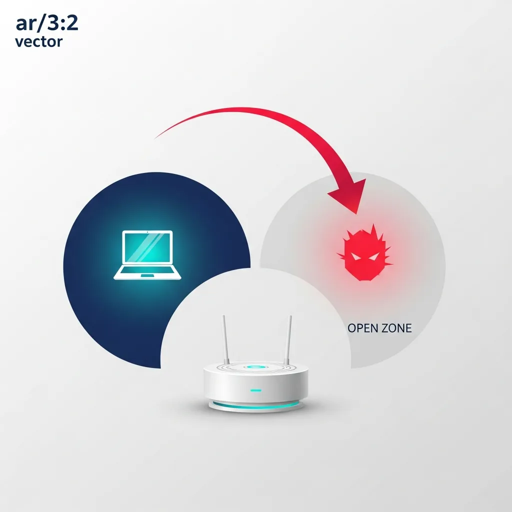

WPA2와 WPA3 암호화 표준, 그리고 동일 네트워크 내 기기 간 통신을 차단하는 클라이언트 격리(Client Isolation) 기술은 기업용 Wi-Fi 보안의 근간을 지탱해온 요소입니다. 그러나 최근 NDSS Symposium 2026에서 공개된 AirSnitch 공격 기법은 이 메커니즘이 가진 설계적 맹점을 파고듭니다. 이 공격은 암호화 알고리즘의 수학적 결함이 아니라, 네트워크 프로토콜과 물리적 인프라가 상호작용하는 논리적 과정에서의 틈새를 실증하고 있습니다.

### 계층 간 식별 불일치가 초래하는 격리 우회

기업용 Wi-Fi 환경은 다수의 사용자가 단일 액세스 포인트(AP)에 연결되더라도 서로의 트래픽을 간섭할 수 없도록 설계됩니다. 공용 공간이나 공유 오피스에서 필수적인 이 보안 장벽은 물리 계층(L1)과 데이터 링크 계층(L2)의 식별 정보가 상위 계층과 항상 동기화될 것이라는 전제하에 작동합니다.

AirSnitch의 핵심은 '계층 간 정체성 불일치(Cross-layer identity desynchronization)'를 유도하는 데 있습니다. 공격자는 AP 내부의 MAC 주소 테이블을 교란하여 특정 클라이언트로 향해야 할 유니캐스트 패킷의 경로를 자신의 기기로 재지정합니다. 이는 기기 식별 방식의 허점을 이용해 AP가 데이터의 목적지를 오인하게 만드는 기법입니다.

### 공격 메커니즘: 포트 스틸링과 게이트웨이 바운싱

실무적인 관점에서 가장 경계해야 할 기법은 포트 스틸링(Port Stealing)입니다. 무선 AP는 연결된 기기의 MAC 주소를 기반으로 패킷을 전달하는데, 공격자가 피해 기기의 MAC 주소를 도용해 활성 신호를 보내면 AP는 해당 포트(또는 논리적 채널)의 소유권이 이전된 것으로 판단합니다. 암호화 세션이 유지되는 상태에서도 데이터 흐름 자체를 공격자 쪽으로 전환할 수 있게 되는 것입니다.

게이트웨이 바운싱(Gateway Bouncing)은 더욱 정교한 우회 경로를 활용합니다. 상당수의 AP는 L2 수준의 격리는 철저히 수행하지만, L3(IP) 수준의 패킷 검사까지는 병행하지 않습니다. 공격자는 패킷의 목적지 MAC 주소를 게이트웨이(라우터)로 설정하고, 최종 IP 주소는 피해 클라이언트로 지정하여 패킷을 송신합니다. AP는 이를 외부로 나가는 정상 트래픽으로 간주해 게이트웨이로 전달하며, 게이트웨이는 수신된 IP 패킷을 다시 동일 네트워크 내의 피해자에게 회신합니다. 결과적으로 격리 기술을 우회하여 공격 패킷이 전달되는 경로가 형성됩니다.

이러한 기법을 통해 공격자는 중간자 공격(MitM) 상태를 확보하게 됩니다. 피해자의 웹 요청 정보나 DNS 쿼리 등 평문 데이터는 물론, 암호화된 통신이라 할지라도 DNS 캐시 포이즈닝 등을 통한 2차 공격의 교두보가 마련될 수 있습니다.

### 단일 하드웨어 기반 다중 SSID 운영의 구조적 리스크

현대 무선 인프라는 효율성을 위해 하나의 물리적 AP에서 업무용(Enterprise), 게스트용(Guest) 등 다수의 SSID를 가상화하여 운영합니다. AirSnitch가 실무적으로 위협적인 이유는 보안 설정이 상대적으로 느슨한 게스트 망의 공격자가 보안 수준이 높은 업무용 망의 클라이언트를 타격할 수 있다는 점에 있습니다. 주요 글로벌 네트워크 벤더들의 장비 대다수가 이러한 논리적 격리 우회에 노출되어 있음이 확인되었습니다.

대표적인 예로 대학이나 대형 캠퍼스의 공용 Wi-Fi 환경을 들 수 있습니다. 공격자는 보안 인증이 강화된 망에 직접 침입하는 대신, 동일한 하드웨어를 공유하는 오픈 망에 접속하여 업무망 사용자의 트래픽을 가로챕니다. 이는 물리적 자원을 공유하는 가상화된 네트워크 분리 모델이 근본적으로 가질 수밖에 없는 취약점을 시사합니다.

[이미지: A professional network security architecture map showing multiple virtual local area networks (VLANs) connected to a central firewall. The map illustrates defensive measures such as MACsec encryption between access points and core switches, and per-client randomized Group Temporal Keys (GTK) to enhance wireless security.]

### 무선 인프라 보안 강화를 위한 다각적 대응 전략

AirSnitch의 일부 기법은 프로토콜 표준 자체의 특성에서 기인하므로 단일 패치만으로는 대응에 한계가 있습니다. 인프라 관리자와 보안 엔지니어는 다음과 같은 다층적 방어 체계 구축을 검토해야 합니다.

- 가상 네트워크(VLAN) 기반의 엄격한 세분화: 단순히 SSID를 분리하는 것을 넘어, 백홀 구간에서부터 VLAN을 통해 논리적 통로를 완전히 격리해야 합니다. 특히 게스트 망은 내부망과 물리적으로 분리된 업링크를 사용하거나, 방화벽 수준에서 L2/L3 필터링 정책을 강화해야 합니다.
- 하위 계층 암호화 및 스푸핑 방지 도입: MACsec(IEEE 802.1AE)과 같은 링크 계층 암호화 표준 도입을 고려해야 합니다. 또한 AP 설정에서 단일 MAC 주소가 여러 BSSID에서 동시에 탐지될 경우 해당 포트를 즉시 차단하는 스푸핑 방지 기능을 활성화해야 합니다.
- 제로 트러스트 기반의 엔드포인트 보안: 네트워크 환경의 안전을 전제하지 않는 접근이 필요합니다. 내부망이라 할지라도 브라우저의 HSTS 강제 적용, DoH(DNS over HTTPS) 사용, 그리고 민감 데이터 통신 시 종단 간 암호화(VPN 등)를 적용하여 패킷 탈취 시에도 정보 유출을 원천 차단해야 합니다.

네트워크 보안은 고정된 상태가 아닌 지속적인 검증 과정입니다. 과거에 검증된 격리 방식이라 할지라도 새로운 프로토콜 분석 기법에 의해 무력화될 수 있음을 AirSnitch는 증명하고 있습니다. 현재 운영 중인 무선 환경이 단순히 암호화 설정에만 의존하고 있지는 않은지, 논리적 격리가 물리적 공유 환경의 한계를 극복하고 있는지에 대한 아키텍처 차원의 점검이 시급합니다.

---

📚 참고 자료 확인하기

<ul>
<li><a href="https://unit42.paloaltonetworks.com/air-snitch-enterprise-wireless-attacks/" target="_blank" rel="noopener noreferrer">unit42.paloaltonetworks.com 원문</a></li>
<li><a href="https://www.sans.org/webcasts/airsnitch-how-worried-should-you-be" target="_blank" rel="noopener noreferrer">sans.org 원문</a></li>
<li><a href="https://arstechnica.com/security/2026/02/new-airsnitch-attack-breaks-wi-fi-encryption-in-homes-offices-and-enterprises/" target="_blank" rel="noopener noreferrer">arstechnica.com 원문</a></li>
</ul>

