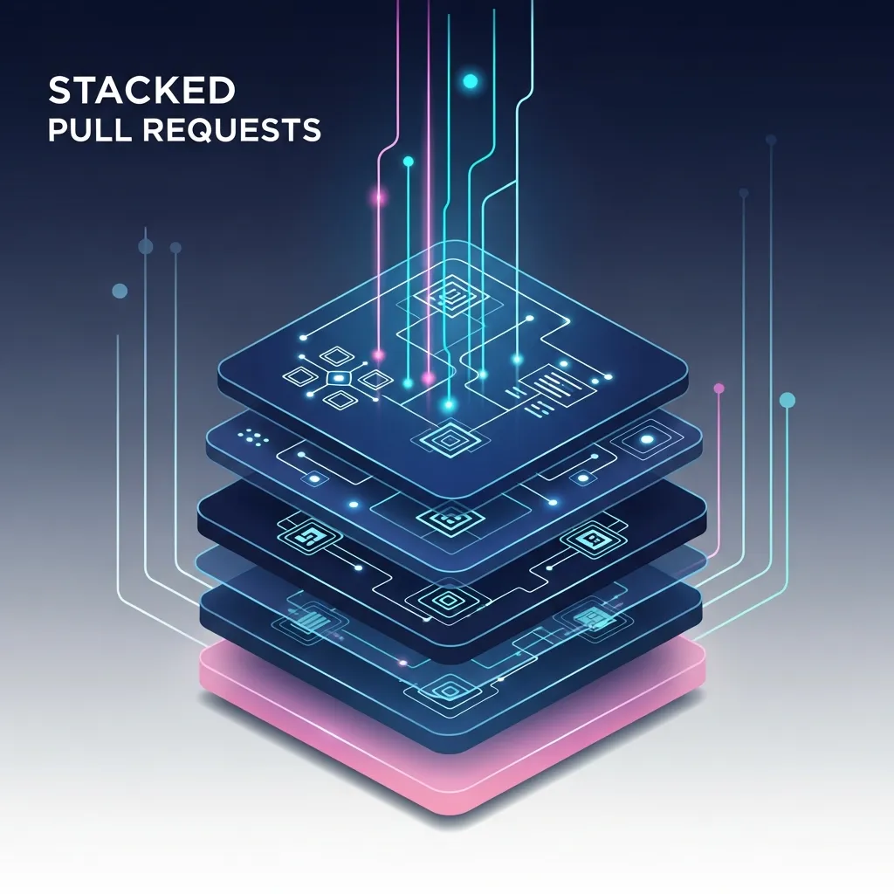
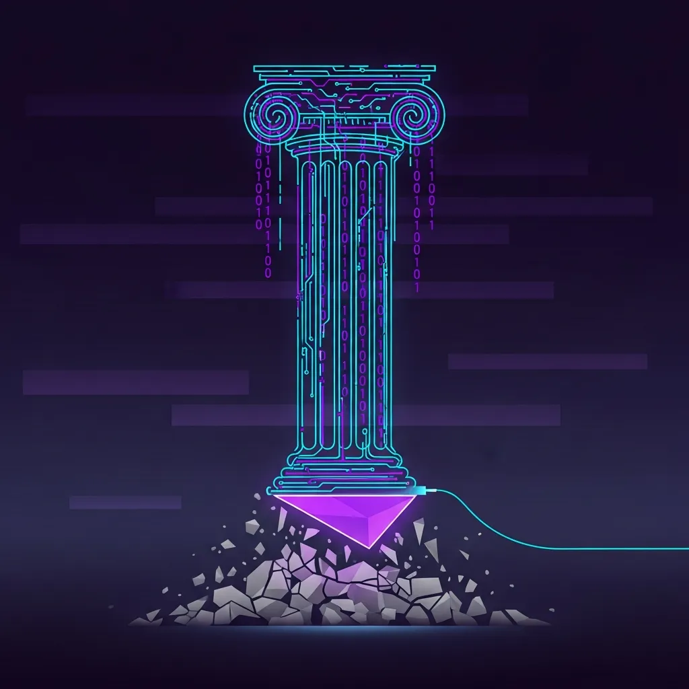

규모가 커진 소프트웨어 개발 조직에서 코드 리뷰는 품질을 유지하는 핵심 장치인 동시에, 개발 속도를 늦추는 가장 큰 요인으로 지목되기도 합니다. 특히 하이퍼그로스 단계의 조직은 속도와 품질 사이에서 끊임없는 절충안을 찾게 됩니다. 최근 시니어 엔지니어들 사이에서 주목받는 <a href="/ko/glossary/what-is-stacked-prs" class="glossary-tooltip" data-definition="대규모 기능을 논리적인 단위로 세분화하여 여러 개의 연관된 풀 리퀘스트(PR)를 계층적으로 쌓아 올리는 개발 워크플로우 방식입니다. 리뷰 효율을 높이고 작업의 병목을 줄여주지만, Git 이력 관리와 동기화의 복잡도가 높아지는 특징이 있습니다.">Stacked PRs</a>는 이러한 고민에 대한 기술적 응답 중 하나입니다. 하나의 거대한 기능을 물리적인 단위가 아닌 논리적으로 완결된 작은 브랜치들로 쪼개어 층층이 쌓아 올리는 이 방식은, 이론적으로는 매우 효율적인 구조를 지향합니다.

Stacked PRs의 핵심은 대규모 기능을 데이터베이스 스키마, 비즈니스 로직, API 엔드포인트, UI 레이어 등으로 세분화하여 각각 독립적인 PR(Pull Request)을 생성하는 데 있습니다. 리뷰어는 맥락이 명확한 수백 줄 이내의 코드를 빠르게 검토할 수 있고, 작성자는 이전 단계의 승인을 기다리지 않고 다음 작업을 이어나갈 수 있습니다. 하지만 이 정교한 워크플로우 이면에는 개발자의 수동 조작과 높은 인지 부하라는 기술적 부채가 숨어 있습니다.

가장 우려되는 지점은 메인 브랜치의 이력을 깔끔하게 유지하기 위해 흔히 사용하는 스쿼시(Squash) 머지와의 충돌입니다. 깃허브 등에서 하위 PR이 스쿼시 머지되는 순간, 그 위에 쌓인 상위 브랜치들은 참조하고 있던 부모 커밋의 해시값이 변경되면서 연결 고리를 잃게 됩니다. 이때부터 개발자는 리베이스(Rebase)를 통한 이력 재구성에 상당한 시간을 할애해야 합니다.

특히 실무에서 간혹 목격되는 `git merge -X ours`와 같은 명령어를 통한 강제 동기화는 시스템의 안정성을 해치는 요소입니다. 이는 충돌을 논리적으로 해결하는 것이 아니라, 현재 브랜치의 상태를 우선시하여 부모 브랜치의 변경 사항을 덮어쓰는 행위이기 때문입니다. 만약 동료 개발자가 공통 모듈을 수정했더라도 이 과정에서 해당 변경분이 소리 없이 누락될 수 있으며, 이는 곧 코드 무결성의 파괴로 이어집니다.

기존의 기능 브랜치 방식과 Stacked PRs 워크플로우를 비교하면 각 방식이 지향하는 비용과 이익이 극명하게 갈립니다.

- 전통적인 기능 브랜치 (Feature Branch)
  - 리뷰 크기: 대규모 (종종 1,000라인 이상으로 리뷰 피로도 높음)
  - 개발 흐름: PR 승인 전까지 후속 작업 진행이 까다로움
  - 히스토리 관리: 표준 Git 기능만으로 충분하여 비교적 단순함
  - 휴먼 에러 위험: 표준 머지 프로세스를 따르므로 상대적으로 낮음

- Stacked PRs 워크플로우
  - 리뷰 크기: 소규모 (논리적 단위로 분절되어 가독성 높음)
  - 개발 흐름: 승인 대기 중에도 상위 레이어 작업 지속 가능
  - 히스토리 관리: 매우 복잡하며 잦은 리베이스와 레퍼런스 업데이트 필수
  - 휴먼 에러 위험: 수동 충돌 해결 및 브랜치 포인팅 오류 가능성 존재

Stacked PRs가 약속하는 '빠른 피드백 루프'는 매력적이지만, 이를 뒷받침할 도구 체계가 미비하다는 점은 큰 걸림돌입니다. Graphite나 jj와 같은 도구들이 대안으로 제시되고 있으나, 특정 운영체제에서의 설치 제약이나 Node.js 환경 강제와 같은 범용성 문제는 여전합니다. 전용 도구 없이 수동으로 이 체계를 유지하려는 시도는 자동화된 파이프라인 대신 숙련된 개인의 기교에 시스템의 명운을 맡기는 것과 다름없습니다.

리뷰 시스템의 효율화는 단순히 코드의 양을 줄이는 것에 그치지 않습니다. `git-absorb`나 `--update-refs` 같은 옵션을 수시로 확인하며 이력이 꼬이지 않았는지 전전긍긍해야 하는 환경은 오히려 개발자의 집중력을 분산시킵니다. 기술적 기교로 프로세스의 결함을 메우려다 보면, 비즈니스 가치 검증보다 Git 이력의 심미적 깔끔함에 더 매몰되는 주객전도 현상이 발생할 수 있습니다.

결국 시스템의 한계를 개인의 숙련도로 돌파하려는 시도는 성숙한 전용 도구의 지원 없이는 소수 전문가를 위한 위태로운 기예에 머물기 쉽습니다. 선형적인 히스토리에 대한 강박이 팀 전체의 협업 효율을 저해하고 있다면, 도구의 선택보다는 워크플로우 자체의 본질적인 단순화를 우선순위에 두어야 합니다. 자동화되지 않은 복잡성은 결코 혁신이 될 수 없으며, 시스템 안정성을 내부에서부터 위협하는 조용한 변수가 될 수 있음을 유념해야 합니다.

## 🔗 함께 읽으면 좋은 글
- [어텐션이 재편한 기술 지형과 트랜스포머의 명암](/ko/posts/attention-transformers-tech-landscape)
- [에이전틱 사이버 보안: 자율형 방어의 실체와 통제의 역설](/ko/posts/agentic-cybersecurity-autonomous-defense)