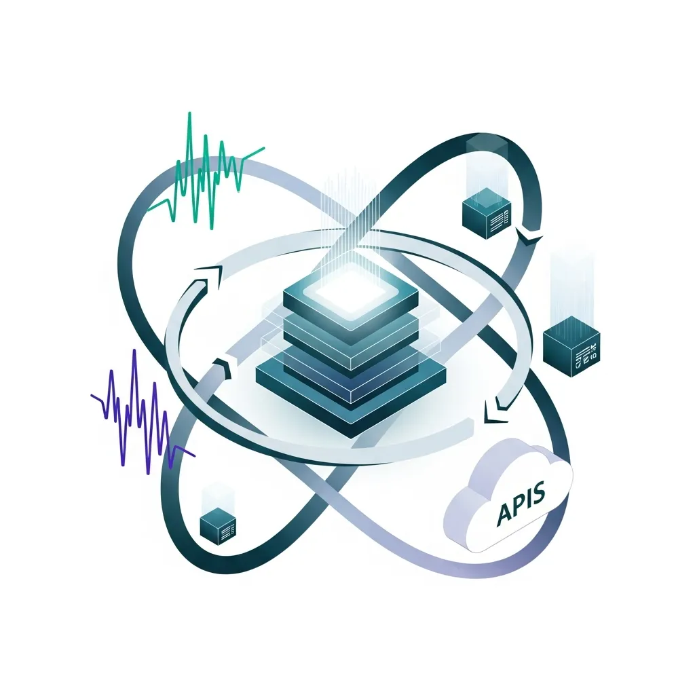
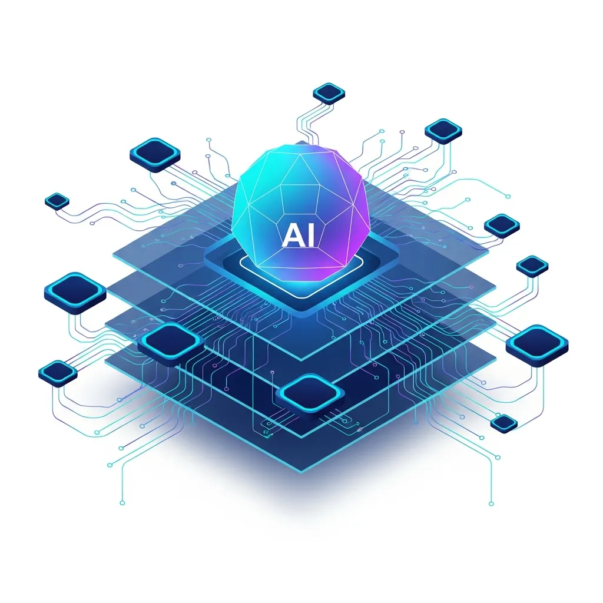

클라우드 인프라의 확장은 엔터프라이즈 환경에 유연성을 선사했지만, 동시에 인간의 인지 능력을 상회하는 복잡성이라는 과제를 남겼습니다. 수천 개의 마이크로서비스와 AI 워크로드가 얽힌 생태계에서 운영자는 매일 쏟아지는 경고 알람에 노출되어 있습니다. 이러한 상황에서 업계는 Agentic AIOps를 대안으로 제시하고 있습니다. 이는 단순히 대시보드에 이상 징후를 표시하는 수동적 모니터링을 넘어, AI 에이전트가 스스로 상황을 판단하고 후속 조치를 실행하는 자율 운영 단계로의 진입을 의미합니다.

최근 마이크로소프트가 발표한 애저 코파일럿(Azure Copilot)의 변화는 이러한 흐름을 명확히 보여줍니다. 기존 AIOps가 텔레메트리 데이터를 분석해 통계적 이상치를 보고하는 수준이었다면, Agentic AIOps는 실행력을 갖춘 추론 엔진에 가깝습니다. 데이터베이스 응답 지연이 발생하면 에이전트는 관련 신호를 취합해 근본 원인을 식별하고, 서버 재부팅이나 특정 서비스 재시작 중 최적의 대안을 선택해 운영자에게 제안하거나 직접 수행합니다. 이는 운영팀의 업무 부하를 줄이고 평균 복구 시간(<a href="/ko/glossary/mttr-mean-time-to-repair" class="glossary-tooltip" data-definition="장애 발생 시점부터 정상 서비스 상태로 복구될 때까지 소요된 평균 시간으로, IT 운영의 효율성과 시스템 가용성을 측정하는 핵심 지표입니다.">MTTR</a>)을 단축하는 실질적인 지표 개선으로 이어질 수 있습니다.

실무 현장에서의 성과도 가시화되고 있습니다. 유럽의 정보통신기술 서비스 기업 게트로닉스(Getronics)는 IT 서비스 관리(ITSM)에 에이전틱 자동화를 도입해 연간 100만 건 이상의 티켓을 처리하며, 85%의 자동 해결률을 기록했습니다. 맥킨지(McKinsey)의 조사에 따르면 조직의 78%가 업무 프로세스에 AI를 활용하고 있으며, 특히 IT 영역의 AI 도입률은 최근 6개월 사이 27%에서 36%로 상승했습니다. 하지만 이러한 수치 이면에는 운영 구조의 근본적인 변화에 따른 리스크가 잠재해 있습니다.

가장 먼저 제기되는 우려는 통제권의 역전 현상입니다. Agentic AIOps는 복잡한 인프라 로직을 AI라는 추상화 계층 아래로 숨깁니다. 운영자가 시스템 내부의 동작 원리를 파악하기보다 에이전트가 제공하는 요약 정보에 의존하게 되면, 장기적으로 운영 숙련도 저하와 시스템의 블랙박스화를 피하기 어렵습니다. 만약 AI 에이전트가 학습되지 않은 유형의 보안 위협에 직면하거나 오작동할 경우, 내부 구조에 대한 이해가 부족한 인간 운영자가 기계보다 신속하게 개입하기는 불가능에 가깝습니다. 이는 효율성이라는 명목하에 특정 벤더의 알고리즘에 대한 기술적 종속을 심화시킬 수 있습니다.

| 구분 | 기존 AIOps | Agentic AIOps |
| :--- | :--- | :--- |
| 핵심 역할 | 이상 징후 감지 및 시각화 알림 | 원인 분석, 계획 수립 및 자율 실행 |
| 운영 방식 | 분석 후 운영자 판단 대기 | 자율 또는 반자율 작업 수행 |
| 주요 지표 | 알림 정확도 및 가시성 확보 | 문제 해결 완료율 및 MTTR |
| 기술적 근간 | 통계 모델, 머신러닝(ML) 알고리즘 | 대형언어모델(LLM), 모델 컨텍스트 프로토콜(MCP) |

기술적인 관점에서도 해결해야 할 지점이 많습니다. Agentic AIOps가 유기적으로 작동하려면 엔트로픽(Anthropic)이 주도하는 모델 컨텍스트 프로토콜(MCP)과 같은 표준화된 통신 규약이 정착되어야 합니다. AI 에이전트가 기업 내 파편화된 도구들과 데이터를 주고받는 과정에서 보안 리스크는 필연적으로 발생합니다. 에이전트가 부여받은 권한을 악용한 권한 상승 공격이나 데이터 유출 가능성을 원천 차단하는 것은 매우 까다로운 과제입니다. 마이크로소프트가 BYOS(Bring Your Own Storage)를 통해 대화 데이터를 격리하려는 시도 역시 에이전틱 시스템의 보안 취약성을 보완하기 위한 조치로 풀이됩니다.

비용 효율성 측면에서의 '토큰 트랩' 역시 간과할 수 없는 변수입니다. 엔터프라이즈 환경에서 반복적이고 단순한 작업에 고가의 LLM 인퍼런스 비용을 지불하는 것이 경제적으로 합당한지는 냉정하게 따져봐야 합니다. 대규모 장애가 발생했을 때 수많은 에이전트가 동시에 추론을 시작하며 발생하는 비용은 기업에 예상치 못한 부담이 될 수 있습니다. 현장에서는 화려한 AI 모델보다 명확한 규칙 기반의 자동화 스크립트가 안정성과 경제성 면에서 우월할 때가 많습니다.

결국 Agentic AIOps의 도입은 기술적 전환을 넘어 조직의 책임 소재를 재정의하는 과정입니다. 에이전트의 판단 착오로 운영 환경에 장애가 발생했을 때, 그 책임이 설계자에게 있는지, 승인한 운영자에게 있는지, 혹은 플랫폼 제공사에 있는지에 대한 명확한 가이드라인이 필요합니다. 체계적인 거버넌스 없이 기술을 도입하는 것은 통제 수단이 결여된 가속 페달을 밟는 것과 같습니다.

시스템의 로직을 AI라는 외피로 감추는 시도는 자칫 운영 주권을 기술 제공자에게 넘겨주는 결과로 이어질 수 있습니다. 기술적 부채가 자동화의 흐름 속에 은폐될 때, 거대한 시스템 장애 앞에서 인간의 대응력은 무력해질 것입니다. 진정한 기술적 진보는 복잡성을 AI 뒤로 숨기는 것이 아니라, 인간이 전체 구조를 명확히 통제하고 이해할 수 있는 투명한 거버넌스 체계를 구축하는 데서 시작되어야 합니다.

## 🔗 함께 읽으면 좋은 글
- [어텐션이 재편한 기술 지형과 트랜스포머의 명암](/ko/posts/attention-transformers-tech-landscape)
- [MCP, AI 통합의 복잡성을 관통하는 표준 프로토콜의 설계도](/ko/posts/mcp-ai-integration-standard-protocol)