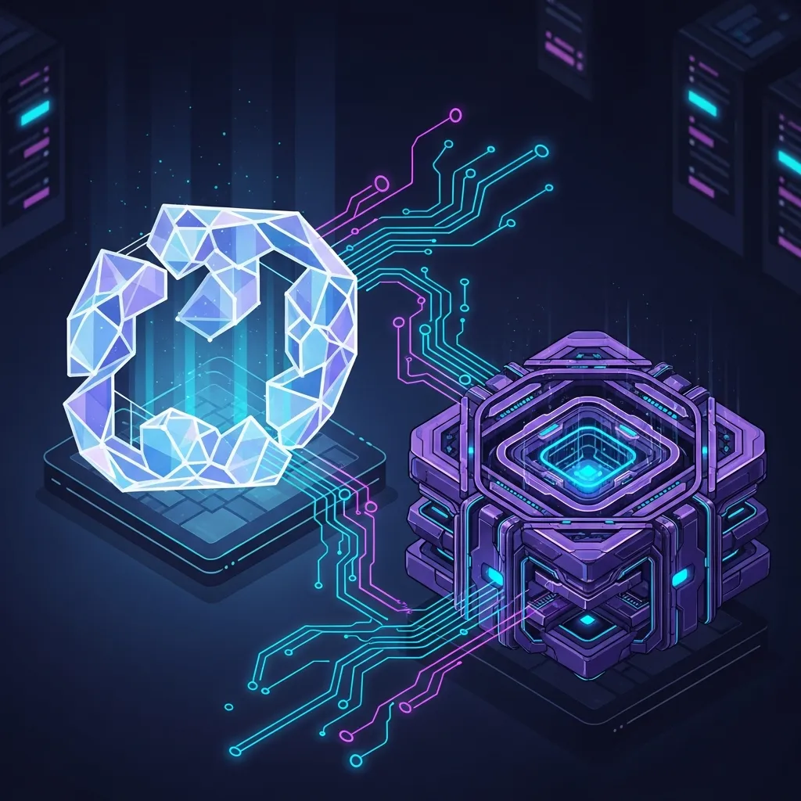
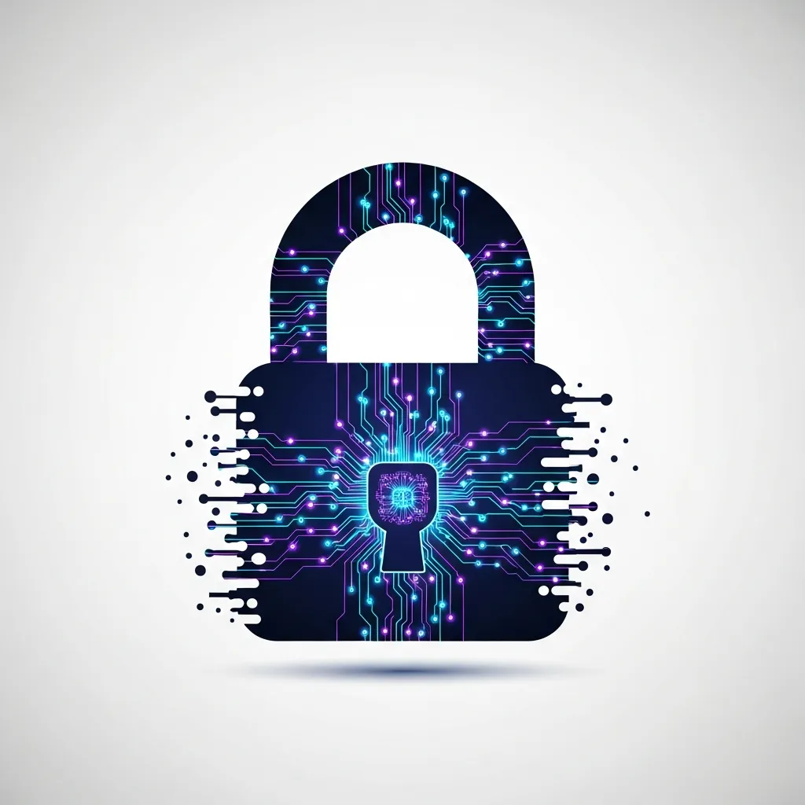

디지털 환경에서 신뢰를 구축하는 비용은 갈수록 높아지고 있습니다. 브라우저 주소창의 자물쇠 아이콘으로 상징되는 이 보안 체계의 중심에는 1970년대 화이트필드 디피와 마틴 헬먼이 정립한 공개키 암호화(Public Key Cryptography)가 자리합니다. 이 기술은 해킹 시도를 원천적으로 차단하는 견고한 수학적 논리를 제공하지만, 동시에 사용자에게는 단 한 번의 실수도 용납하지 않는 엄격한 책임 구조를 부여합니다.

비대칭 암호화 메커니즘의 핵심은 수학적으로 연결된 공개키와 개인키의 쌍입니다. 누구나 접근할 수 있는 공개키로 정보를 암호화하면, 오직 그에 대응하는 개인키를 보유한 수신자만이 내용을 복호화할 수 있습니다. 과거 대칭형 암호 체계가 가졌던 키 전달 과정의 보안 취약점을 극복했다는 점에서 이 시스템은 현대 네트워크 보안의 기점이 되었습니다. 하지만 기술적 무결성이 곧 실무 환경에서의 편의성이나 안전을 보장하는 것은 아닙니다.

### 디지털 비즈니스를 지탱하는 조용한 신뢰의 기반

<a href="/ko/glossary/pki-definition-summary" class="glossary-tooltip" data-definition="공개키 암호화 방식을 기반으로 디지털 인증서를 발급하고 관리하는 보안 인프라 체계입니다. 네트워크상에서 신원을 확인하고 데이터의 무결성을 보장하는 디지털 신뢰의 핵심 기반 역할을 합니다.">PKI</a>(Public Key Infrastructure)는 엔터프라이즈 보안의 핵심 인프라입니다. 디지털 보안 전문 기업 디지서트(DigiCert)는 이를 두고 시스템 이면에서 작동하는 '조용한 신뢰(Quiet Trust)'라 정의합니다. 유효한 인증서가 없는 웹사이트는 보안 경고를 발생시켜 비즈니스 신뢰도에 타격을 입히며, 이는 곧 사용자 이탈과 매출 감소로 이어집니다. 이커머스와 온라인 뱅킹 등 현대적 금융 서비스가 유지되는 근간이 바로 이 암호화 체계에 있습니다. 다만 인증서 관리 소홀이나 키 노출은 시스템 가용성을 즉각적으로 저해하는 요인이 되기도 합니다.

암호화 알고리즘의 선택 문제는 기술적 효율성과 현장 운용성 사이의 간극을 잘 보여줍니다. 거대 소수의 소인수분해 난제에 기반한 RSA는 오랫동안 표준으로 군림해 왔으나, 최근에는 타원 곡선 이산 로그 문제를 활용한 ECC(Elliptic Curve Cryptography)가 부상하고 있습니다.

| 구분 | RSA (Rivest-Shamir-Adleman) | ECC (Elliptic Curve Cryptography) |
| :--- | :--- | :--- |
| 핵심 원리 | 거대 소수의 소인수분해 난제 | 타원 곡선 이산 로그 문제 |
| 키 길이 (256비트 보안 수준) | 약 3,072비트 이상 필요 | 약 256비트면 충분 |
| 연산 효율성 | 상대적으로 낮음 | 높음 (모바일 및 IoT 적합) |
| 주요 특징 | 높은 호환성과 표준화 수준 | 짧은 키 길이와 적은 전력 소모 |

기술적으로는 ECC가 적은 연산 자원으로도 높은 보안 수준을 제공하지만, 레거시 시스템과의 호환성이나 구현상의 복잡성 때문에 현장에서는 여전히 RSA가 널리 쓰입니다. 이는 기술적 우위보다 시스템 안정성과 연속성을 중시하는 IT 실무의 특성을 반영합니다.

### 사라진 비밀번호 찾기와 절대적 자기책임의 무게

비대칭 암호화 체계가 직면한 가장 큰 과제는 역설적으로 그 완벽한 설계에 있습니다. 블록체인과 가상자산 생태계의 확장은 이 문제를 수면 위로 끌어올렸습니다. 통계에 따르면 멕시코 내 가상자산 사용자는 약 2,800만 명에 달하지만, 대다수는 개인키 분실이 초래할 결과를 충분히 인지하지 못하고 있습니다. 중앙화된 관리 주체가 없는 시스템에서 개인키를 잃어버리는 것은 단순히 접근 권한을 잃는 것이 아니라, 자산의 영구적인 소멸을 의미합니다.

수학적 완결성이 보장하는 보안이 사용자에게는 '비밀번호 재설정'이 불가능한 가혹한 환경을 제공하는 셈입니다. 인간의 망각이나 물리적 관리 부주의를 포용하지 않는 기술 구조는 대중화 과정에서 상당한 사회적 비용을 발생시키고 있습니다.

### 양자 컴퓨팅의 위협과 차세대 보안의 방향

미래의 위협 또한 현재 진행형입니다. 양자 컴퓨팅의 발전은 쇼어(Shor) 알고리즘을 통해 현재의 RSA나 ECC 체계를 단시간 내에 무력화할 잠재적 위험을 안고 있습니다. 보안 업계가 격자 기반 암호(Lattice-based Cryptography)와 같은 양자 내성 암호(PQC)로의 전환을 서두르는 이유도 여기에 있습니다. 현재의 암호화 구조가 가진 시한부적 성격을 인지하고 이에 대비하는 과정입니다.

비대칭 암호화는 인류가 이룩한 정교한 수학적 성취이지만, 사용자에게 친절한 기술은 아닙니다. 기술적 난공불락의 요새를 짓는 것도 중요하지만, 그 안에서 활동하는 인간이 사소한 실수로 인해 시스템 밖으로 밀려나지 않도록 돕는 안전장치가 병행되어야 합니다. 결국 차세대 보안 기술이 지향해야 할 지점은 수학적 무결성을 유지하면서도 인간의 취약성을 보완할 수 있는 유연한 설계에 있을 것입니다.

## 🔗 함께 읽으면 좋은 글
- [MCP, AI 통합의 복잡성을 관통하는 표준 프로토콜의 설계도](/ko/posts/mcp-ai-integration-standard-protocol)
- [어텐션이 재편한 기술 지형과 트랜스포머의 명암](/ko/posts/attention-transformers-tech-landscape)