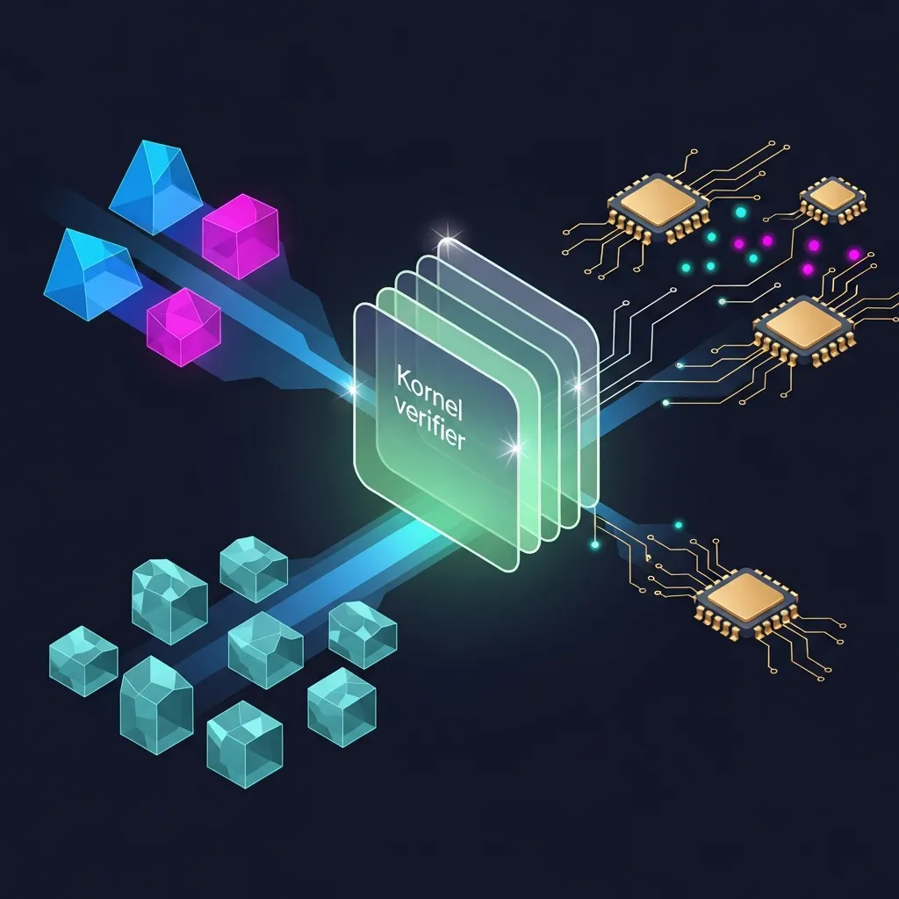
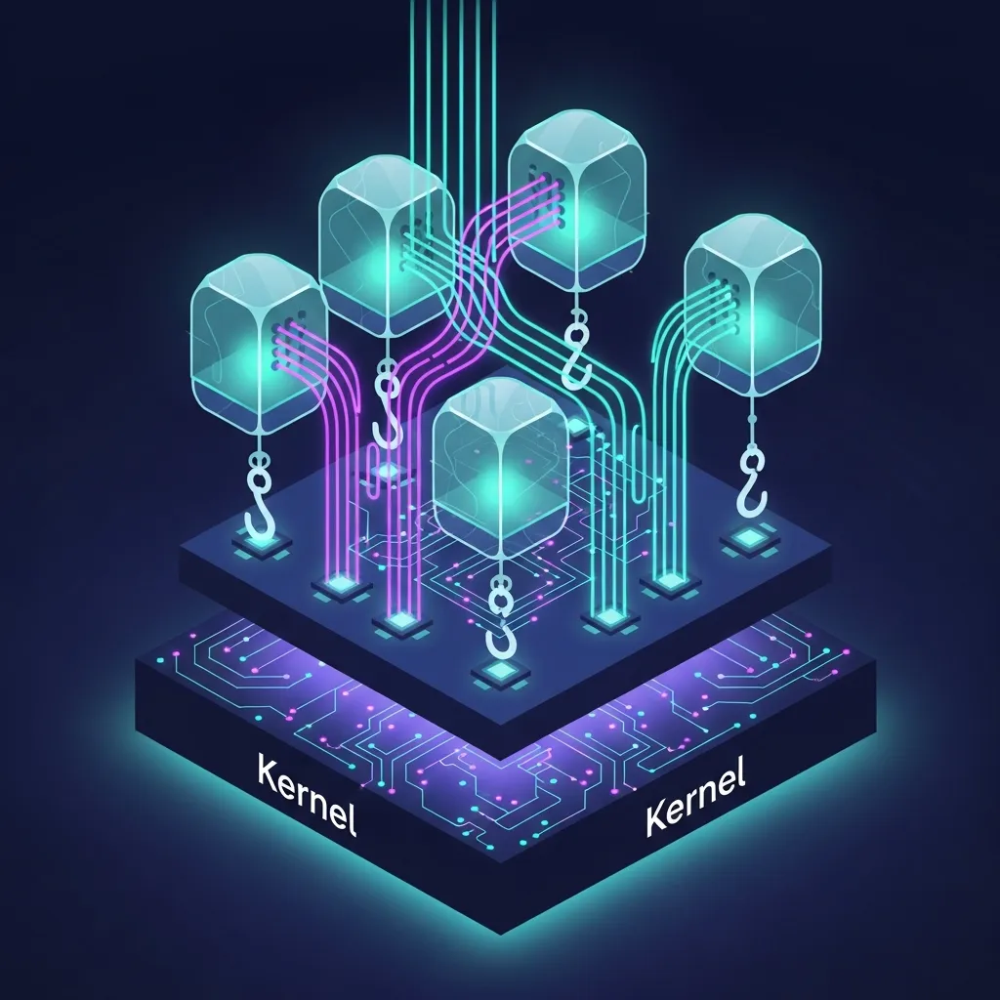

리눅스 커널은 오랫동안 수정이 어려운 성역으로 여겨졌으나, <b>eBPF</b>(Extended Berkeley Packet Filter)의 등장은 이 거대한 운영체제의 심장을 프로그래밍 가능한 영역으로 끌어내렸습니다. 메타, 구글, 넷플릭스 등 글로벌 테크 기업들이 운영 환경에 전면 배치한 이 기술은 실리엄(Cilium)이나 픽시(Pixie) 같은 도구의 기반이 되며 시스템 관찰 가능성(Observability)의 새로운 표준을 제시하고 있습니다. 하지만 기술적 화려함 이면에 존재하는 운영 복잡성과 난해한 제약 사항을 간과한 채 도입을 서두르는 것은 신중히 고려해야 할 문제입니다.

## 시스템의 심장을 여는 프로그래밍 인터페이스

eBPF를 요약하자면 리눅스 커널을 수정하거나 재부팅할 필요 없이, 커널 내부에서 사용자 정의 프로그램을 안전하게 실행할 수 있게 해주는 기술입니다. 과거에는 커널 기능을 확장하려면 커널 모듈을 직접 작성하여 삽입하거나 수년에 걸친 메인라인 패치 과정을 거쳐야 했습니다. 2014년 도입된 eBPF는 커널 내부에 일종의 경량 가상 머신을 구현하여 이러한 진입 장벽을 낮췄습니다.

이 기술의 핵심은 안정성 확보에 있습니다. 커널 내부에서 실행되기 전, Verifier(검증기)라는 단계에서 무한 루프 여부, 유효하지 않은 메모리 접근, 시스템 중단 가능성 등을 정적으로 분석합니다. 이 관문을 통과한 코드만이 JIT(Just-In-Time) 컴파일러를 통해 네이티브 기계어로 변환되어 실행됩니다. 결과적으로 커널의 고성능을 유지하면서도 전체 시스템의 안정성을 해치지 않는 샌드박스 환경을 제공하는 것이 핵심입니다.

## 데이터 복사를 넘어선 직접적인 정보 통찰

기존의 모니터링 방식은 에이전트가 사용자 공간(User Space)에서 동작하며 커널 공간(<b>Kernel</b> Space)의 데이터를 복사해 오는 과정을 반복했습니다. 이 과정에서 발생하는 <a href="/ko/glossary/context-switching-overhead-optimization" class="glossary-tooltip" data-definition="운영체제가 현재 실행 중인 프로세스나 스레드의 상태를 저장하고 다른 프로세스로 전환하는 과정을 의미하며, 이 과정에서 발생하는 <b>CPU</b> 자원 소모를 비용(오버헤드)으로 간주합니다.">컨텍스트 스위칭</a> 오버헤드는 대규모 트래픽을 처리하는 현대의 마이크로서비스 <b>아키텍처</b>(MSA)에서 상당한 비용 부담으로 작용합니다. 반면 eBPF는 데이터를 복사하지 않고 커널 내부에서 직접 처리하거나, Maps라는 효율적인 키-값 저장소를 통해 필요한 최소한의 데이터만 사용자 공간으로 전달합니다.

주목할 만한 기술적 디테일은 Hook 포인트의 확장성입니다. 단순히 네트워크 패킷을 필터링하던 과거의 BPF와 달리, eBPF는 kprobes(커널 함수), uprobes(사용자 공간 함수), tracepoints 등 거의 모든 시스템 이벤트에 접근할 수 있습니다. 특히 2020년에 정립된 CO-RE(Compile Once, Run Everywhere) 기술은 특정 커널 버전에 종속되던 단점을 해결하며 이식성을 높였습니다. 덕분에 애플리케이션 코드를 수정하지 않고도 암호화된 트래픽을 분석하거나 마이크로초 단위의 디스크 I/O 지연 시간을 추적하는 것이 가능해졌습니다.

- <b>계측 방식</b>: 기존 라이브러리 주입 방식과 달리 커널 수준 Hooking을 통해 코드 수정 없이 동작
- <b>성능 효율</b>: 커널 내 직접 실행으로 컨텍스트 스위칭 및 데이터 복사 오버헤드 감소
- <b>가시성 범위</b>: 애플리케이션 로직을 넘어 시스템 콜, 네트워크, 하드웨어 계층까지 확장
- <b>안정성</b>: 검증기를 통한 커널 보호 및 격리된 실행 환경 보장

## 클라우드 네이티브의 혈맥을 짚어내다

쿠버네티스 환경에서 eBPF의 가치는 더욱 선명해집니다. 수많은 포드가 동적으로 생성되고 소멸하는 환경에서 단순 IP 주소 기반의 보안 정책이나 모니터링은 한계가 명확합니다. 뉴렐릭이 인수한 픽시(Pixie) 같은 플랫폼은 eBPF를 활용해 <b>클러스터</b> 전체의 텔레메트리 데이터를 자동으로 수집합니다. 별도의 수동 계측 없이도 서비스 간 의존성 맵을 그리고 HTTP/gRPC 요청 성공률을 실시간으로 파악할 수 있는 이유는 eBPF가 커널 레벨에서 모든 통신을 관찰하고 있기 때문입니다.

실제 데이터에 따르면 eBPF를 적용한 인프라는 수동 계측 대비 데이터 수집 오버헤드를 줄이면서도 대규모 트래픽 유입 상황에서 안정적인 가시성을 확보할 수 있습니다. 이는 비용 효율성을 중시하는 엔터프라이즈 환경에서 강력한 대안이 됩니다.

## 가시성 확보와 운영 부채 사이의 외줄타기

하지만 이 고성능 도구를 도입하기 전, 운영 팀이 커널 수준의 프로그램을 관리하고 디버깅할 준비가 되었는지 자문해야 합니다. eBPF는 강력하지만 이를 다루기 위해서는 리눅스 커널 구조에 대한 심도 있는 이해가 필수적입니다. C 언어의 하위 집합을 사용해야 하며, 512바이트로 제한된 스택 크기나 엄격한 메모리 접근 제한을 준수하는 코드를 작성하는 것은 상당한 숙련도를 요구합니다.

디버깅의 불투명성 또한 해결해야 할 과제입니다. 검증기가 프로그램을 거부할 때 출력하는 오류 메시지는 난해한 경우가 많으며, 실행 중인 <b>eBPF</b> 프로그램이 시스템 자원과 충돌을 일으킬 경우 원인을 추적하는 과정은 일반적인 애플리케이션 디버깅보다 훨씬 복잡합니다. 시스템을 투명하게 보기 위해 도입한 기술이 정작 장애 상황에서는 원인 파악이 어려운 블랙박스가 될 위험이 있습니다.

보안 관점에서도 신중한 접근이 필요합니다. 공격자가 시스템 권한을 획득한 후 악성 eBPF 프로그램을 주입한다면, 기존 보안 도구를 우회하며 커널 수준에서 데이터를 탈취하거나 시스템 무력화를 시도하는 은밀한 경로로 악용될 수 있습니다. 기술의 권한이 커질수록 보안 리스크와 관리 책임 역시 비례해서 증가한다는 사실을 기억해야 합니다.

eBPF가 제공하는 코드 수정 없는 가시성은 분명 매력적인 대안이지만, 이는 탄탄한 엔지니어링 역량이 뒷받침될 때만 온전히 누릴 수 있는 성과입니다. 인프라 전체를 조망하겠다는 의욕이 자칫 소수만이 다룰 수 있는 기술적 부채를 양산하는 결과로 이어지지 않도록, 비즈니스 로직과의 적합성 및 운영 가시성을 냉정하게 평가하여 단계적으로 접근하는 지혜가 필요합니다.

## 🔗 함께 읽으면 좋은 글

- [완벽한 수학이 설계한 불완전한 신뢰: 비대칭 암호화의 이면](/ko/posts/imperfect-trust-asymmetric-encryption)
- [토큰 소지자 모델에서 증명 기반 보안으로: DPoP가 재정의하는 웹 인증의 신뢰 모델](/ko/posts/dpop-proof-based-web-authentication)