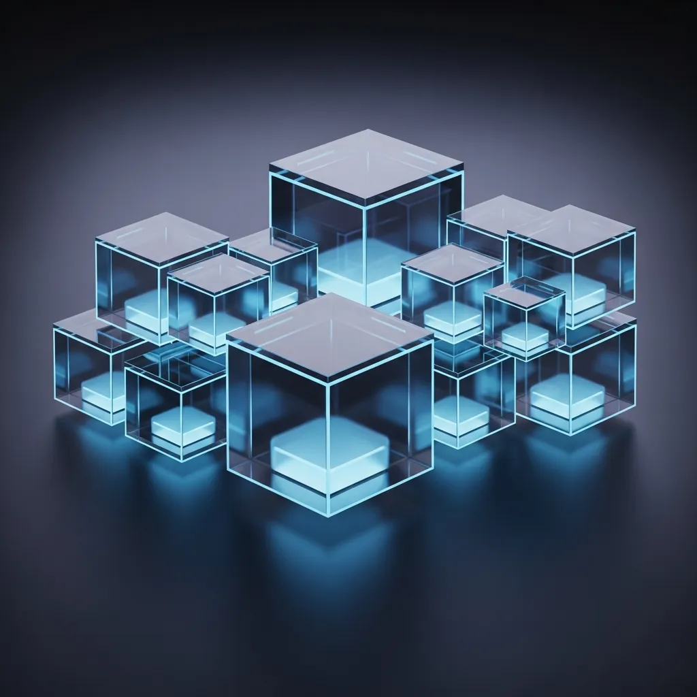
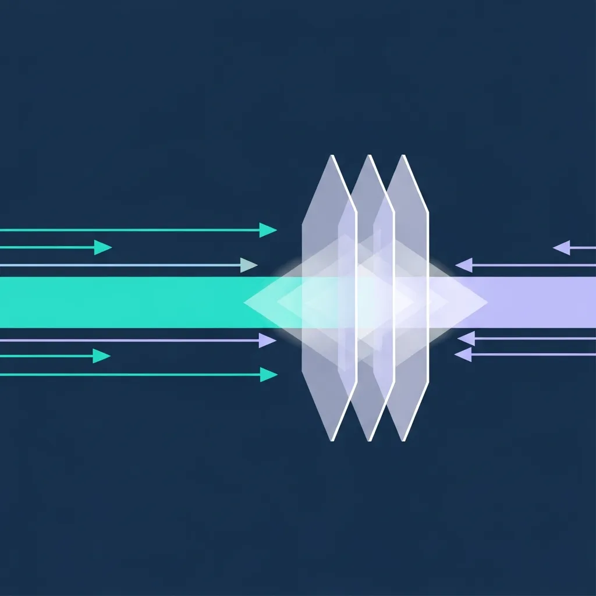
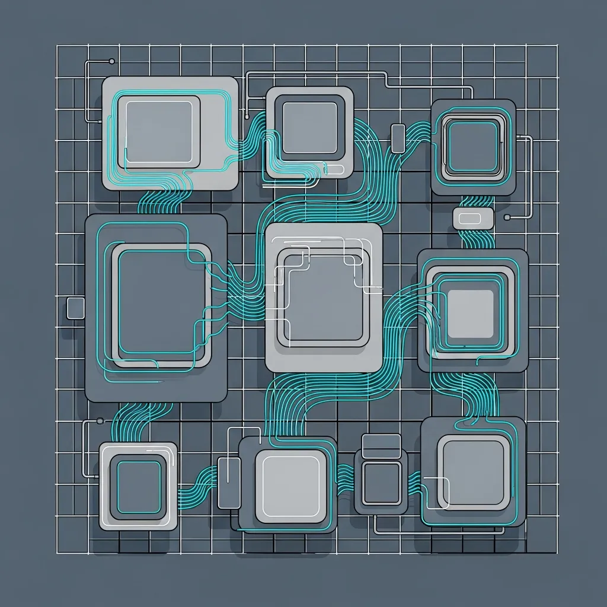

---
title: 'GKE Agent Sandbox 출시: AI 에이전트 보안의 혁신인가, 관리 지옥의 시작인가?'
author: editornom
author_role: Senior Tech Editor
author_url: https://editornom.com/about
pubDatetime: 2026-05-09 16:50:54.099448+09:00
slug: gke-agent-sandbox-ai-security-innovation-vs-management-hell
featured: false
draft: false
ogImage: "../../../../../source/posts/GKE_Agent_Sandbox/5b80945c-0.webp"
description: GKE Agent Sandbox는 1초 미만의 빠른 프로비저닝을 제공하지만, 웜 풀 방식에 따른 높은 인프라 비용과 gVisor의
  성능 오버헤드 및 클라우드 종속성 문제를 수반합니다. AI 에이전트 보안을 위해 이 기술을 도입하기 전, 아키텍트가 반드시 고려해야 할 경제적
  비용과 기술적 제약 사항을 상세히 분석합니다.
references:
- https://docs.cloud.google.com/kubernetes-engine/docs/concepts/machine-learning/agent-sandbox
- https://docs.cloud.google.com/kubernetes-engine/docs/how-to/agent-sandbox
- https://docs.cloud.google.com/kubernetes-engine/docs/how-to/how-install-agent-sandbox
modDatetime: 2026-05-09 17:00:54.099448+09:00
faqs:
- q: GKE Agent Sandbox란 무엇인가요?
  a: 구글 클라우드에서 AI 에이전트를 안전하게 격리하여 실행하기 위해 출시한 보안 기술입니다. gVisor 런타임을 활용해 보안성을 높였으며,
    1초 미만의 매우 빠른 프로비저닝 속도를 제공하는 것이 특징입니다.
- q: 이 서비스의 가장 핵심적인 장점은 무엇인가요?
  a: 가장 큰 장점은 신속한 대응 속도입니다. 웜 풀(Warm Pool) 방식을 사용하여 AI 에이전트 워크로드를 즉각적으로 실행할 수 있게 함으로써,
    대기 시간을 최소화해야 하는 실시간 AI 서비스에 최적화되어 있습니다.
- q: AI 에이전트 보안을 위해 왜 샌드박스 기술이 필요한가요?
  a: AI 에이전트는 외부 코드나 복잡한 명령을 수행하는 경우가 많아 보안 위협에 노출되기 쉽습니다. 샌드박스는 커널을 격리하여 악성 코드가 호스트
    시스템이나 다른 컨테이너로 확산되는 것을 방지합니다.
- q: GKE Agent Sandbox를 사용하기 위한 기술적 요구사항은 무엇인가요?
  a: GKE 1.35.2 버전 이상이 필요하며, 특정 하드웨어인 N2 머신 타입과 cos_containerd 이미지를 사용해야 합니다. 특정 버전과
    하드웨어 환경이 강제된다는 제약 사항이 있습니다.
- q: gVisor는 어떤 역할을 수행하나요?
  a: gVisor는 애플리케이션과 호스트 커널 사이에 가상화된 커널 레이어를 두는 보안 런타임입니다. 직접적인 시스템 콜을 차단하고 가로챔으로써
    강력한 보안 격리 벽을 형성하는 역할을 합니다.
- q: 빠른 성능에도 불구하고 비용 문제가 지적되는 이유는 무엇인가요?
  a: 요청이 없을 때도 자원을 미리 할당해 두는 웜 풀 방식 때문입니다. 고가의 N2 머신 자원을 상시 점유하므로, 쿠버네티스의 장점인 동적 자원
    할당을 통한 비용 절감 효과를 누리기 어렵습니다.
- q: gVisor 도입 시 발생할 수 있는 성능상의 한계는 무엇인가요?
  a: gVisor는 시스템 콜을 가로채는 과정에서 오버헤드를 발생시킵니다. 이로 인해 실시간 응답이 중요한 대규모 언어 모델(LLM) 기반 워크로드에서는
    누적된 지연 시간(Latency)이 성능 저하로 이어질 수 있습니다.
- q: 벤더 종속성(Lock-in) 문제가 발생하는 구체적인 원인은 무엇인가요?
  a: 구글 전용 API와 비표준 CRD 구조를 사용하기 때문입니다. 특정 클라우드 벤더의 전용 규격에 맞춰 아키텍처를 설계하게 되면, 향후 타
    클라우드로 이전하거나 하이브리드 환경을 구축할 때 큰 제약이 됩니다.
- q: GKE Agent Sandbox를 도입하면 기존보다 서버 비용이 얼마나 더 많이 나올까요?
  a: 워크로드가 없어도 N2 머신 같은 고성능 자원을 계속 켜두는 웜 풀 구조라서 비용이 꽤 늘어날 수 있습니다. 단순히 부팅 속도만 보지 마시고,
    실제 사용량 대비 상시 유지 비용을 꼭 미리 계산해 보셔야 합니다.
- q: 보안 때문에 gVisor를 쓰면 AI 답변 속도가 체감될 정도로 느려지나요?
  a: 시스템 콜이 잦은 복잡한 AI 에이전트라면 지연 시간을 느낄 수도 있습니다. 보안 격리 단계가 추가되면서 발생하는 성능 손실이 있으니, 서비스의
    실시간 응답 요구 수준과 보안 강화 사이에서 적절한 균형을 고민해 보세요.
---
<strong>[BLUF]</strong>
<b>GKE</b> Agent Sandbox는 1초 미만의 빠른 프로비저닝을 제공하지만, 이는 유휴 자원을 상시 점유하는 '웜 풀(Warm Pool)' 방식에 의존하여 인프라 비용을 대폭 상승시킵니다. 또한 <a href="/ko/glossary/what-is-gvisor" class="glossary-tooltip" data-definition="구글에서 개발한 오픈 소스 <b>컨테이너</b> 런타임으로, 애플리케이션과 호스트 커널 사이에 가상화된 커널 레이어를 두어 보안 격리 수준을 높여주는 기술입니다.">gVisor</a> 기반의 격리는 보안성을 강화하는 대신 시스템 콜 오버헤드로 인한 성능 저하를 유발하며, 비표준 CRD 사용으로 인해 구글 클라우드에 대한 기술적 종속성(Lock-in)을 심화시킬 우려가 큽니다.

## 1. 자율성이 불러온 보안의 실질적 위협

 클라우드 네이티브 환경에서 AI 에이전트의 보안은 더 이상 선택이 아닌 필수적인 과제가 되었어요. 구글이 최근 선보인 'GKE Agent <b>Sandbox</b>'는 이러한 요구에 부응하는 듯 보이지만, 그 화려한 기술적 수식어 뒤에는 아키텍트가 반드시 짚고 넘어가야 할 냉혹한 현실이 숨어 있답니다.

 아키텍트의 관점에서 볼 때, 인프라의 효율성은 단순히 속도만으로 정의되지 않아요. 구글은 1초 미만의 부팅 속도를 강조하지만, 이는 기술적 혁신이라기보다 자원을 미리 할당해 두는 운영 방식의 선택일 뿐이라는 점을 명심해야 해요.

### 기술적 관점에서의 핵심 분석

 가장 먼저 지적하고 싶은 부분은 바로 '웜 풀(Warm Pool)'의 경제적 모순이에요. <b>GKE</b> Agent Sandbox는 빠른 응답성을 위해 워크로드가 없는 상태에서도 컴퓨팅 자원을 상시 점유하는 구조를 채택하고 있어요.

 이는 쿠버네티스의 본질적인 가치인 '동적 자원 할당'과 '효율적인 빈 패킹(Bin-packing)' 원칙에 정면으로 위배되는 방식이지요. 사용자가 요청을 보내지 않는 시간에도 N2 머신 타입의 고비용 인프라가 계속 돌아가며 비용을 발생시킨다는 사실을 간과해서는 안 돼요.

> "웜 풀 방식은 응답 속도를 위해 클라우드 비용 효율성을 희생한 결과물입니다. 이는 인프라 유연성을 중시하는 엔지니어들에게 오히려 운영상의 큰 부담이 될 수 있어요."

## 2. GKE 에이전트 샌드박스의 격리 메커니즘

 기술적 세부 사항을 들여다보면 제약 조건은 더욱 까다로워요. 이 기능을 활용하기 위해서는 최소 GKE 1.35.2-gke.1269000 이상의 버전이 필요하며, 특정 인프라인 N2 머신 타입과 cos_containerd 이미지가 강제되거든요.

 인프라의 결정권이 특정 벤더의 특정 하드웨어 타입에 고정된다는 것은 멀티 클라우드 전략을 추진하는 기업에게 치명적인 약점이 될 수 있어요. 우리는 이를 '기술적 부채의 예고편'이라고 불러야 할지도 모릅니다.

 성능 측면에서도 gVisor 런타임의 한계는 분명해요. gVisor는 강력한 커널 격리를 제공하지만, 응용 프로그램이 시스템 콜을 호출할 때마다 발생하는 오버헤드는 고성능 AI 추론 워크로드에서 병목 현상을 유발하는 주범이 되곤 해요.

## 3. 성능 저하와 보안성 간의 <b>아키텍처</b> 트레이드오프

 특히 실시간 응답이 중요한 대규모 언어 모델(<b>LLM</b>) 기반의 에이전트라면, 이러한 미세한 지연 시간(Latency)이 누적되어 사용자 경험을 해칠 수 있답니다. 보안을 위해 성능을 어디까지 포기할 수 있는지에 대한 진지한 고민이 필요한 시점이에요.

 더욱 우려스러운 점은 구글 고유의 <b>API</b> 그룹인 `extensions.agents.x-k8s.io/v1alpha1`과 같은 비표준 CRD 구조의 사용이에요. 이는 쿠버네티스의 표준 생태계를 벗어나 특정 플랫폼에 종속되는 구조를 고착화할 가능성이 매우 높아요.

## 4. 현실적인 엔터프라이즈 하이브리드 인프라 방어선

 향후 다른 클라우드 환경으로 워크로드를 이관하거나 하이브리드 전략을 세울 때, 이러한 전용 API는 이식성을 저해하는 거대한 장벽으로 작용하게 될 것입니다. 아키텍트는 오늘 선택한 편리함이 내일의 족쇄가 되지 않을지 날카롭게 분석해야 해요.

> "기술적 신뢰는 투명성에서 나옵니다. 특정 벤더에 고정된 확장성은 클라우드 네이티브의 진정한 가치를 훼손하는 기술적 퇴보일 수 있습니다."

 결론적으로 <b>GKE</b> Agent Sandbox는 강력한 보안 격리를 원하는 이들에게 매력적인 대안이 될 수 있지만, 그 대가는 결코 가볍지 않아요. 높은 운영 비용과 성능 저하, 그리고 벤더 종속성이라는 세 가지 과제를 어떻게 해결할 것인지가 관건이지요.

 우리는 단순히 제공되는 기능을 수동적으로 수용하기보다, 비즈니스 목적에 맞는 최적의 인프라 조합을 스스로 설계할 수 있는 능력을 유지해야 해요. 보안은 인프라의 제약이 아니라, 서비스의 지속 가능성을 담보하는 도구가 되어야 하기 때문입니다.

 마지막으로 <b>GKE</b> Agent <b>Sandbox</b> 도입을 검토 중인 팀이 있다면, 웜 풀로 인한 비용 시뮬레이션을 반드시 선행하시길 권장해요. 기술의 화려함에 가려진 운영의 현실을 직시할 때 비로소 우리는 진정한 인프라의 주인으로 거듭날 수 있답니다.
