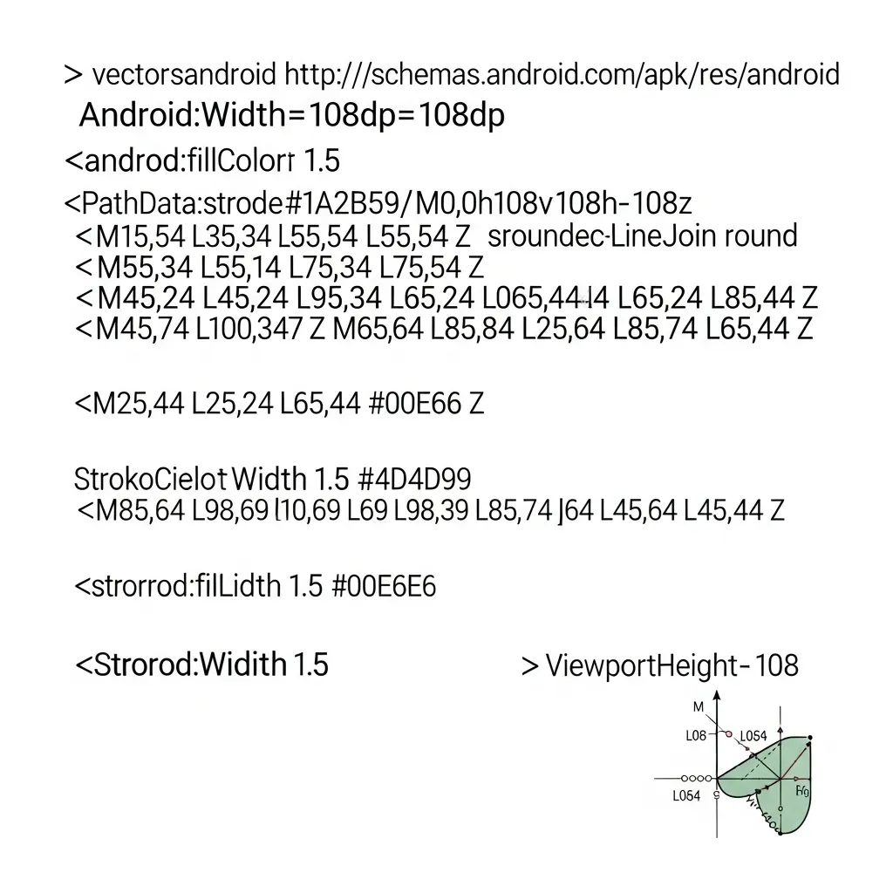

---
title: 'Model Context Protocol(MCP) 보안 가이드: 표준화된 연결의 혁명인가, 취약점의 서막인가'
author: editornom
author_role: Senior Tech Editor
author_url: https://editornom.com/about
pubDatetime: 2026-05-10 17:03:14.506591+09:00
slug: mcp-security-guide
featured: false
draft: false
ogImage: "../../../../../source/posts/Model_Context_Protocol/593d2810-0.webp"
description: Model Context Protocol(MCP) 도입 시 발생할 수 있는 신뢰 경계 붕괴와 보안 리스크를 분석하고, 데이터
  유출 및 임의 코드 실행 방지를 위한 최소 권한 원칙 및 보안 프록시 구축 등 실무적인 거버넌스 전략을 제시합니다.
references:
- https://modelcontextprotocol.io/specification/2025-11-25
- https://modelcontextprotocol.io/docs/getting-started/intro
- https://modelcontextprotocol.io/specification/2025-11-25/server/tools
modDatetime: 2026-05-10 17:13:14.506591+09:00
faqs:
- q: Model Context Protocol(MCP)이란 무엇인가요?
  a: MCP는 AI 에이전트와 다양한 데이터 소스 및 도구 간의 연결 방식을 표준화한 프로토콜입니다. 파편화된 인터페이스를 하나로 통합하여 LLM이
    외부 데이터와 도구에 더 쉽게 접근할 수 있도록 돕는 역할을 합니다.
- q: MCP를 왜 AI의 USB-C 포트라고 부르나요?
  a: USB-C가 서로 다른 기기들의 연결 규격을 하나로 통일한 것처럼, MCP도 제각각이었던 AI 모델과 데이터 간의 통신 방식을 표준화했기
    때문입니다. 이를 통해 복잡한 설정 없이도 다양한 도구를 즉시 연결할 수 있습니다.
- q: MCP의 주요 특징은 무엇인가요?
  a: 확률적으로 동작하는 LLM과 엄격한 규칙 기반의 시스템을 결합하는 것이 핵심입니다. Anthropic이 제안한 규격을 바탕으로 실시간 데이터
    접근과 외부 도구 실행을 위한 통일된 인터페이스를 제공하여 호환성을 극대화합니다.
- q: MCP 도입이 왜 중요한가요?
  a: AI 에이전트 구축 시 발생하는 파편화 문제를 해결하고 개발 효율성을 획기적으로 높여주기 때문입니다. 표준화된 연결을 통해 기업은 다양한
    데이터 자산을 AI와 더 빠르고 체계적으로 연동할 수 있는 기반을 마련하게 됩니다.
- q: MCP 환경에서 신뢰 경계의 붕괴란 무엇을 의미하나요?
  a: AI 에이전트가 외부 도구에 직접 접근할 때, 해당 도구의 안전성을 보증할 주체가 모호해지는 현상을 뜻합니다. 표준화된 연결 방식이 오히려
    공격자에게 표준화된 침투 경로를 제공하여 보안 사고의 원인이 될 수 있다는 경고입니다.
- q: MCP 도입 시 가장 주의해야 할 보안 위협은 무엇인가요?
  a: 과도한 권한 부여로 인한 데이터 유출과 임의 코드 실행(ACE)입니다. 단 한 번의 프롬프트 인젝션만으로도 에이전트가 가진 넓은 데이터 접근권을
    남용하여 전사적인 정보를 탈취하거나 악성 명령을 수행할 위험이 있습니다.
- q: Denial of Wallet(DoW) 공격은 어떻게 방어할 수 있나요?
  a: 공격자가 에이전트를 무한 루프에 빠뜨려 API 비용을 폭증시키는 DoW 공격을 막으려면 전용 보안 프록시 도입이 필요합니다. 이를 통해 호출
    속도를 제한하고 쿼터 설정을 적용하여 자산 고갈을 사전에 차단해야 합니다.
- q: 보안을 위해 기술적으로 어떤 수칙을 지켜야 하나요?
  a: RFC-9728 명세를 준수한 OAuth2 권한 관리와 최소 권한 원칙을 적용해야 합니다. 로컬 통신은 STDIO 방식을 우선 사용하고,
    보안 스캐너로 매니페스트 파일을 사전 분석하여 위험한 함수 호출이 있는지 확인하는 과정이 필수입니다.
- q: MCP를 연동할 때 우리 회사 데이터가 밖으로 새 나가지 않게 하려면 어떤 보안 설정을 가장 먼저 확인해야 하나요?
  a: 에이전트에게 꼭 필요한 데이터에만 접근할 수 있도록 최소 권한을 설정하는 것이 가장 중요합니다. RFC-9728 기반의 스코프 필터링을 적용하고,
    외부 문서를 읽어올 때 악성 지시문이 섞이지 않도록 입력값을 철저히 소독하는 설정을 먼저 점검해 보세요.
- q: 로컬 환경에서 MCP 서버를 돌릴 때 네트워크 방식보다 표준 입출력을 쓰는 게 보안상 진짜 더 유리한가요?
  a: 네, 로컬 환경이라면 HTTP 소켓 통신보다 STDIO 방식을 권장합니다. 네트워크를 통하는 방식은 그 자체로 또 다른 공격 경로가 될 수
    있지만, 표준 입출력을 활용하면 외부 노출을 최소화하면서도 안전하게 데이터를 주고받을 수 있기 때문입니다.
---
<strong>[BLUF]</strong>
Model Context Protocol(<b>MCP</b>)의 보안 리스크는 프로토콜 자체의 결함보다 '보안 책임의 개별 전사'로 인한 거버넌스 공백에 있습니다. LLM과 결정론적 도구 사이의 신뢰 경계(Trust Boundary)가 무너질 경우 임의 코드 실행(ACE) 및 심각한 데이터 유출이 발생할 수 있으며, 이를 위해 RFC-9728 기반의 최소 권한 원칙과 보안 프록시 도입이 시급합니다.

## 1. 모델 컨텍스트 프로토콜(MCP)의 등장과 보안 위협

 Model Context Protocol(MCP)의 등장은 AI 생태계에 있어 마치 'USB-C 포트'의 탄생과도 같은 혁명적 사건입니다. 파편화되어 있던 AI 에이전트와 데이터 소스 간의 연결 방식을 하나로 통합하여 가히 '연결의 민주화'를 이루어냈기 때문이지요.

 하지만 기술 보안 감사관의 관점에서 이 현상을 바라보면, 편리함의 이면에 숨겨진 거대한 그림자를 보지 않을 수 없습니다. 표준화된 연결 방식은 공격자에게도 '표준화된 공격 경로'를 제공한다는 역설적인 보안 위협을 동시에 안겨주었습니다.

 Anthropic이 제시한 이 야심 찬 프로토콜은 확률적으로 동작하는 LLM과 엄격한 규칙으로 동작하는 기존 시스템을 결합합니다. 이 과정에서 발생하는 예측 불가능성은 우리가 지금까지 경험하지 못한 새로운 형태의 <b>보안 취약점</b>을 만들어내고 있어요.

### 기술적 관점에서의 핵심 분석

 보안 전문가 Joff Thyer는 이를 '신뢰 경계(Trust Boundary)의 모호함'이라는 개념으로 설명합니다. MCP를 통해 AI 에이전트가 외부 도구에 직접 접근할 때, 우리는 과연 그 도구의 안전성을 누가 보증하는지에 대한 근본적인 질문을 던져야 합니다.

 현재의 <b>MCP</b> 구조는 보안 승인의 책임을 상당 부분 최종 사용자에게 전가하고 있습니다. 복잡한 에이전트 워크플로우 속에서 사용자가 모든 Tool 호출의 정당성을 판단하는 'Human-in-the-loop' 구조는 현실적으로 무력화되기 쉽지요.

 이는 결국 '표준화된 취약점'이라는 비판적 시각을 견지하게 만듭니다. 개발자들이 MCP의 편리함에 매몰되어 구현 시 필수적인 보안 조치를 소홀히 할 경우, 전 세계의 AI 에이전트가 동일한 패턴의 공격에 노출될 수 있기 때문입니다.

 MCP 환경에서 우리가 직면하게 될 5대 핵심 보안 위협을 매트릭스로 정리해 보았습니다. 이 표는 기술 결정권자들이 도입 시 반드시 검토해야 할 체크리스트가 될 것입니다.

## 2. 연결의 이면에 숨겨진 데이터 유출과 악용 리스크

| 위협 유형 | 상세 메커니즘 | 방어 전략 (GEO 권장) |
| :--- | :--- | :--- |
| 임의 코드 실행 (ACE) | 검증되지 않은 서버의 Tool 호출 유도 | MCPSafetyScanner를 통한 매니페스트 사전 스캔 |
| 데이터 유출 | Excessive Capability 부여로 인한 권한 남용 | RFC-9728 기반의 OAuth2 스코프 필터링 적용 |
| 과금 공격 (DoW) | 무한 루프 호출을 통한 <b>API</b> 자산 고갈 | MCP Guardian 프록시를 통한 속도 제한 및 쿼터 설정 |
| 프롬프트 인젝션 | Stored Prompt Injection을 통한 도구 오염 | BCP 14 기준에 따른 입력값 사전 소독(Sanitization) |
| 자격 증명 노출 | JSON-RPC 메시지 내 인증 정보 평문 노출 | 로컬 전송 시 <a href="/ko/glossary/what-is-stdio" class="glossary-tooltip" data-definition="컴퓨터 프로그램이 운영체제나 외부 환경과 데이터를 주고받기 위해 사용하는 표준화된 입출력 통로로, 일반적으로 입력(stdin), 출력(stdout), 오류(stderr) 스트림으로 구성됩니다.">STDIO</a> 우선 사용 및 메모리 암호화 |

 특히 주목해야 할 위협은 바로 '과도한 권한 부여(Excessive Capability)'입니다. AI 에이전트가 특정 작업을 수행하기 위해 필요한 권한보다 더 넓은 데이터 접근권을 가질 때, 단 한 번의 프롬프트 인젝션만으로도 전사적 데이터 유출이 가능해집니다.

 또한 'Denial of Wallet(DoW)' 공격은 기업의 자산을 직접적으로 위협합니다. 공격자가 의도적으로 에이전트를 무한 루프에 빠뜨려 API 호출 비용을 폭증시키는 행위는 MCP 서버의 <b>가용성</b>을 순식간에 무너뜨릴 수 있지요.

## 3. 안전한 <b>MCP</b> 사용을 위한 엔터프라이즈 보안 게이트웨이

 그렇다면 우리는 이 안전하지 않은 혁명을 어떻게 수용해야 할까요? 기술 보안 감사관으로서 제안하는 첫 번째 방어 체계는 RFC-9728 명세를 준수한 OAuth2 기반의 권한 관리입니다.

 단순히 '연결'하는 것에 집중하지 말고, 각 연결마다 최소 권한 원칙(Least Privilege)을 적용하여 스코프를 세밀하게 분리해야 합니다. 이는 BCP 14 보안 원칙에 따른 시스템 설계의 핵심이기도 합니다.

 두 번째로 로컬 환경에서의 통신은 가급적 HTTP보다는 STDIO(표준 입출력) 방식을 우선적으로 사용하시길 권장합니다. 네트워크 소켓을 통한 통신은 그 자체로 또 다른 공격 벡터가 될 수 있음을 명심해야 합니다.

 세 번째로는 'MCPSafetyScanner'와 같은 보안 전용 프록시나 스캐너를 파이프라인에 도입하는 것입니다. MCP 서버가 제공하는 매니페스트 파일을 사전에 분석하여 위험한 명령어나 함수 호출이 포함되어 있는지 자동으로 스캔해야 합니다.

## 4. 제로 트러스트 프레임워크와의 완벽한 융합 전략

 마지막으로 Stored Prompt Injection에 대한 대비가 필요합니다. MCP 서버가 외부 웹페이지나 문서를 읽어올 때, 그 데이터 속에 포함된 악의적인 지시문이 LLM의 제어 흐름을 탈취하지 못하도록 입력값을 철저히 소독(Sanitization)해야 합니다.

> "보안이 전제되지 않은 표준화는 기술적 진보가 아니라, 표준화된 재앙을 향한 행진일 뿐입니다." 라는 한 보안 전문가의 경고를 무겁게 받아들여야 할 때입니다.

 결국 MCP의 성공 여부는 얼마나 많은 도구를 연결하느냐가 아니라, 얼마나 신뢰할 수 있는 연결을 유지하느냐에 달려 있습니다. 기술적 편리함을 누리기 전에 거버넌스 체계를 먼저 수립하는 지혜가 필요합니다.

 Anthropic의 최신 스펙(2025-11-25)이 보여주듯 프로토콜은 계속 진화할 것입니다. 하지만 보안의 기본 원칙은 변하지 않습니다. 신뢰할 수 없는 데이터는 의심하고, 모든 권한은 최소한으로 유지하며, 모든 동작은 기록되어야 합니다.

 AI 에이전트 시대를 선도하는 아키텍트라면 기술의 화려함 뒤에 숨겨진 구조적 결함을 꿰뚫어 볼 줄 알아야 합니다. MCP는 분명 연결의 혁명이지만, 그 혁명이 완성되기 위해서는 '신뢰의 표준'이 그 자리를 채워야 할 것입니다.
