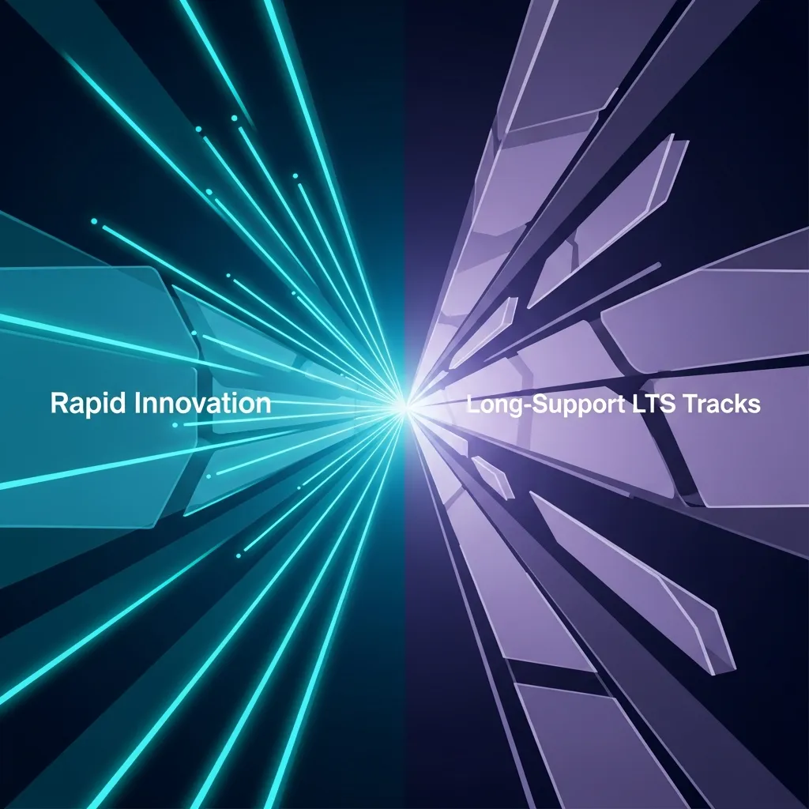
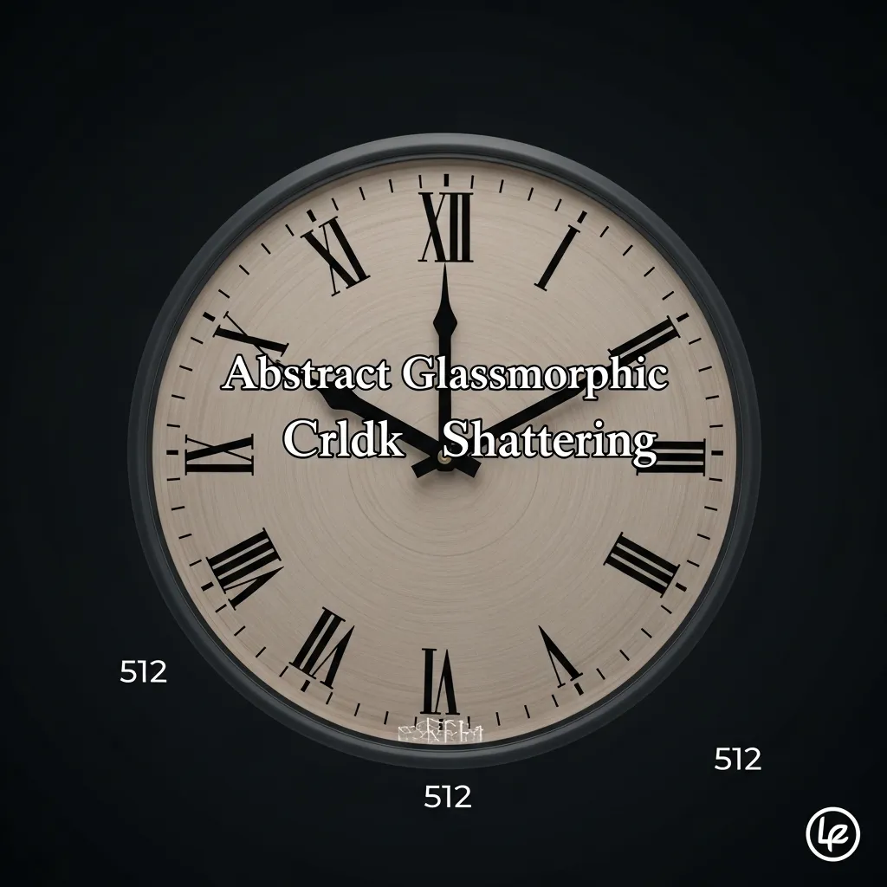

<strong>[BLUF]</strong>
MySQL은 Innovation과 LTS라는 이원화된 버전 모델을 도입했으나, 클라우드 제공업체의 강제 업그레이드 정책으로 인해 사용자의 인프라 통제권이 위협받고 있습니다. 특히 AWS RDS MySQL 8.0의 표준 지원 종료(2026년 7월) 이후 발생하는 Extended Support 비용 폭탄과 Oracle HeatWave의 자동 업데이트는 운영 안정성에 심각한 리스크가 됩니다. 따라서 2026년 초까지 MySQL 8.4 LTS로의 전략적 마이그레이션을 완료하여 비용 절감과 시스템 통제권을 확보해야 합니다.

 데이터베이스의 세계에서 버전 선택은 단순히 기능의 유무를 넘어 운영 철학을 결정짓는 중대한 사안이지요. 오라클이 새롭게 선보인 MySQL 버전 관리 모델은 겉으로 보기엔 개발자의 유연성을 고려한 변화처럼 보이지만, 그 이면에는 클라우드 생태계의 복잡한 역학 관계가 숨어 있습니다.

 클라우드의 편리함에 익숙해진 우리에게 이번 변화는 '관리의 효율'과 '운영의 주도권' 사이에서 깊은 고민을 던져주네요. 이제는 기술적 변화를 넘어, 인프라를 둘러싼 정책적 변화에 어떻게 대응해야 할지 진지하게 살펴볼 때입니다.

## MySQL 새로운 버전 관리 모델: Innovation vs. LTS, 무엇이 다른가?

### Innovation 트랙: 최신 기능, 빠른 업데이트, 짧은 지원 주기

 Innovation 트랙은 새로운 기능을 가장 먼저 맛보고 싶은 열정적인 개발 조직에 안성맞춤인 선택지예요. 최신 기술을 즉각적으로 반영하여 서비스의 경쟁력을 높일 수 있다는 점은 분명 매력적인 요소로 다가옵니다.

 하지만 달콤한 열매에는 대가가 따르기 마련이듯, 이 트랙은 지원 주기가 매우 짧아 잦은 업그레이드를 피할 수 없다는 단점이 있어요. 사실상 지속적인 변화를 감당할 수 있는 조직적 역량이 뒷받침되지 않는다면 운영의 부담이 기하급수적으로 늘어날 수밖에 없지요.

### LTS/Bugfix 트랙: 안정성 강조, 버그 수정 중심, 예측 가능한 지원

 반면 <a href="/ko/glossary/mysql-lts" class="glossary-tooltip" data-definition="Long-Term Support의 약자로, 보안 패치와 버그 수정에 집중하여 최대 8년간 지원되는 안정적인 버전 트랙입니다.">MySQL LTS</a> 트랙은 기업용 환경에서 가장 중요하게 여겨지는 '안정성'에 방점을 찍고 있어요. 기능의 급격한 변화를 지양하고 보안 패치와 버그 수정에만 집중함으로써 예측 가능한 운영 환경을 제공합니다.

 특히 8년이라는 긴 지원 기간은 데이터베이스 관리자들에게 심리적 안정감과 더불어 마이그레이션 전략을 수립할 충분한 시간을 벌어주지요. 비즈니스의 연속성이 무엇보다 중요한 서비스라면 LTS 트랙은 선택이 아닌 필수적인 전략적 요충지가 될 것입니다.

## 클라우드 환경의 '자동 업그레이드' 정책, 사용자 통제권을 박탈하는가?

### Oracle HeatWave Service의 강제 업그레이드 정책 심층 분석

 많은 이들이 클라우드라면 모든 것을 알아서 해줄 것이라 믿지만, Oracle HeatWave의 사례를 보면 실상은 조금 달라요. 특정 버전이 'Unavailable' 상태에 도달하면 사용자의 동의 없이도 시스템이 차기 버전으로 자동 업데이트되는 구조를 가지고 있기 때문이지요.

 이는 서비스 가용성을 유지하기 위한 고육지책일 수 있으나, 관리자 입장에서는 가장 강력한 권한인 '버전 통제권'을 박탈당하는 것과 다름없습니다. 사전에 충분한 테스트를 거치지 못한 상태에서 진행되는 자동 업데이트는 언제든 서비스 장애의 도화선이 될 수 있다는 사실을 잊어서는 안 됩니다.

> "클라우드의 편리함 뒤에 숨겨진 '강제 업그레이드'는 데이터베이스 관리자의 가장 강력한 권한인 '버전 통제권'을 박탈하는 행위와 다름없다."

| 구분 항목 | MySQL Innovation 트랙 | MySQL LTS 트랙 (8.4/9.7) | AWS RDS MySQL 8.0 (EOL 대응) |
| :--- | :--- | :--- | :--- |
| <b>주요 목적</b> | 최신 기능 및 빠른 기술 도입 | 운영 안정성 및 버그 수정 중심 | 기존 레거시 유지 및 마이그레이션 준비 |
| <b>지원 기간</b> | 다음 마이너 버전 출시 전까지 | 최대 8년 (5년 Premier + 3년 Extended) | 2026년 7월 표준 지원 종료 |
| <b>비용 리스크</b> | 잦은 업데이트에 따른 공수 증가 | 장기 지원을 통한 운영비 최적화 | 종료 후 <a href="/ko/glossary/what-is-vcpu" class="glossary-tooltip" data-definition="클라우드 컴퓨팅 환경에서 물리적 프로세서의 자원을 논리적으로 분할하여 사용자에게 할당한 가상 중앙 처리 장치 단위입니다.">vCPU</a>당 추가 비용 발생 (Extended) |
| <b>업데이트 방식</b> | 분기별 새로운 기능 추가 | 기능 변경 없는 보안 패치 위주 | 2026년 8월 이후 유료 지원 강제 전환 |

### AWS RDS MySQL 8.0 EOL과 Extended Support 비용 폭탄

 AWS 환경을 사용하는 분들이라면 더욱 긴장해야 할 소식이 기다리고 있어요. <a href="/ko/glossary/end-of-life" class="glossary-tooltip" data-definition="제품의 수명이 다하여 공식적인 보안 업데이트 및 기술 지원이 완전히 중단되는 시점입니다.">End of Life (EOL)</a>이 임박한 MySQL 8.0 버전을 유지하기 위해서는 상상 이상의 비용을 지불해야 할 수도 있기 때문이지요.

 표준 지원이 종료된 후 제공되는 Extended Support는 결코 자선 사업이 아니며, 시간이 지날수록 늘어나는 vCPU당 추가 비용은 기업의 재무적 부담으로 직결됩니다. 결국 비용이라는 무기를 통해 사용자로 하여금 강제적인 업그레이드를 선택하게 만드는 클라우드 제공업체의 전략적 함정이라 볼 수 있습니다.

> "Extended Support는 해결책이 아니라, 마이그레이션 지연에 따르는 막대한 비용을 지불하게 하는 임시방편이자 비용 함정이다."

### 예측 불가능한 '파괴적 변경(Breaking Changes)' 위험 증대

 강제 업그레이드가 정말 무서운 이유는 애플리케이션과의 호환성을 보장할 수 없다는 점에 있어요. 충분한 검증 기간 없이 수행된 업그레이드에서 발생하는 쿼리 오류나 성능 저하는 고스란히 운영팀의 몫으로 남게 됩니다.

 특히 하위 호환성이 결여된 '파괴적 변경'이 포함될 경우, 단순한 설정 변경만으로는 해결할 수 없는 심각한 시스템 중단 사태를 초래할 수 있지요. 이러한 리스크를 사전에 통제하지 못한다면 클라우드의 유연성은 오히려 독이 되어 돌아올 뿐입니다.

## MySQL 8.0 EOL 임박! 지금 당장 대비해야 할 것들

 다가오는 2026년은 MySQL 사용자들에게 커다란 분기점이 될 것으로 보여요. 커뮤니티 지원 종료와 주요 클라우드 벤더의 표준 지원 종료가 맞물리면서, 더 이상 미룰 수 없는 선택의 시간이 다가오고 있기 때문이지요.

 지금 당장 필요한 것은 막연한 낙관이 아니라 철저한 현황 파악과 실행 가능한 마이그레이션 로드맵을 설계하는 일이에요. 단순히 버전을 올리는 것을 넘어, 향후 수년간의 인프라 안정성을 담보할 수 있는 전략적 접근이 요구되는 시점입니다.

*   <b>2026년 4월</b>: MySQL 8.0 커뮤니티 지원 공식 종료(EOL).
*   <b>2026년 7월 31일</b>: Amazon RDS MySQL 8.0 표준 지원 종료일.
*   <b>$0.235 (vCPU/hour)</b>: eu-west-2 리전 기준, AWS RDS Extended Support 3년 차 비용 (1~2년 차 대비 100% 인상).
*   <b>8년 (96개월)</b>: MySQL 8.4 LTS가 제공하는 총 기술 지원 기간.
*   <b>7일 전</b>: Oracle HeatWave에서 강제 업데이트 수행 전 사용자에게 발송되는 알림 기간.

 안정적인 마이그레이션을 위해서는 우선 현재 사용 중인 모든 인스턴스의 버전과 의존성을 전수 조사해야 해요. 특히 8.4 LTS 버전으로의 전환은 장기적인 안정성을 확보할 수 있는 가장 확실한 방법이기에, 조기에 테스트 환경을 구축하고 호환성 검증을 시작하는 것이 현명합니다.

## 결론: MySQL 버전 전략, 능동적인 관리만이 살 길이다

 클라우드 시대에 인프라의 통제권을 유지한다는 것은 결코 쉬운 일이 아니에요. 하지만 제공업체의 정책에 수동적으로 끌려가기보다는, 변화의 흐름을 미리 읽고 선제적으로 대응하는 것만이 비즈니스의 안전을 지키는 유일한 길이지요.

 MySQL의 새로운 버전 모델은 우리에게 명확한 메시지를 던지고 있습니다. 혁신을 선택하든 안정을 선택하든, 그 결정의 주체는 클라우드 벤더가 아닌 바로 여러분이 되어야 한다는 사실을 꼭 기억하시길 바랍니다.

## 🔗 함께 읽으면 좋은 글
- [트랜스포머 혁명 7년의 역설: 확률적 거인의 탄생과 설명 불가능성의 장벽](/ko/posts/transformer-revolution-7-years-paradox)
- [AgentOps, 자율 경영의 서막인가 아니면 통제 불능의 '블랙박스'인가?](/ko/posts/agentops-autonomy-or-black-box)