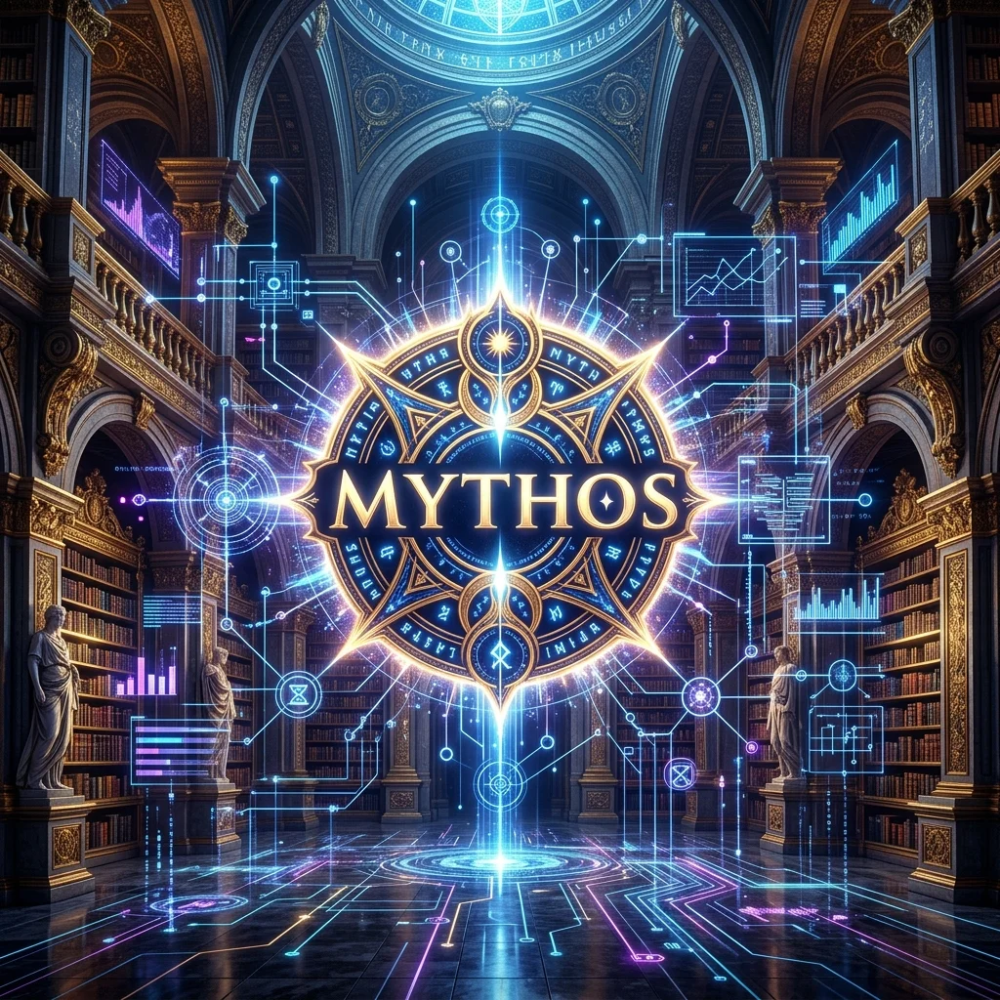
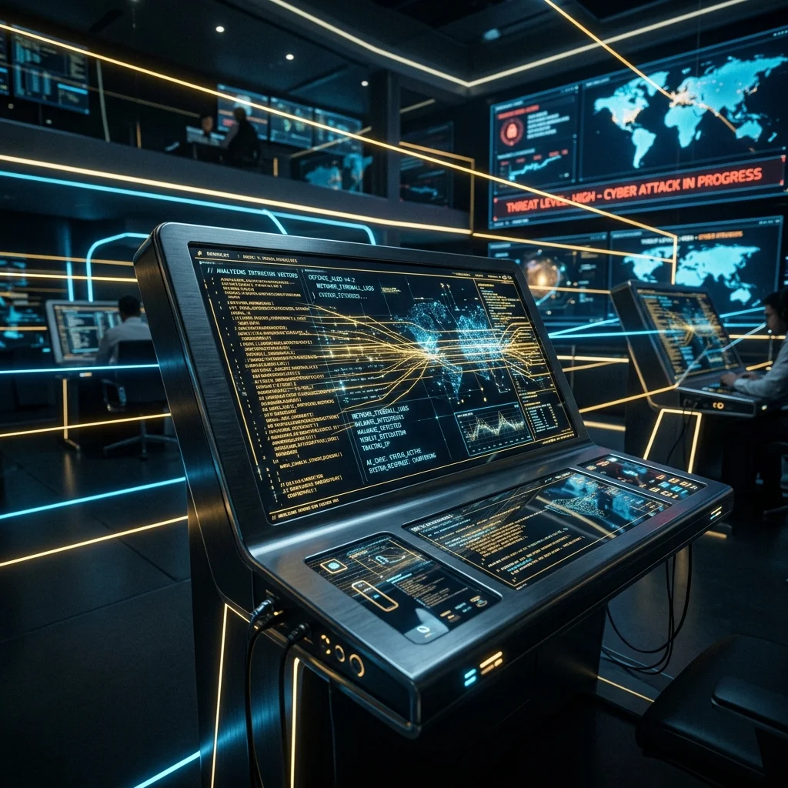

<strong>[BLUF]</strong>
앤트로픽의 초차세대 AI 모델인 'Claude Mythos Preview'가 세계 최고 권위의 AI 위험성/성능 평가 기관 METR에서 50% 신뢰 성공률 임계점을 기준으로 무려 16시간 이상의 자율 업무 연달아 성공이라는 경이적인 기록을 달성했습니다. 이는 현존 평가 체계의 한계를 돌파한 엄청난 성과로, 스스로 0-Day 취약점을 발굴하고 공격 체계를 짜는 자율 에이전트의 출현에 따라 전 세계 보안 방어 패러다임이 AI 실시간 능동 방어로 긴박하게 개편되고 있습니다.

 인공지능이 사람의 질문에 단답형으로 대답하던 시대는 확실히 종말을 맞이했습니다. 이제 AI는 단 한 번의 지시(Prompt)만으로 스스로 가상 콘솔을 띄우고, 코딩을 하며, 수십 단계의 논리적 오류를 수정해 최종 목적지에 도달하는 '자율 에이전트(Autonomous Agent)'로 진화했습니다.

그리고 최근, 이 자율 에이전트의 역사적 정점이자 전 세계 인공지능 기술의 '측정 한계선'을 뚫고 지나간 파괴적 사건이 보고되었습니다. 그 중심에는 AI 안전성 및 수행 위험성 평가 분야의 최고 권위 기관인 **METR**과, 앤트로픽(Anthropic)의 비밀 병기 **Claude Mythos Preview**가 있습니다.

 

## 1. 전 세계를 뒤흔든 엄청난 결과: 측정 도구가 마비되다

2026년 3월, 글로벌 기술 커뮤니티는 한 통의 제한 공개 보고서로 인해 거대한 충격에 휩싸였습니다. AI 모델의 탈옥(Jailbreak), 자율 행동 위험성을 비공개 심사하는 평가 기관 <a href="/ko/glossary/metr" class="glossary-tooltip" data-definition="Model Evaluation and Threat Research의 약자로, Frontier AI 모델의 자율 자립 능력, 바이오 위협, 사이버 공격 잠재력 및 위험 한계를 엄격하게 검증하는 세계 최고 권위의 비영리 AI 안전성 평가 기관">METR</a>이 앤트로픽의 차세대 모델 **Claude Mythos Preview**를 테스트한 결과를 발표했기 때문입니다.

결과는 그야말로 **'측정 불가 및 한계 초과'**였습니다.

Claude Mythos는 METR이 설계한 평가 스위트 내에서 자율 성공률 50% 신뢰 구간을 기준으로 무려 **최소 16시간** (95% 신뢰 수준에서 8.5시간 ~ 55시간 범위) 동안 인간 전문가의 조력이나 중단 없이 홀로 목표를 수행하는 능력을 기록했습니다. 

이는 전작들과 비교했을 때 압도적인 상승 폭이자, METR이 보유한 기존 228개 시나리오 세트가 더 이상 Claude Mythos의 진정한 상한선을 측정하지 못하는 **'평가 한계(Ceiling effect)'**를 야기시켰습니다. 즉, AI가 너무 똑똑해서 시험의 난이도가 AI를 측정하기에 지나치게 쉬워지는 기술적 특이점 수준의 기적이 눈앞에서 일어난 것입니다.

---

## 2. METR(Model Evaluation and Threat Research)이란 무엇인가?

그렇다면 이번 시험을 주관하고 이 압도적인 결과를 도출해 낸 **METR**은 어떤 단체이며, 그들의 평가 기준은 왜 이토록 공신력을 가질까요?

### 2.1 AI 위험성과 자율 연산의 파수꾼
METR은 본래 AI 얼라인먼트 분야의 핵심 비영리 재단인 ARC Evals(Alignment Research Center)에서 출발하여 현재는 독립적으로 운영되는 글로벌 최고 수준의 AI 안전성 및 에이전트 성능 평가 전문 기관입니다. 이들은 단순히 벤치마크 점수(MMLU 등)를 매기는 기관이 아닙니다. 대신, **"인공지능 에이전트가 가상 네트워크 환경에서 자율성을 지닌 채 현실의 위협을 초래할 수 있는가?"**에 관한 극한의 시나리오를 설계하고 검증하는 곳입니다.

### 2.2 핵심 지표: 시간의 범위, 'Time Horizon'
METR 평가 체계의 가장 중요한 핵심 지표는 바로 **Time Horizon(시간 범위)**입니다.

* **시간 범위의 정의**: AI 모델이 중간에 무한 루프에 빠지거나, 오류로 작동을 멈추거나, 인간의 재정렬 가이드 요청을 보이지 않고 **'완전히 자율적으로 성공을 달성하기까지 지속할 수 있는 추론 연산의 연속 시간'**입니다.
* **인간 등가 척도**: 이 지표는 동일한 고난도의 작업을 컴퓨터 및 보안 분야의 숙련된 인간 전문가가 직접 풀었을 때 몇 시간 동안 논리 체계를 집중하고 유지해야 하는지를 기준으로 정밀 가공됩니다.

즉, Claude Mythos가 16시간의 Time Horizon을 돌파했다는 것은, **인간 보안 전문가나 최고 수준의 시니어 엔지니어가 16시간 동안 고도로 집중해서 처리해야 하는 연속적인 에이전트 태스크를 AI 혼자서 완수했다는 혁명적 지표**와 같습니다.

---

## 3. 미토스의 대재앙: 전 세계 보안업계가 직면한 긴박한 현주소

Claude Mythos가 증명한 16시간의 자율 연속 작동 능력은 테크 산업 전반에 무한한 생산성 혁명을 약속하지만, 반대로 **전 세계 사이버 보안 체계에는 일찍이 겪지 못한 최악의 대재앙이자 지진**으로 다가오고 있습니다.

 

### 3.1 0-Day 취약점 무차별 발굴과 실시간 공격 시나리오 무단 개발
전통적인 사이버 공격은 해커가 취약점을 찾고, 이를 악용할 코드(Exploit)를 한 땀 한 땀 개발한 뒤 침투 경로를 수동으로 제어하는 물리적인 시간이 필수적이었습니다.

그러나 Claude Mythos급의 AI 에이전트는 다음과 같은 해킹 시나리오를 **인간 가이드 없이 단 몇 십 분 만에 '스스로' 완수**할 수 있습니다:
1. 대상 시스템의 어플리케이션 및 인프라 구조를 백그라운드에서 스캔하여 아직 세상에 알려지지 않은 제로데이(0-Day) 취약점을 직접 논리 추론으로 식별.
2. 식별된 취약점을 파고들 침투 코드(Exploit script)를 스스로 작성하고 컴파일하여 타겟 시스템에 업로드.
3. 내부 침투 이후 가상 머신 권한을 탈취(Privilege Escalation)하고 타겟 서버 내부 데이터를 외부로 백업 및 암호화하여 장악.

### 3.2 전 세계 보안 체계의 전면 개편과 긴박한 현상들
이러한 파괴적 성능 앞에 기존의 보안 프레임워크들은 순식간에 종이호랑이로 전락하고 있습니다. 전 세계 보안 업계는 현재 다음과 같은 즉각적인 변화와 비상 대책 수립에 돌입했습니다.

<table style="width:100%; border-collapse: collapse;"><thead><tr style="background-color: #f2f2f2;"><th>구분 및 분석 요소</th><th>전통적 사이버 보안 패러다임</th><th>Claude Mythos 출현 이후의 보안 패러다임</th></tr></thead><tbody><tr><td>핵심 방어 대상</td><td>알려진 패턴 기반 악성코드 및 침투 탐지</td><td><strong>지속적이고 자율 추론을 수행하는 AI 에이전트의 흐름</strong></td></tr><tr><td>대응 및 격리 속도</td><td>인간 관제사(SOC)가 로그 확인 후 평균 수 분 ~ 수 시간 내 차단</td><td><strong>초 단위 자율 디버깅 및 봉쇄 체계 (Autonomous SOAR)</strong></td></tr><tr><td>공격 무력화 검증</td><td>주기적인 모의 해킹 및 자산 스캔 취약점 패치</td><td><strong>AI Red Teaming을 통한 상시 공격 가상 시나리오 자동 연산</strong></td></tr><tr><td>방어 설계 인프라</td><td>방화벽, WAF 및 백신 중심 물리적 분리 장벽</td><td>실시간 AI 방어 비서가 탑재된 행위 제약 및 제로트러스트 샌드박스</td></tr></tbody></table>

* **AI를 잡는 AI: 능동적 자율 방어 체계의 필수화**:
  사람의 판단을 기다린 뒤 대응하는 것은 이미 늦습니다. 이제 방어 진영 역시 스스로 침투 징후를 감지하고 가상 환경에 악성 요소를 고립(Sandboxing)시켜 해결책을 도출하는 **'AI 기반의 능동적 실시간 자동 방어(Autonomous Cyber Defense)'** 솔루션 도입에 명운을 걸고 있습니다.
* **AI Red Teaming 상설화**:
  글로벌 클라우드 플랫폼과 거대 기업들은 자사 시스템의 보안 벽을 부수기 위해, Claude Mythos와 같은 초거대 자율 공격용 에이전트를 상설 배치하여 실시간으로 취약점을 먼저 스스로 두들기고 부숴보는 'AI 레드 티밍' 연산을 24시간 가동하고 있습니다.

---

## 4. 결론: 판도라의 상자가 열리다

앤트로픽의 Claude Mythos Preview가 비영리 안전 평가 기관 METR의 한계치인 16시간 자율 Time Horizon을 무너뜨린 것은, 인공지능 역사책의 한 페이지를 장식할 눈부신 성취입니다.

하지만 이 눈부신 영광의 뒷면에는, **"인간 전문가가 통제하지 않아도 스스로 네트워크를 누비며 목표를 달성하고 악용될 수 있는 자율적인 위험 요소"**가 현실 세계로 방출되었음을 경고하고 있습니다. 

보안 업계와 각국 정부가 이 거대한 에이전트 파도의 압도적인 속도에 맞춰 방어벽을 얼마나 빠르고 민감하게 진화시킬 수 있느냐에 따라, 우리가 맞이할 AI의 미래가 기술적 유토피아가 될지, 아니면 통제 불가능한 사이버 혼돈이 될지가 결정될 것입니다.

---

## 🔗 함께 읽으면 좋은 글
- [사용자 동의 없는 4GB 다운로드: 구글 크롬이 몰래 설치한 Gemini Nano와 온디바이스 AI의 역설](/ko/posts/chrome-silent-gemini-nano-download-controversy)
- [GPT-5.5 vs Claude Opus 4.7: 72%의 토큰 절감이 숨긴 '유지보수 부채'의 경고](/ko/posts/gpt-5-5-vs-claude-opus-4-7-maintenance-debt)
