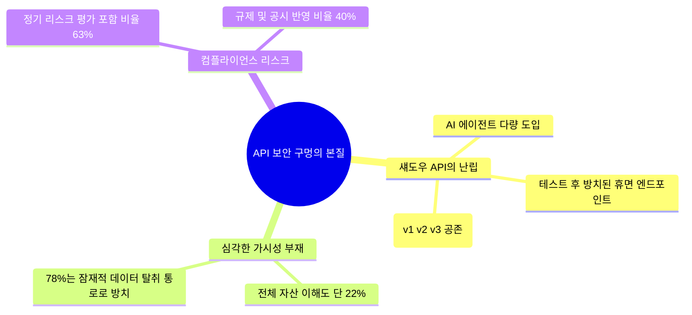
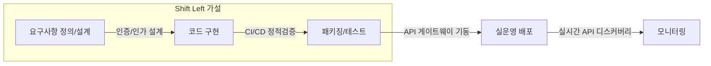

<strong>[BLUF]</strong>
글로벌 네트워크 보안 기업 아카마이(Akamai)의 '2026 API 보안 영향 연구 아태 에디션' 결과에 따르면, 아시아태평양 지역 기업의 무려 81%가 최근 1년 내 API 보안 사고를 겪었으며, 사고당 피해 비용은 평균 100만 달러(한화 약 13억 원)를 돌파했습니다. 급격한 AI 애플리케이션 및 거대언어모델(LLM) 에이전트 확산 속에서 방치된 수많은 '섀도우 API'가 기업의 데이터 주권을 위협하고 있습니다. 위기의 원인과 이를 격파할 차세대 보안 프레임워크를 정밀 해부합니다.

 기업의 서비스 아키텍처가 마이크로서비스(MSA)와 오픈 플랫폼으로 고도화되고, 특히 생성형 AI(Generative AI)가 기업 비즈니스의 핵심 심장부로 빠르게 이식되면서 전 세계 데이터 트래픽의 모세혈관 역할을 수행하는 <strong>API(Application Programming Interface)</strong>의 밀도가 상상을 초월할 정도로 치솟았습니다.

하지만 데이터 소통의 고속도로인 이 API들이, 지금 기업의 보안 성벽을 일순간에 무너뜨리는 가공할 만한 <strong>'아킬레스건'</strong>으로 변모하고 있습니다.

최근 보안 거두 아카마이(Akamai)가 아태 지역 보안 핵심 의사결정자들을 대상으로 전수 조사하여 도출한 리포트는 매우 충격적입니다. 무려 <strong>81%의 기업이 이미 API 탈취나 유출 사고를 경험</strong>했으며, 단 한 번의 사고로 지불해야 하는 청구서가 평균 <strong>100만 달러(한화 약 13억 5천만 원)</strong>를 넘어섰다는 경고음입니다. 

AI 도입의 화려한 그늘 아래 가려진 API 보안 공백의 실태와 이를 아키텍처 수준에서 극복할 실전 마스터 플랜을 심층 분석합니다.

## 01. 폭발하는 피해 규모: 숫자로 직시하는 아태 API 보안 위기

아카마이가 고시한 정밀 서베이 결과는 일시적인 경고 수준을 넘어, 엔터프라이즈 아키텍처의 암호 체계와 인프라 전반에 즉각적인 비상 경계령을 강제합니다.

* <strong>81%의 압도적 사고 노출율:</strong> 지난 12개월간 중국, 인도, 일본, 싱가포르 등 아태 지역 주요 국가의 응답 기업 중 무려 <strong>81%가 최소 1건 이상의 심각한 API 유출 및 보안 사고</strong>를 겪었습니다.
* <strong>피해 금액 2배 폭증 ($1M+):</strong> 사고 1건당 평균 추정 수습 비용이 작년 <strong>58만 달러</strong>에서 올해 <strong>100만 달러 이상</strong>으로 약 2배 폭증했습니다. 이는 API를 통한 데이터 유출 시 기업이 직면하는 사후 복구 비용, 서비스 중단 여파, 규제 위반 벌금 및 신뢰 훼손 손실이 상상을 초월하는 수준으로 구체화되고 있음을 반증합니다.
* <strong>AI API 집중 표적화 (43%):</strong> 가장 치명적인 공격 표적은 단순 레거시 데이터 송수신이 아닌, 애플리케이션에 내장된 <strong>AI 에이전트 및 거대언어모델(LLM) 연동형 API</strong>였습니다. 응답자의 43%가 이 구간에 대한 집중적인 인젝션 및 데이터 하이재킹 공격을 받았다고 증언했습니다.

---

## 02. 가시성 22%의 사각지대: "보이지 않는 장벽은 방어할 수 없다"

가장 위험한 사실은 해커들의 침투력이 아니라, <strong>'우리 전산망 내부에서 돌아가는 API가 총 몇 개이고, 그 중 민감 정보를 다루는 라우팅이 어느 것인지 아는 기업이 단 22%에 불과하다'</strong>는 아키텍처적 무방비 상태에 있습니다.

기업들은 개발 속도 경쟁에 쫓겨 새로운 AI 모듈을 신속히 배포하는 데 급급한 나머지, 이로 인해 파생되는 API 엔드포인트를 명확히 명세화하거나 중앙 관리 인벤토리에 수록하지 않고 있습니다. 이렇게 방치된 <strong>섀도우 API(Shadow API)</strong>와 <strong>레거시/휴면 API</strong>는 해커들에게 아무런 탐지 알람 없이 내부 기밀 가상 DB로 통과할 수 있는 프리패스 백도어로 유용됩니다.

---

## 03. 동상이몽: C-Level의 낙관론 vs 실무 보안의 절망

리포트가 지목한 또 다른 흥미로운 위협 지표는 <strong>'보안 인식의 양극화 장벽'</strong>입니다.

* <strong>경영진(C-Level)의 낙관론 (56%):</strong> 조직 내부의 고위 의사결정자 중 56%는 "우리의 AI 및 API 연동 인프라는 위협에 완벽히 대비되어 있다"라고 믿고 있었습니다.
* <strong>현업 보안팀의 경고 (44%):</strong> 반면, 실제로 소스코드를 감시하고 엔드포인트 방어막을 구축하는 어플리케이션 보안 실무 조직은 단 44%만이 충분히 준비되어 있다고 답했습니다.

이러한 <strong>12%p의 보안 인식 괴리</strong>는 고위 경영진이 컴플라이언스 체크리스트 통과나 보안 솔루션 계약 체결이라는 표면적 외형 지표만 보고 조직이 안전하다고 판단하기 때문에 발생합니다. 

반면 실무진은 하루에도 수백 번 가동되는 CI/CD 배포 파이프라인에서 개발자들이 임의로 뚫어놓은 API 엔드포인트와 인가 검증이 누락된 AI 토큰들이 실시간으로 유출 위험을 뿜어내고 있음을 온몸으로 체감하고 있어, 의사결정 구조의 대대적인 정비가 시급한 시점입니다.

---

## 04. 무너지는 규제 방벽: 다가오는 AI 컴플라이언스 폭풍

과거의 API 유출은 단순히 시스템 복구 수준에서 마무리될 수 있었지만, 유럽 연합의 AI 법안(EU AI Act)과 한·미·일의 개인정보 거버넌스 규제가 대폭 강화된 현 시점에는 <strong>기업의 영구 퇴출을 초래할 컴플라이언스 시한폭탄</strong>이 되었습니다.

아카마이 조사 결과, 컴플라이언스 체계에 API를 명시한다고 답하면서도 정작 <strong>정기 리스크 평가 범위 내에 API를 올리는 비율은 63%</strong>에 머물렀으며, 규제 당국 보고 및 대외 공시 체계에 반영하는 비중은 단 <strong>40%</strong>로 처참하게 무너져 있었습니다. 

내가 알지 못하는 API 엔드포인트를 통해 고객의 주민등록번호나 민감 AI 대화 데이터가 1건이라도 유출되는 순간, 기업은 규제 당국으로부터 '고의적인 거버넌스 방치' 혐의로 매출액의 수 %에 달하는 천문학적인 벌금 처분을 받게 됩니다.

---

## 05. 섀도우를 걷어내는 아태 엔터프라이즈 3대 보안 마스터 플랜

위기를 극복하고 강력한 데이터 주권을 수호하기 위해, 인프라 보안 설계에 지금 당장 이식해야 할 3대 기술 아키텍처 대책을 선언합니다.

### ① 실시간 API 디스커버리(Discovery) 자동화 도입
문서화된 엑셀 대장이나 수동 수집에 기반한 API 관리는 오늘 당장 폐기해야 합니다. 전체 네트워크 게이트웨이 및 미들웨어 트래픽을 실시간으로 디코딩하여, 시스템이 자동으로 새로운 엔드포인트의 등장을 실시간 포착하고 리스크 등급을 판정하여 인벤토리에 동기화하는 <strong>'지속적 API 디스커버리 엔진'</strong> 탑재가 첫 단추입니다.

### ② 개발 생애주기 전반으로의 '시프트 레프트(Shift Left)' 전격 실행
보안은 배포 전날 수행하는 모의해킹 단계에서 끝나는 겉치레가 아닙니다. 코드 기획 및 빌드 아키텍처 구성 초기 단계부터 개발자가 정의한 OpenAPI 스펙(OAS)을 파이프라인에서 실시간 자동 유효성 검증(Validation)하고, 권한 제어(OAuth 2.0 / JWT) 인증 로직 누출 여부를 정적 분석 도구(SAST/DAST)로 필터링하는 <strong>'보안의 조기 주입(Shift Left)'</strong> 체계를 CI/CD 프로세스 전 가설에 강제 안착시켜야 합니다.

### ③ API 보호(WAAP)와 차세대 데이터 세그멘테이션 연동
웹 어플리케이션 방화벽(WAF) 수준의 전통적인 탐지 패턴을 과감히 넘어, API 동작 패턴의 머신러닝 분석을 병행하는 <strong>WAAP(Web Application and API Protection)</strong> 솔루션을 기동해야 합니다. 

특히 특정 API 엔드포인트가 비정상적으로 대량의 LLM 임베딩 데이터를 조회하거나 특정 IP 구간으로 벌크 유출을 시도할 경우, 시스템이 즉각 세션을 차단하고 전산 노드를 격리하는 제로 트러스트 세그멘테이션 기법을 적용해야만 다가올 AI 보안 대혼란 세대 속에서 비즈니스 영토를 안전하게 영속 보존해 낼 수 있습니다.

---

## 🔗 함께 읽으면 좋은 글
- [Zero Trust 역설: NIST 800-207로 바라본 지속적 검증과 엔터프라이즈의 보안 탄력성](/ko/posts/zero-trust-paradox-nist-800-207-cyber-resilience)
- [양자 대재앙(Y2Q)과 HNDL 위협: 차세대 보안 혁신을 이끌 양자보안(QKD vs PQC) 완벽 기술 해부](/ko/posts/quantum-apocalypse-pqc-qkd-guide)
