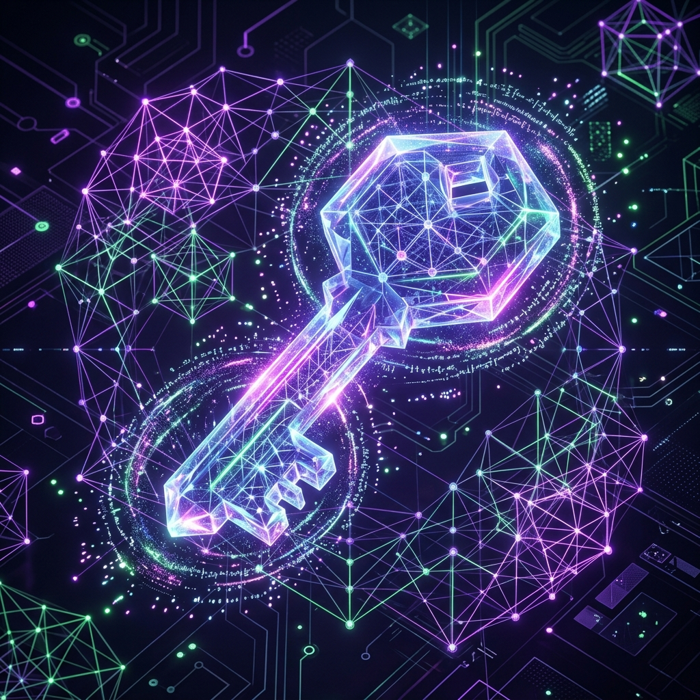
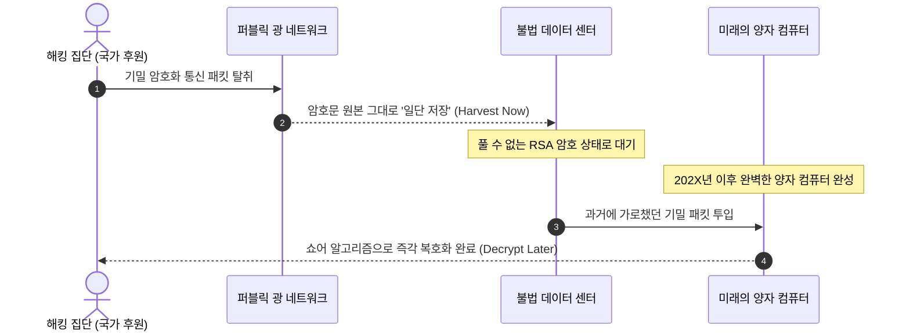

<strong>[BLUF]</strong>
수학적 소인수분해 난해함에 기대어 온 현대 공개키 암호체계(RSA, ECC)는 양자 컴퓨터의 '쇼어 알고리즘(Shor’s Algorithm)' 연산력 앞에 완전한 붕괴 위기를 맞이하고 있습니다. 보안 업계는 이를 'Y2Q'라 명명하며, 지금 데이터를 가로채 미래에 해독하는 'HNDL' 공격에 대응하고자 양자키분배(QKD)와 양자내성암호(PQC)라는 투트랙 양자보안 인프라 구축을 서두르고 있습니다. 물리학과 첨단 수학 격자 이론이 융합되는 차세대 방어막의 아키텍처를 세밀하게 분석합니다.

 우리가 매일 사용하는 모바일 뱅킹 결제, 기밀 기업 메신저, 군사 전술 데이터 링크 등 현대 모든 디지털 주권과 프라이버시를 지탱하는 보이지 않는 강철 성벽이 있습니다. 바로 <strong>공개키 암호체계(PKI)</strong>입니다. 

하지만 인류가 수억 년의 수학 계산 장벽으로 구축해 놓은 이 성벽을 단 몇 초 만에 무력화시킬 수 있는 절대적인 '창'이 다가오고 있습니다. 물리적 한계를 뛰어넘어 병렬 연산을 가동하는 <strong>양자 컴퓨터(Quantum Computer)</strong>가 바로 그 주인공입니다. 

이 거대한 기술적 지각변동을 마주하며, IT 인프라 아키텍처와 사이버 보안 리더들은 기존 암호 설계를 통째로 갈아엎어야 하는 역사상 가장 거대한 전환기인 <strong>'양자보안(Quantum Security)'</strong> 패러다임에 진입하고 있습니다. 왜 우리의 기존 인프라가 무너질 수밖에 없는지, 그리고 QKD와 PQC가 구축하는 이중 방어막의 정체는 무엇인지 입체적으로 해부해 드립니다.

## 01. 무너지는 소인수분해 장벽: Y2Q와 암호 대재앙

현재 전 세계 자금줄과 국가 일급 기밀 데이터를 봉인하고 있는 대표적인 알고리즘은 <strong>RSA</strong>와 <strong>ECC(타원곡선암호)</strong>입니다. 이 알고리즘들의 보안성은 "일반 컴퓨터로는 수백 자릿수의 두 소수를 곱한 결과값을 다시 역산(소인수분해)하여 알아내는 데 우주 나이에 준하는 막대한 수억 년의 시간이 걸린다"는 연산 복잡도 법칙에 의존합니다.

하지만 양자 컴퓨터는 비트(Bit: 0 또는 1) 단위로 연산하는 클래식 컴퓨팅과 달리, 양자의 고유 성질인 <strong>중첩(Superposition)</strong>과 <strong>얽힘(Entanglement)</strong>을 이용해 큐비트(Qubit) 단위로 데이터를 처리합니다. 

이러한 양자 중첩 상태에서 수학자 피터 쇼어(Peter Shor)가 개발한 <strong>쇼어 알고리즘(Shor's Algorithm)</strong>을 구동할 경우, 소인수분해와 이산대수 방정식의 정답을 평행 우주 전체에서 동시에 뒤져 찾아내듯 단 몇 초 만에 도출해 버릴 수 있습니다.

보안 학계와 군사 정보계는 양자 컴퓨터가 범용 암호를 무력화할 수 있는 임계 도달 시점을 <strong>Y2Q(Year to Quantum)</strong> 혹은 <strong>양자 대재앙(Quantum Apocalypse)</strong>이라 일컬으며 경종을 울리고 있습니다.

---

## 02. HNDL 위협: "지금 가로채고 미래에 해독하라"

일부 경영진과 실무자들은 "아직 쓸 만한 완벽한 큐비트를 갖춘 상용 양자 컴퓨터가 등장하려면 수년 이상 남았는데, 왜 벌써 수십억 원을 들여 인프라를 개편해야 하느냐?"라는 의문을 제기합니다.

이러한 안일함을 무자비하게 깨부수는 위협 시나리오가 바로 <strong>HNDL(Harvest Now, Decrypt Later: 지금 수확하고 나중에 해독하라)</strong> 공격입니다.

적대 국가나 글로벌 해커 집단은 지금 당장 복호화할 수 없는 국가 일급 군사 통신, 원자력 발전소 가설 정보, 기업의 핵심 특허 설계도, 고객의 평생 의료 정보 패킷을 백본 통신선에서 <strong>원본 그대로 통째로 가로채어 대형 서버에 조용히 수집·저장(Harvest)</strong>하고 있습니다. 

그리고 수년 뒤, 필요한 연산력을 지닌 양자 컴퓨터가 가동되는 바로 그날, 과거에 받아 두었던 데이터 패키지를 집어넣어 <strong>전부 한순간에 해독(Decrypt)</strong>해 버리는 작전을 실행 중입니다. 

오늘 흘러나간 암호문은 미래의 시점에 유효기간 없이 소급 노출되므로, <strong>'양자 컴퓨터가 개발된 후 교체하는 것은 아무런 의미가 없다'</strong>는 무서운 진실이 양자보안 인프라 구축의 가장 큰 기폭제가 되고 있습니다.

---

## 03. 양자보안의 두 가지 핵심 방어엔진 기술 해부

양자 컴퓨터라는 전무후무한 '절대 공격 무기'에 맞서 인류가 구축하고 있는 차세대 방어 메커니즘은 본질적인 아키텍처에 따라 물리적 방어선인 <strong>QKD</strong>와 수학적 방어선인 <strong>PQC</strong>로 완벽하게 나뉩니다.

### ① 양자키분배 (QKD, Quantum Key Distribution)

QKD는 어떤 수학적 알고리즘도 쓰지 않고, 순수한 <strong>'양자물리학 법칙'</strong> 자체를 가설 장벽으로 사용하는 하드웨어 기반의 물리가설 기술입니다.

* <strong>동작 원리:</strong> 송신자(Alice)와 수신자(Bob)가 기밀 데이터를 암호화할 '대칭 비밀키'를 나눌 때, 이 정보를 아주 미세한 빛의 알갱이인 단일 <strong>광자(Photon)</strong>의 편광 상태에 실어 보냅니다.
* <strong>복제 불가능성과 하이젠베르크의 측정 법칙:</strong> quantum 역학의 불확정성 원리에 따라, 제3의 중간 도청자(Eve)가 광케이블 중간에 탭을 대어 이 광자 정보를 관측하거나 가로채 복제(Cloning)를 시도하는 순간, 광자의 스핀과 편광 상태가 완벽하게 변형 및 파괴됩니다.
* <strong>보안적 우위:</strong> 송수신자는 광자의 수신 신호 왜곡율(QBER, Quantum Bit Error Rate)을 실시간으로 계산하여 중간 도청 유입 시도를 즉각 감지하고 해당 유출 키를 미련 없이 영구 폐기합니다. 이론적으로 수학적 난이도와 무관하게 <strong>우주가 멸망할 때까지 무적의 도청률 0%를 자랑하는 궁극의 물리 암호망</strong>입니다.

### ② 양자내성암호 (PQC, Post-Quantum Cryptography)

PQC는 기존의 클래식 컴퓨터 인프라와 현재 사용 중인 광대역 퍼블릭 인터넷 망을 고스란히 온존하면서, 연산 방식의 설계를 바꿔 양자 컴퓨터도 절대 해결할 수 없는 <strong>차원이 다른 복잡한 수학 퍼즐</strong>을 끼워 넣는 소프트웨어 알고리즘 혁신입니다.

* <strong>동작 원리 (격자 기반 암호 - Lattice-based Cryptography):</strong> 기존 RSA가 2차원 평면의 정수론을 썼다면, PQC의 주류인 격자 기반 암호는 수만 차원의 초고차원 벡터 공간 내에서 '가장 가까운 무작위 격자점(LVP, Nearest Vector Problem)'을 찾아내는 다차원 기하학 미로를 활용합니다. 이 미로는 양자 컴퓨터가 병렬 연산을 무제한 돌리더라도 수학적으로 우회 연산 루트를 뚫어낼 수 없는 절대 난이도의 구조입니다.
* <strong>표준의 표준 (NIST ML-KEM & ML-DSA):</strong> 전 세계의 표준 암호 규격을 통제하는 미국 NIST(국립표준기술연구소)는 수년간의 글로벌 서바이벌 공모전을 거쳐 최종 양자내성 표준 알고리즘들을 명문화 고시했습니다:
  * <strong>ML-KEM (과거 명칭: Kyber):</strong> 격자 수학을 활용한 고속 패킷 키 교환 메커니즘의 표준.
  * <strong>ML-DSA (과거 명칭: Dilithium):</strong> 인증 및 전자 서명 시스템 표준.
  * <strong>SLH-DSA (과거 명칭: SPHINCS+):</strong> 해시 함수 트리 구조를 극대화해 격자 이론이 무너질 차선책 보안까지 확보한 백업 표준 서명.

---

## 04. QKD vs PQC 일목요연 기술 대조 가이드

각 인프라의 아키텍처 특성과 비용, 구축 복잡도에 따라 기업의 선택지가 확실하게 나뉩니다.

<table>
  <thead>
    <tr>
      <th>평가 비교 지표</th>
      <th>🛡️ 양자키분배 (QKD)</th>
      <th>🔑 양자내성암호 (PQC)</th>
    </tr>
  </thead>
  <tbody>
    <tr>
      <td>보안의 본질적 원천</td>
      <td><strong>물리학 법칙</strong> (광자 불확정성)</td>
      <td><strong>수학적 난이도</strong> (초고차원 격자 행렬)</td>
    </tr>
    <tr>
      <td>필수 요구 인프라</td>
      <td><strong>전용 광수신기, 고가 양자 소자 칩셋, 다이렉트 전용 광케이블 단독망</strong></td>
      <td><strong>기존 공용 인터넷 망, 기존 데이터 센터 장비, 가상 클라우드 그대로 사용</strong></td>
    </tr>
    <tr>
      <td>구축 비용 및 경제성</td>
      <td><strong>매우 높음</strong> (수억~수십억 원 대 대형 국가 통신 백본 하드웨어 개량 필요)</td>
      <td><strong>현저히 저렴함</strong> (기존 인프라 위의 패치 배포 및 알고리즘 소프트웨어 업데이트)</td>
    </tr>
    <tr>
      <td>물리적 전송 거리 장벽</td>
      <td><strong>한계 뚜렷</strong> (빛의 감쇄 현상으로 약 100~150km마다 중계기 기지 가설 필수)</td>
      <td><strong>무제한</strong> (기존 글로벌 백본망 인프라 데이터 전송 구조에 완벽 호환)</td>
    </tr>
    <tr>
      <td>주요 타겟 군</td>
      <td>군 사령부 전술 백본망, 금융 중앙 전산 허브, 하이퍼 스케일 데이터 센터 코어망</td>
      <td>웹 브라우저, 모바일 금융 앱, 자율주행 차량 통신(V2X), IoT 대량 단말기</td>
    </tr>
    <tr>
      <td>한 줄 직관 비유</td>
      <td><strong>"중간에 가로채는 즉시 불타 사라지는 마법의 광선 편지"</strong></td>
      <td><strong>"초고속 연산력을 가진 외계인도 풀지 못하게 설계된 기하학 수학 성벽"</strong></td>
    </tr>
  </tbody>
</table>

---

## 05. 하이브리드 아키텍처: 양자보안의 미래 지향점

글로벌 보안 업계의 주류 트렌드는 QKD와 PQC를 대립적인 기술로 바라보지 않고, 상호 보완적으로 밀결합하는 <strong>'하이브리드 양자 보안 아키텍처(Hybrid Quantum Security)'</strong> 방향으로 급격히 재편되고 있습니다.

* <strong>최고 권한의 고정식 핵심 전산실 망(Data Center Core)</strong>에는 물리학의 원리로 영구 불침의 보장을 가설하는 <strong>QKD 하드웨어 노드</strong>를 단단히 박아놓아 시작과 끝 노드의 패킷 도청 가능성을 물리 배제합니다.
* 동시에 수천만 대의 모바일 기기, 사물인터넷 센서, 전 세계 각지의 최종 사용자 분산 전산 포인트를 연결하는 <strong>동적 네트워크 구간(Last-Mile Edge)</strong>에는 가볍고 효율적인 <strong>PQC 격자 암호 알고리즘</strong>을 소프트웨어 주입하여, 성능 병목 없는 최고 존엄 등급의 차세대 전방위 무적 암호 가설망을 완벽히 도출해 내는 구상입니다.

실제로 이미 애플은 자사의 실시간 메신저 iMessage 프로토콜에 새로운 양자내성 암호 알고리즘인 <strong>'PQ3'</strong>을 전격 적용하여 배포했으며, 구글 크롬 또한 브라우저 내부 키 교환 프로세스에 NIST의 PQC 알고리즘 탑재를 기본 옵션화했습니다. 양자 대재앙을 향한 카운트다운은 이미 시작되었으며, 미래를 선제 정복하는 아키텍트만이 다가올 양자 세대의 안전한 주권 영토를 영속 수호해 낼 것입니다.

---

## 🔗 함께 읽으면 좋은 글
- [Cloudflare PQC 연결 갭: 양자 내성 암호 전환과 엣지 네트워크 보안의 지연 시간 트레이드오프](/ko/posts/cloudflare-pqc-connection-gap)
- [비대칭 암호화의 불완전한 신뢰성: 수학적 한계와 미래 보안 장벽 분석](/ko/posts/imperfect-trust-asymmetric-encryption)
