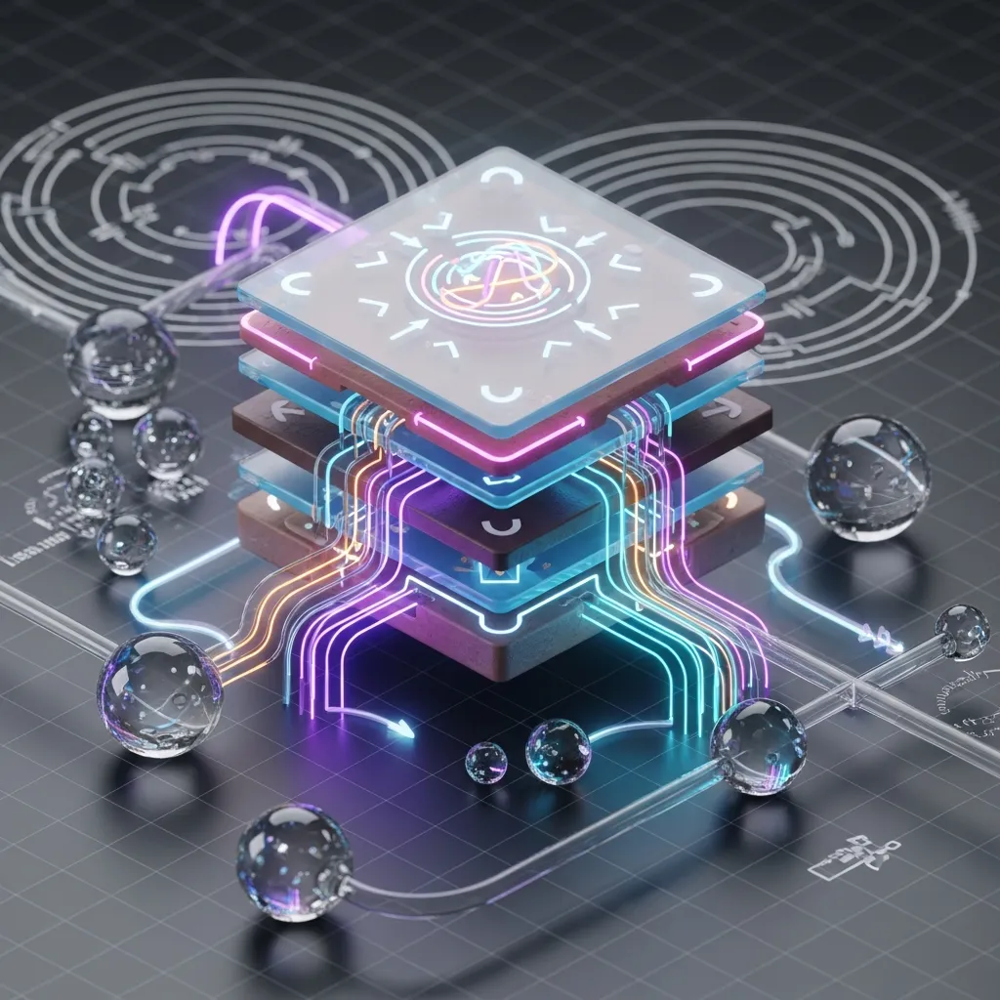
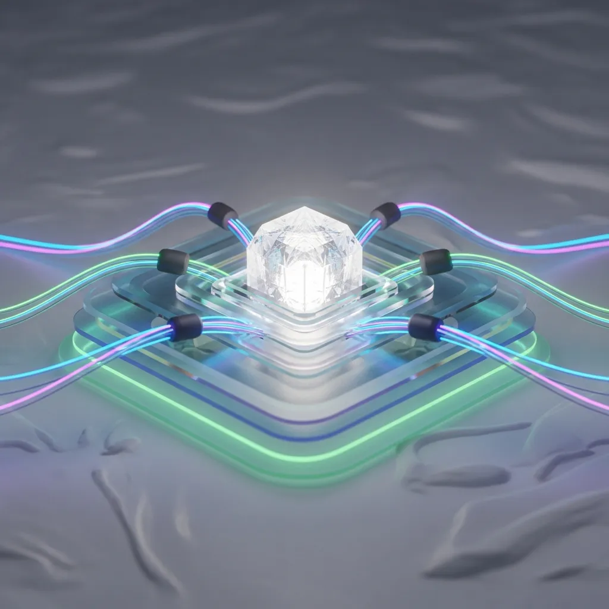

<strong>[BLUF]</strong>
역전파는 2차 세계대전의 제어 이론에서 시작된 인류의 '최적화 집착'이 낳은 기념비적 도구로, 현대 딥러닝의 핵심 학습 엔진입니다. 그러나 이 알고리즘은 '책임 배분'이라는 수학적 효율성 뒤에 '블랙박스'라는 근본적 한계를 내포하고 있습니다. 우리는 역전파의 혁신적 가치를 인정하면서도, 그 맹목적 최적화가 초래하는 논리적 타당성의 괴리를 비판적으로 성찰해야 합니다.

 2차 세계대전의 포화 속에서 레이더를 최적화하려던 인류의 집념은, 오늘날 인공지능이라는 거대한 지적 탐험의 서막을 열었습니다. '역전파(Backpropagation)'는 단순한 학습 알고리즘을 넘어, 이 최적화 집착이 낳은 기념비적 도구이자 동시에 현대 AI의 '블랙박스적 한계'를 규정하는 양날의 검으로 우리 앞에 서 있습니다. 날카로운 통찰력을 지닌 기술 역사학자의 시선으로, 이 수학적 엔진의 숨겨진 계보와 그 이면에 드리워진 그림자를 탐색해 보시죠.

## 1. 전장의 레이더에서 딥러닝까지: 역전파의 숨겨진 계보학

 역전파의 뿌리는 의외로 전장의 한가운데에서 찾을 수 있습니다. 1940년대, 2차 세계대전은 군사 작전의 효율성을 극대화하기 위한 '최적화'라는 개념에 불을 지폈고, 이는 현대 인공지능의 토대가 될 씨앗을 뿌렸습니다.

### 1.1 1940년대 <a href="/ko/glossary/optimal-control-theory" class="glossary-tooltip" data-definition="시스템을 목표 상태로 가장 효율적으로 유도하는 방법을 다루는 수학적 이론. 2차 세계대전 중 군사 작전 최적화 연구에서 시작되었다.">최적 제어 이론</a>(Optimal Control Theory)과 벨먼의 유산

 최적 제어 이론은 시스템을 가장 효율적인 방식으로 목표 상태로 이끄는 수학적 프레임워크입니다. 전장의 레이더 시스템이 적기를 가장 빠르게 탐지하고 요격하는 최적의 경로를 찾는 것에서 시작된 이 이론은, 리처드 벨먼과 레프 폰트랴긴 같은 선구자들에 의해 동적 계획법과 최대 원리로 발전하며 복잡한 다단계 의사결정 문제를 해결하는 데 결정적인 기여를 했습니다.

### 1.2 1974년 웨어보스의 고독한 발견과 1986년 힌튼의 대중화

 역전파 알고리즘 자체는 폴 웨어보스가 1974년 박사 학위 논문에서 '역방향 모드 최적화'로 개념을 정립하며 그 존재를 알렸습니다. 그러나 당시에는 시대의 흐름을 앞서간 그의 통찰이 큰 주목을 받지 못했죠. 이후 1986년, 데이비드 루멜하트와 제프리 힌튼이 <a href="/ko/glossary/multilayer-perceptron" class="glossary-tooltip" data-definition="입력층과 출력층 사이에 하나 이상의 은닉층을 포함하여 구성된 인공 신경망으로, 데이터의 복잡한 비선형 관계를 학습할 수 있는 모델입니다.">다층 퍼셉트론</a>에 이 알고리즘을 적용하며 역전파는 비로소 대중화의 길을 걷고 현대 딥러닝의 폭발적인 성장을 이끄는 결정적인 촉매제가 되었습니다.

### 1.3 왜 현대 IT 생태계는 역전파라는 '거인'의 어깨 위에 서 있는가

 현대 IT 생태계는 역전파라는 거인의 어깨 위에서 눈부신 발전을 이루었습니다. 이미지 인식, 음성 처리, 자연어 이해 등 딥러닝이 지배하는 거의 모든 분야에서 역전파는 신경망이 복잡한 패턴을 학습하고 예측 정확도를 높이는 핵심 동력으로 작용합니다. 이는 인류가 당면한 수많은 최적화 문제에 대한 강력한 해결책을 제시하며 기술 혁신을 가속화했습니다.

 

 역전파의 역사는 인류의 끊임없는 '최적화' 열망과 그 구현 과정을 명확하게 보여줍니다. 아래 표는 역전파가 걸어온 주요 이정표를 통해 그 숨겨진 계보를 한눈에 볼 수 있도록 정리했습니다.

| 연도/기간 | 인물/개념 | 주요 기여 및 의미 | 현대 AI와의 연결점 |
| :---------- | :------------------------ | :--------------------------------------------------- | :-------------------------- |
| 1940년대 | 최적 제어 이론, 작전 연구 | 2차 세계대전 중 군사 목표 최적화, 레이더 데이터 분석 | 초기 피드백 제어 시스템의 토대 |
| 1947년 | 조지 B. 단치히 | 선형 계획법(Linear Programming)의 심플렉스 알고리즘 | 최적화 문제 해결의 근본적 접근 |
| 1950년대 | 리처드 벨먼, 폰트랴긴 | 동적 계획법(Dynamic Programming), 최대 원리(Maximum Principle) | 다단계 의사결정 및 제어 이론 심화 |
| 1974년 | 폴 웨어보스 | '역방향 모드 최적화'로 역전파 개념 정립 | 심층 신경망 학습의 선구적 제안 |
| 1986년 | 힌튼, 루멜하트, 윌리엄스 | 다층 퍼셉트론에 역전파 적용 및 대중화 | 현대 딥러닝 '붐'의 결정적 촉매 |

 역전파의 역사적 맥락과 주요 사건들을 구체적으로 살펴보면 다음과 같습니다.

*   **1940년대**: 로버트 왓슨-와트는 영국에서 레이더 방향 탐지 분석을 통해 '작전 연구(Operations Research)' 분야를 개척하며 최적화 사고의 기반을 다졌습니다.
*   **1947년**: 조지 B. 단치히는 미 국방부의 기계화 노력을 지원하며 선형 계획법의 효율적인 해결책인 심플렉스 알고리즘을 발표했습니다.
*   **1950년대**: 리처드 벨먼은 RAND Corporation에서 동적 계획법(Dynamic Programming)을 개발했으며, 소련 수학자 레프 폰트랴긴은 최대 원리를 통해 제어 이론 발전에 기여했습니다.
*   **1974년**: 폴 웨어보스는 그의 박사 학위 논문에서 역동적 시스템을 위한 '역방향 모드 최적화'로서 역전파의 개념을 독자적으로 정립했으나, 당시에는 큰 주목을 받지 못했습니다.
*   **1986년**: 데이비드 루멜하트와 제프리 힌튼은 다층 신경망에 역전파 알고리즘을 적용하는 연구를 통해 이 기술을 널리 알리고 현대 딥러닝 시대의 초석을 놓았습니다.

## 2. 수치적 책임의 분배: 역전파가 '실패'를 다루는 방식

 역전파의 핵심은 '실패'를 다루는 매우 정교하고 효율적인 메커니즘에 있습니다. 신경망이 예측에 실패했을 때, 그 오차를 발생시킨 원인을 찾아내고 각 구성 요소에 책임을 배분하여 다음번에는 더 나은 예측을 할 수 있도록 학습하는 과정이죠.

### 2.1 계산 그래프(Computational Graph): 인과관계를 추적하는 수학적 지도

 신경망의 연산은 복잡한 계산 그래프로 시각화될 수 있습니다. 이 그래프는 입력부터 출력까지 데이터가 흐르는 과정을 노드와 엣지로 표현하며, 각 노드는 특정 연산을 수행하고 엣지는 데이터의 흐름을 나타냅니다. 역전파는 이 계산 그래프를 역으로 추적하며 오차가 발생한 지점을 찾아냅니다.

### 2.2 <a href="/ko/glossary/chain-rule" class="glossary-tooltip" data-definition="복합 함수의 미분을 구할 때 각 구성 함수의 미분을 곱하여 전체 함수의 변화율을 계산하는 미적분학의 기본 규칙. 역전파 알고리즘의 핵심 원리이다.">연쇄 법칙</a>(Chain Rule): 출력의 오차를 입력의 책임으로 소급하는 논리

 오차의 책임 배분은 미적분학의 '연쇄 법칙'에 기반합니다. 출력에서 발생한 오차의 기울기를 거꾸로 거슬러 올라가며, 각 계층의 가중치와 편향이 전체 오차에 얼마나 기여했는지 계산합니다. 이를 통해 마치 회사에서 프로젝트 실패의 책임을 각 팀원에게 공정하게 배분하듯, 신경망의 각 파라미터가 '얼마나 반성해야 하는지'를 수치적으로 알려주는 셈입니다.

> Backpropagation is a disciplined way of telling every parameter how much it should apologize for a mistake.

 이 인용구처럼 역전파는 각 파라미터가 실수에 대해 얼마나 '사과'해야 하는지를 규율 있는 방식으로 알려줍니다. 이는 단순한 수동적 학습이 아닌, 정교한 피드백을 통해 시스템 전체의 성능을 능동적으로 향상시키는 과정입니다.

### 2.3 '무작위 희망'을 '정교한 방향성'으로 바꾼 피드백 루프의 마법

 초기 신경망은 무작위적인 가중치에서 출발하여 사실상 '무작위 희망'에 의존했습니다. 그러나 역전파는 이 무작위적인 시도에 '정교한 방향성'을 부여하는 마법 같은 피드백 루프를 제공합니다. 오차를 줄이는 방향으로 파라미터들을 조금씩 조정함으로써, 신경망은 점차적으로 복잡한 데이터 패턴을 학습하고 예측 정확도를 놀랍도록 높여나갑니다. 이는 마치 조각가가 거친 돌에서 불필요한 부분을 깎아내며 원하는 형상을 찾아가는 과정과 유사합니다.

 

## 3. [비판적 분석] 연쇄의 덫: 역전파의 구조적 결함과 실무적 리스크

 역전파는 분명 혁신적이지만, 그 완벽함 뒤에는 구조적인 결함과 실무적인 리스크가 도사리고 있습니다. 인류의 '최적화 집착'이 낳은 기념비적 도구임에도 불구하고, 동시에 현대 AI의 블랙박스적 한계를 규정하는 양날의 검이라는 비판적 시각을 간과해서는 안 됩니다.

### 3.1 <a href="/ko/glossary/vanishing-exploding-gradient" class="glossary-tooltip" data-definition="심층 신경망 학습 시 역전파 과정에서 기울기가 너무 작아져 학습이 멈추거나(소실) 너무 커져 발산하는(폭주) 문제.">기울기 소실 및 폭주</a>(Vanishing/Exploding Gradient): 층이 깊어질수록 무너지는 신뢰도

 심층 신경망은 여러 계층을 쌓아 올린 구조를 가집니다. 역전파 과정에서 오차의 기울기가 이전 계층으로 전달될 때, 이 기울기 값이 너무 작아져 사실상 학습이 멈추거나(기울기 소실) 반대로 너무 커져서 발산해 버리는(기울기 폭주) 문제가 발생할 수 있습니다. 이는 층이 깊어질수록 신뢰도가 무너지는 주된 원인이 되며, 학습을 매우 어렵게 만듭니다.

### 3.2 블랙박스적 맹목성: 수학적 정답이 반드시 논리적 진실을 의미하지 않는 이유

 역전파는 오차를 최소화하는 방향으로 파라미터를 조정하는 순수한 수학적 최적화 과정입니다. 그러나 이 과정은 왜 특정 결정이 내려졌는지, 어떤 특징이 가장 중요하게 작용했는지에 대한 논리적 설명을 제공하지 않습니다. 즉, '블랙박스적 맹목성'을 띠며, 이는 AI가 내놓은 '수학적 정답'이 반드시 인간의 관점에서 '논리적 진실'이나 '합리적인 이유'를 의미하지 않을 수 있다는 치명적인 한계를 드러냅니다.

> 수학적 정답이 반드시 논리적 진실을 의미하지 않는 이유가 바로 역전파의 '블랙박스적 맹목성'에 있다.

 이처럼 역전파는 그저 최적의 수치를 찾아낼 뿐, 그 수치가 갖는 의미나 윤리적 타당성에 대해서는 침묵합니다. 2차 세계대전의 전장에서 시작된 레이더 최적화는 인간의 생존을 위한 '최적화 집착'을 대변합니다. 그러나 현대 AI의 심장인 역전파는 그 최적화 과정에서 '수치적 책임'을 완벽히 분배하더라도, 생물학적 뇌가 가지는 '시공간적 지역성(spatio-temporal locality)'의 한계와 '논리적 타당성'의 괴리를 간과하며 '왜'라는 질문이 거세된 블랙박스를 만들고 있습니다. 이는 단순히 알고리즘의 한계를 넘어, 정보의 국소성과 전역성 사이에서 인간의 지적 탐구와 기계적 효율성이 충돌하는 지점을 명확히 보여주는 대목입니다.

### 3.3 기계적 최적화의 한계: '왜'라는 질문이 거세된 AI의 지적 한계

 결국, 역전파 기반 AI는 주어진 목표 함수를 최적화하는 데는 탁월하지만, 그 최적화 과정에서 '왜'라는 근본적인 질문이 거세됩니다. 이는 기계적 효율성만을 추구하며 얻어진 결과가 때로는 예측 불가능하거나 비합리적인 결정을 초래할 수 있음을 의미합니다. 진정한 지능이라면 단순히 '무엇'을 해야 할지 아는 것을 넘어, '왜' 그렇게 해야 하는지에 대한 이해와 설명 능력을 갖추어야 합니다. 역전파는 이 지점에서 현대 AI의 지적 한계를 여실히 드러냅니다.

## 4. 포스트 역전파 시대를 향하여: 생물학적 뇌에서 찾는 새로운 단서

 역전파의 한계를 인식하면서, 연구자들은 생물학적 뇌에서 새로운 학습 패러다임의 단서를 찾고 있습니다. 인간의 뇌는 역전파와 같은 전역적인 오차 신호를 사용하지 않고도 놀라운 학습 능력을 보여주기 때문입니다.

### 4.1 국소적 학습(Local Plasticity)과 GLE 프레임워크의 가능성

 생물학적 신경망은 각 뉴런이 자신의 국소적인 환경(인접한 뉴런들과의 연결)에서 정보를 기반으로 학습 규칙을 업데이트하는 '국소적 학습' 메커니즘을 주로 사용합니다. 이는 역전파가 전체 신경망에 걸쳐 오차 신호를 전파하는 방식과 대조됩니다. 'GLE(Global-Local Error)'와 같은 프레임워크는 이러한 국소적 학습이 어떻게 전역적인 성능 향상으로 이어질 수 있는지 탐구하며, 역전파의 대안으로서의 가능성을 모색하고 있습니다.

### 4.2 시공간적 제약을 넘어서는 '전망적 코딩(Prospective Coding)'의 가치

 생물학적 뇌는 단순히 과거의 오차를 수정하는 것을 넘어, 미래를 예측하고 그 예측에 따라 행동을 조절하는 '전망적 코딩' 능력을 가집니다. 이는 역전파의 후향적(backward) 책임 배분 방식과는 다른, 시공간적 제약을 넘어서는 학습 메커니즘을 의미합니다. 이러한 생물학적 영감은 더욱 유연하고 자율적인 학습 시스템을 설계하는 데 중요한 통찰을 제공할 것입니다.

 

## 5. 결론: 역전파의 기념비적 가치를 인정하되, 그 맹목성을 경계하라

 역전파는 인류의 지적 도구 상자에서 가장 강력하고 기념비적인 도구 중 하나입니다. 2차 세계대전의 전장에서 시작된 최적화의 열망이 낳은 이 수학적 엔진은 현대 딥러닝 혁명의 심장이며, 수많은 기술적 기적을 가능하게 했습니다. 우리는 이 알고리즘의 혁신적 가치를 충분히 인정해야 합니다.

 그러나 우리는 동시에 역전파가 가진 '블랙박스적 맹목성'과 '수학적 최적화와 논리적 타당성의 괴리'라는 근본적인 한계를 경계해야 합니다. '왜'라는 질문이 거세된 기계적 최적화는 때로 예측 불가능하고 비합리적인 결과를 초래할 수 있습니다. 기술 역사학자로서, 우리는 이 강력한 도구가 지닌 역설을 명확히 인지하고, 단순히 효율성만을 좇는 것을 넘어 인간적 가치와 윤리적 책임감을 잃지 않는 방향으로 AI를 발전시켜야 합니다.

> 역전파는 역설이다. 인류의 최적화 집착이 낳은 기념비적 도구이지만, 동시에 현대 AI의 블랙박스적 한계를 규정하는 양날의 검이다.

 궁극적으로, 포스트 역전파 시대는 생물학적 지능의 통찰을 빌려와, 단순히 '최적'의 답을 찾는 것을 넘어 '설명 가능하고', '이해 가능한', 그리고 '책임질 수 있는' 인공지능을 향한 새로운 탐험이 될 것입니다. 이 여정에서 역전파의 공과 과를 냉철하게 분석하는 것이 우리의 중요한 첫걸음입니다.
