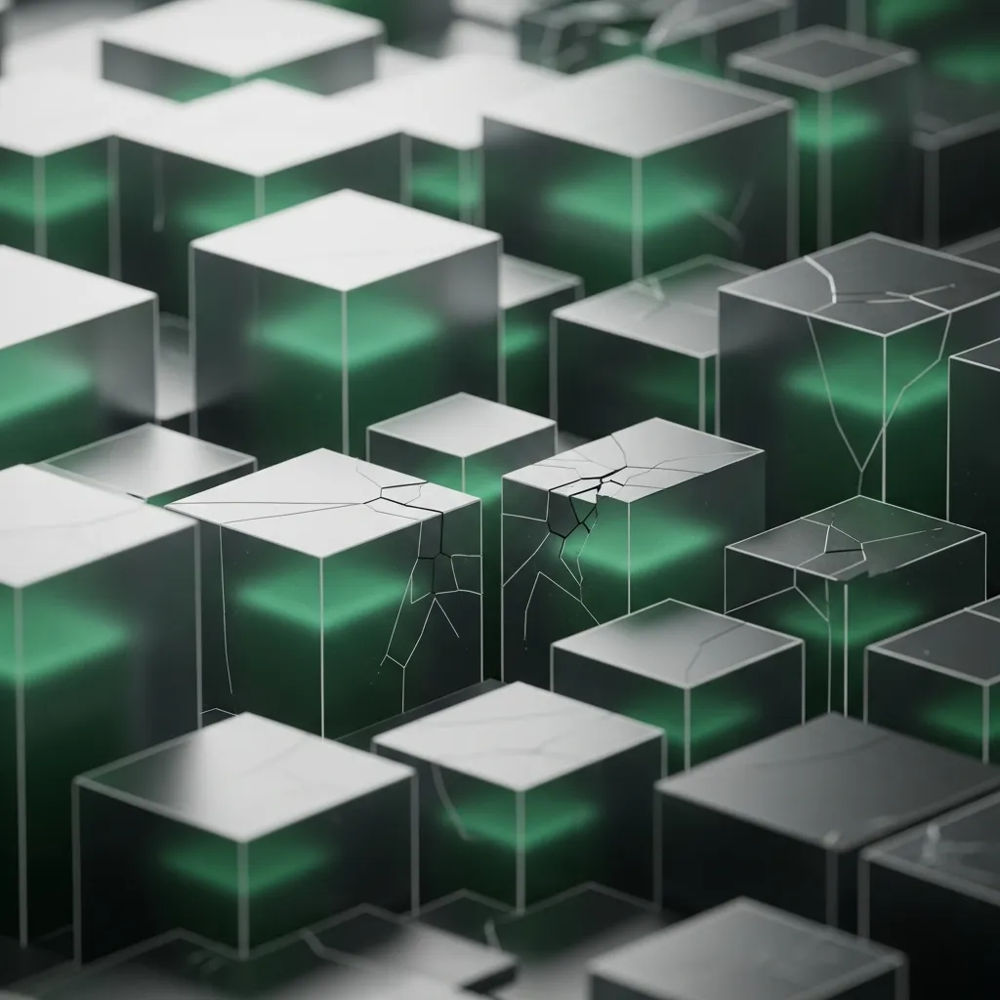

<strong>[BLUF]</strong>
컨테이너화는 배포 효율성을 혁신했으나, 호스트 커널 공유로 인한 보안 취약점과 오케스트레이션의 과잉 복잡성이라는 심각한 기술 부채를 동반합니다. 단순 도입을 넘어 공유 커널의 한계를 직시하고 하드웨어 수준의 격리 보완책을 마련하는 것이 CTO의 핵심 과제입니다.

 현대 IT 인프라의 지형도는 컨테이너라는 거대한 파도에 의해 완전히 재편되었어요. 배포의 속도와 유연성을 극대화한 이 기술은 이제 엔터프라이즈 환경의 표준으로 굳건히 자리 잡았죠.

 하지만 눈부신 효율성의 이면에는 우리가 애써 외면해온 구조적 결함이 도사리고 있어요. 기술의 연대기를 따라가 보면, 현재 우리가 마주한 <a href="/ko/glossary/kubernetes-technical-debt" class="glossary-tooltip" data-definition="쿠버네티스의 과도한 복잡성과 구성 오류로 인해 장기적으로 발생하는 운영 비용 및 관리 부채">Kubernetes technical debt</a>가 결코 우연이 아님을 깨닫게 된답니다.

 

## 인프라 격리 기술의 고고학: chroot에서 Docker까지

### 1970년대 격리의 시작과 유닉스의 유산

 격리의 역사는 사실 1979년 유닉스 V7에 도입된 chroot 시스템 콜에서 시작되었어요. 이는 특정 프로세스가 루트 디렉토리 밖의 파일에 접근하지 못하도록 가두는 아주 원시적인 형태의 파일 시스템 격리였죠.

 비록 보안상 완벽하지는 않았지만, 이 개념은 훗날 리눅스 커널의 네임스페이스(Namespaces)와 컨트롤 그룹(cgroups)으로 진화하며 현대 컨테이너 기술의 튼튼한 뿌리가 되었답니다. 우리는 수십 년 전의 유산을 바탕으로 현대의 클라우드 네이티브를 쌓아 올린 셈이에요.

### 2013년 Docker 혁명: 소프트웨어 배포의 산업 표준화

 2013년 등장한 Docker는 파편화되어 있던 리눅스 커널의 격리 기능들을 '이미지 레이어링'이라는 혁신적인 개념으로 통합했어요. 인프라를 코드처럼 다룰 수 있게 되면서 가용성은 비약적으로 상승했죠.

 그러나 이 혁명적인 변화는 하드웨어 수준의 강력한 물리적 격리를 포기하고, 운영체제 수준의 논리적 격리라는 위태로운 타협을 선택한 결과이기도 해요. 이 지점이 바로 오늘날 보안 아키텍트들이 고심하는 모든 문제의 출발점이 되었답니다.

> "컨테이너는 결코 가상머신의 가벼운 버전이 아니다. 그것은 격리의 안전성을 운영 효율성과 맞바꾼 위태로운 타협의 산물이다."

## 치명적 약점: 공유 커널 구조와 보안 격리의 허상

### 호스트 OS 취약점의 연쇄 효과: 단일 장애점이 시스템 전체를 무너뜨리는 방식

 컨테이너 기술이 VM보다 가벼운 이유는 호스트 OS의 커널을 공유하기 때문이에요. 이 경제적인 구조는 역설적으로 시스템 전체를 위협하는 치명적인 단일 장애점(Single Point of Failure)을 만들어냈죠.

 만약 커널 수준에서 취약점이 발견된다면, 공격자는 <a href="/ko/glossary/container-breakout" class="glossary-tooltip" data-definition="컨테이너 내부의 프로세스가 격리 장벽을 뚫고 호스트 운영체제의 커널이나 다른 컨테이너에 접근하는 보안 사고">Container breakout</a>을 통해 단번에 호스트 전체 권한을 장악할 수 있어요. 이는 논리적 칸막이만으로는 막을 수 없는 구조적 한계라고 볼 수 있답니다.

### 컨테이너 vs VM: 하드웨어 수준 격리와 OS 수준 가상화의 근본적 격차

 보안 아키텍처 결정권자들은 컨테이너와 VM이 제공하는 격리의 '강도' 차이를 명확히 인지해야 해요. 하이퍼바이저가 물리 자원을 분할하는 방식과 커널이 프로세스를 가두는 방식은 보안 신뢰도 면에서 하늘과 땅 차이이기 때문이죠.

 아래 표는 우리가 흔히 혼동하는 인프라 격리 기술들의 실제 성능과 보안 수준을 비교 분석한 데이터예요.

| 비교 항목 | 전통적 가상화 (VM) | 표준 컨테이너 (Docker) | 샌드박스 컨테이너 (Kata) |
| :--- | :--- | :--- | :--- |
| 격리 메커니즘 | 하드웨어 레벨 (Hypervisor) | OS 커널 레벨 (cgroups/NS) | 경량 VM 기반 격리 |
| 커널 공유 여부 | 독립된 게스트 OS 커널 사용 | 호스트 커널 공유 (공유 취약성) | 전용 경량 커널 사용 |
| 보안 신뢰도 | 높음 (강력한 격리) | 낮음 (Breakout 위험 상존) | 매우 높음 (보안 특화) |
| 부팅 속도/오버헤드 | 낮음 (분 단위 / 무거움) | 매우 높음 (초 단위 / 가벼움) | 중간 (수 초 이내 / 보통) |

## 관리의 역설: 오케스트레이션이 낳은 새로운 기술 부채

### 쿠버네티스의 미궁: 자동화가 가져온 가시성 저하와 복잡성 폭발

 자동화의 정점으로 추앙받는 쿠버네티스는 아이러니하게도 인프라의 내부를 들여다보기 어렵게 만들었어요. 수많은 추상화 레이어는 장애가 발생했을 때 원인 파악을 방해하는 검은 장막이 되기도 하죠.

 운영팀은 이제 단순한 서버 관리가 아니라, 끝없이 팽창하는 설정값과 복잡한 네트워크 토폴로지라는 인지적 부하에 직면해 있어요. 이것이 바로 우리가 지불하고 있는 '자동화의 비용'이자 보이지 않는 기술 부채인 셈이에요.

 

### 거대 파편화: 에코시스템 확장이 야기한 관리 사각지대

 클라우드 네이티브 생태계는 하루가 멀다고 새로운 도구들을 쏟아내고 있어요. 하지만 표준화되지 않은 도구들의 난립은 엔터프라이즈 환경에서 통제 불가능한 관리 사각지대를 형성하고 말았죠.

 결과적으로 많은 기업이 도입 초기에는 속도에 환호하지만, 시간이 흐를수록 급격히 불어나는 운영 비용과 보안 패치 관리의 늪에 빠지게 된답니다. 이제는 확장이 아닌 '정돈'이 필요한 시점이에요.

> "쿠버네티스가 약속한 자동화의 마법은 가시성 저하와 관리 포인트의 폭발이라는 비싼 대가를 요구한다."

## 미래 전망: 기술적 부채를 넘어선 진정한 격리의 시대

 컨테이너화의 다음 세대는 단순히 더 많은 컨테이너를 더 빨리 띄우는 것에 집중하지 않을 거예요. 이제는 속도만큼이나 '격리의 안전성'을 어떻게 확보할 것인가가 핵심 화두가 되었죠.

 Kata Containers와 같은 샌드박스 기술은 컨테이너의 민첩성과 VM의 보안성을 결합하려는 의미 있는 시도예요. 우리가 잃어버렸던 신뢰의 가치를 다시 기술적으로 구현하려는 노력이 본격화되고 있는 것이랍니다.

* **1979년:** 유닉스 버전 7에서 파일 시스템 격리를 위한 **chroot** 시스템 콜 최초 도입.
* **2013년:** Docker 출시 이후 전 세계 컨테이너 도입률은 매년 평균 **30% 이상** 급증했으나, 관련 보안 사고 역시 비례하여 증가.
* **기술 부채 수치:** 쿠버네티스 도입 기업의 **67%**가 설정 오류로 인한 보안 노출을 경험했으며, 관리 복잡성으로 인한 운영 비용은 도입 전 대비 평균 **2.4배** 상승.
* **보안 데이터:** 전체 컨테이너 보안 위협의 약 **45%**가 이미지 취약점 및 잘못된 권한 설정에서 기인함 (Gartner 리서치 참조).

 결국 중요한 것은 기술에 대한 맹목적인 신뢰가 아니라, 그 이면의 한계를 명확히 인지하고 보완하는 전략적 안목이에요. 속도라는 달콤한 유혹에서 잠시 벗어나, 우리 인프라의 기초 체력을 점검해야 할 때가 바로 지금이랍니다.

## 🔗 함께 읽으면 좋은 글
- [Service Worker Architecture: 오프라인 제어권과 성능 사이의 위태로운 균형](/ko/posts/service-worker-architecture-offline-performance-balance)
- [SLM의 역설: 인프라 비용 절감이 '엔지니어링 부채'로 이어지는 이유](/ko/posts/slm-paradox-engineering-debt)