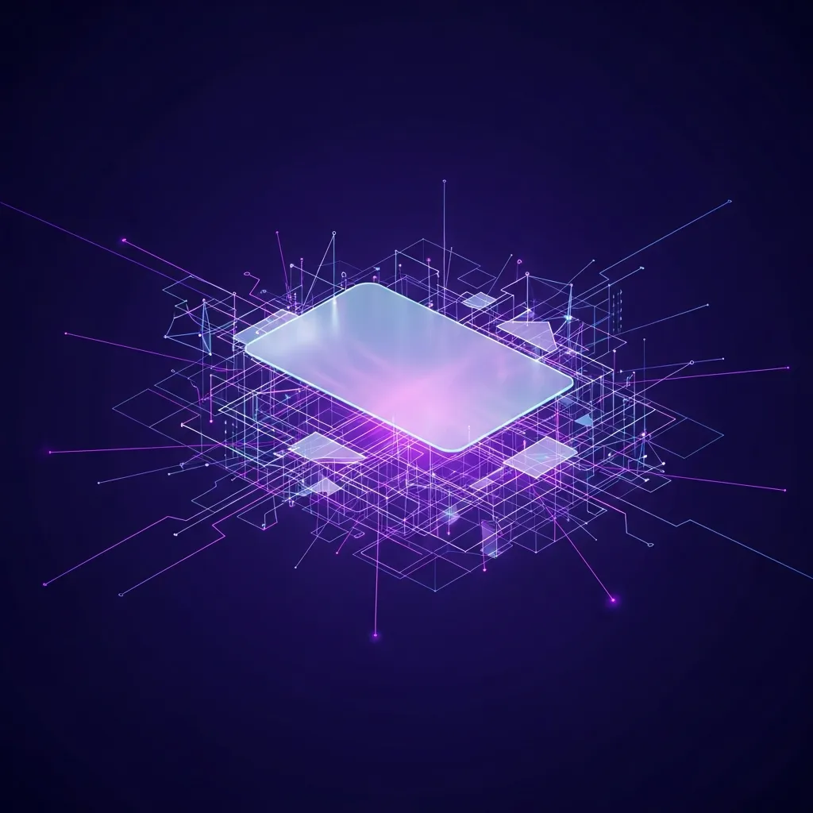

<strong>[BLUF]</strong>
Warp의 오픈소스 전환은 단순히 코드를 공개하는 것이 아니라, AI 에이전트(Oz)가 개발의 주도권을 잡고 인간은 '검증'만 담당하는 Agentic Engineering 시대로의 강제 이행을 선언한 것입니다. 이는 단기적 속도는 높일 수 있으나, 장기적으로는 코드 아키텍처 일관성을 해치고 개발자의 창의성을 단순 반복 검증 작업으로 대체하여 심각한 기술 부채를 야기할 위험이 큽니다.

## 1. 오픈소스의 역사적 변곡점: GNU에서 AI 에이전트까지

 ### 1.1. 인간의 지적 공유가 만든 거인, OSS의 40년 유산

 1980년대 리처드 스톨먼이 주창한 GNU 선언 이후, 오픈소스(OSS)는 인류의 지성적 협업이 만들어낸 가장 거대한 유산으로 자리매김해 왔지요. 수십만 명의 개발자가 자발적으로 코드를 공유하고 개선하며 쌓아 올린 이 철학은 지식의 독점을 막고 기술의 민주화를 실현하는 핵심 동력이 되었답니다.

 하지만 우리가 수십 년간 당연하게 여겨왔던 '인간 중심의 협업 모델'은 이제 거대한 도전 앞에 서 있어요. 지금까지의 오픈소스가 인간의 창의성을 발현하고 공유하는 장이었다면, 최근 등장하는 새로운 패러다임은 그 중심을 인간이 아닌 인공지능으로 옮기려 하고 있지요.

 ### 1.2. Warp의 선택: 왜 <a href="/ko/glossary/agentic-engineering" class="glossary-tooltip" data-definition="AI 에이전트가 주도적으로 코드를 생성하고 워크플로우를 관리하는 차세대 개발 패러다임">Agentic Engineering</a> 우선 오픈소스인가?

 최근 터미널 도구 Warp가 단행한 오픈소스 선언은 단순한 코드 공개 이상의 의미를 내포하고 있어요. 그들이 내세운 핵심 기치는 바로 '에이전트 우선(Agent-first)' 워크플로우이며, 이는 개발의 주도권을 인간에서 AI 에이전트 'Oz'로 이전하겠다는 의지의 표명이지요.

 이 변화의 본질을 이해하기 위해서는 전통적인 모델과 Warp가 지향하는 모델의 차이를 명확히 인지해야 해요. 아래의 비교표를 통해 기술 생태계가 마주한 근본적인 변화를 살펴볼까요?

| 구분 | 전통적 인간 중심 OSS (GNU 정신) | Warp 에이전트 우선 모델 (Oz) |
| :--- | :--- | :--- |
| 주요 창조자 | 인간 개발자 (Human-led) | AI 에이전트 (Oz / GPT-4 기반) |
| 인간의 역할 | 아키텍처 설계 및 직접 코딩 | 제품 스펙 지정 및 결과물 검증 |
| 개발 목표 | 지식의 공유 및 자유 보장 | 개발 병목 해소 및 출시 속도 극대화 |
| 핵심 리스크 | 느린 의사결정 및 참여 저조 | 아키텍처 파편화 및 관리 불가능한 기술 부채 |
| 라이선스 성격 | 자유로운 재배포 (MIT/GPL) | 비즈니스 보호 및 커뮤니티 통제 (<a href="/ko/glossary/what-is-agpl" class="glossary-tooltip" data-definition="네트워크를 통해 소프트웨어를 서비스로 제공하는 경우에도 사용자가 소스 코드를 요구하면 공개해야 하는 조항이 포함된 강력한 카피레프트 성격의 라이선스입니다.">AGPL</a>) |

 

## 2. 에이전트 우선(Agent-first) 전략의 숨겨진 비극: 창의성의 거세

 ### 2.1. 기여자의 몰락: 창의적 개발자에서 ‘AI 코드 검수원’으로

 Warp가 제안하는 미래에서 개발자는 더 이상 빈 화면에 첫 줄의 코드를 써 내려가는 창조자가 아니게 될지도 몰라요. 에이전트가 생성한 방대한 양의 코드를 훑어보고 논리적 오류가 없는지 확인하는 '검수원'의 역할로 격하될 위기에 처한 것이지요.

 이러한 변화는 개발자가 문제를 해결하며 얻는 지적 유희와 성장의 기회를 박탈할 수 있어요. 스스로 깊이 고민하고 실패하며 얻은 아키텍처에 대한 통찰력은, 단순히 기계가 뱉어낸 결과물을 승인하는 과정에서는 결코 길러질 수 없기 때문이랍니다.

 ### 2.2. 기계가 쓴 코드를 인간이 승인하는 ‘검증의 역설’

 에이전트가 생산하는 속도는 인간의 인지 속도를 아득히 초월하기 마련이에요. 쏟아지는 코드의 홍수 속에서 인간 개발자가 모든 로직의 부작용을 완벽히 검증한다는 것은 사실상 불가능에 가까운 일일 수도 있지요.

 > "Warp의 에이전트 우선 전략은 개발자를 창조의 주체에서 기계가 쏟아낸 결과물의 단순 감시자로 격하시키는 창의성의 거세를 예고한다."

 결국 우리는 '기계가 쓴 코드를 기계가 검증하고, 인간은 그저 버튼만 누르는' 기괴한 프로세스에 매몰될 위험이 있어요. 이것이 바로 기술 인문학적 관점에서 우려하는 '인간성 상실의 개발 시대'가 아닐까요?

## 3. 무너지는 아키텍처: 파편화된 코드와 장기적 <a href="/ko/glossary/technical-debt" class="glossary-tooltip" data-definition="빠른 개발을 위해 선택한 임시방편적인 코드가 향후 유지보수 비용을 증가시키는 현상">기술 부채(Technical Debt)</a>

 ### 3.1. 에이전트가 생산한 ‘기능적 파편’들이 초래할 아키텍처 일관성 붕괴

 AI 에이전트는 주어진 프롬프트에 맞춰 최적의 '기능'을 구현하는 데 탁월하지만, 전체 시스템의 유기적인 조화와 장기적인 아키텍처 일관성을 유지하는 데는 한계가 뚜렷해요. 각 기능이 파편화되어 구현되다 보면, 전체 시스템은 누더기처럼 기워진 거대한 혼돈의 덩어리가 될 수 있지요.

 

 ### 3.2. 단기적 AI-first Development 속도의 대가: 관리 불가능한 부채

 단기적으로는 개발 속도가 비약적으로 향상된 것처럼 보일 수 있으나, 이는 미래의 자원을 가불해 쓰는 행위와 다를 바 없어요. 아키텍처의 설계 사상이 부재한 상태에서 쌓인 코드는 훗날 그 누구도 손댈 수 없는 거대한 장벽으로 돌아오게 된답니다.

 > "검증의 역설: 에이전트가 생산하는 기능적 파편들은 인간이 제어할 수 없는 속도로 기술 부채를 쌓으며, 결국 아키텍처의 유기적 통합을 불가능하게 만들 것이다."

## 4. 비즈니스 논리와 오픈소스 정신의 충돌

 ### 4.1. VC 투자와 경쟁 우위 확보를 위한 ‘커뮤니티의 자원화’

 Warp의 이번 행보는 벤처 캐피털(VC)의 기대에 부응하고 시장 지배력을 강화하려는 고도의 비즈니스 전략이기도 해요. 커뮤니티의 열정과 자발적 기여를 에이전트 학습과 에코시스템 확장의 도구로 활용하려는 의도가 깔려 있다고 보는 시각이 지배적이지요.

 현재 오픈소스 생태계가 직면한 현실은 수치로도 명확히 드러나고 있어요.

 * 97%: 상업적 코드베이스 중 오픈소스 코드가 포함된 비율 (Black Duck, 2025)
 * 81%: 보안 취약점을 포함하고 있는 코드베이스의 비중
 * 40년: 1980년대 GNU 선언 이후 이어져 온 인간 협업 중심 개발 역사
 * 1,000,000명: Warp가 에이전트 중심 워크플로우로 유입시키려는 활성 개발자 수

 ### 4.2. AGPL 라이선스와 구글의 거부: 라이선스 전쟁의 재점화

 Warp는 강력한 전염성을 가진 AGPL 라이선스를 선택함으로써, 기업들이 자사의 코드를 함부로 가져가 독점하는 것을 막으려 하고 있어요. 하지만 이는 동시에 구글과 같은 거대 IT 기업들이 내부적으로 Warp를 사용하는 것을 금기시하게 만드는 양날의 검이 되기도 하지요.

 라이선스를 둘러싼 갈등은 결국 오픈소스의 '자유'가 비즈니스의 '보호'와 어떻게 타협해야 하는가에 대한 해묵은 질문을 다시 던지고 있답니다. 과연 이러한 폐쇄적 개방성이 진정한 오픈소스 정신에 부합하는지는 의문이 남네요.

## 5. 결론: 인간 주도권을 잃은 오픈소스의 미래는 지속 가능한가

 Warp가 열어젖힌 에이전트 우선의 시대는 분명 매혹적인 효율성을 약속하고 있어요. 하지만 우리는 기술의 진보가 인간의 창의성을 대체하는 것이 아니라, 확장하는 방향으로 나아가고 있는지 끊임없이 질문해야만 한답니다.

 개발자가 단순히 AI가 쏟아낸 코드의 부작용을 치우는 존재로 전락한다면, 오픈소스 생태계의 역동성은 사라지고 기계적인 관료주의만 남게 될 것이에요. 우리는 도구의 노예가 아닌, 여전히 시스템의 아키텍트이자 창조자로 남아야 한다는 사실을 잊지 말아야 하지요.

 인간의 고뇌와 철학이 담기지 않은 코드는 결국 차가운 고철 덩어리에 불과해요. 에이전트와 공존하되 주도권을 놓지 않는 지혜로운 균형점이 그 어느 때보다 절실한 시점이네요.

## 🔗 함께 읽으면 좋은 글
- [시크릿 매니지먼트의 역설: 2026년 보안 전략이 거대한 단일 실패 지점을 만드는 이유](/ko/posts/secret-management-paradox-2026-spof)
- [eBPF 기반 클라우드 네이티브 관측성 혁신: 제로 인스트루멘테이션의 유혹과 블랙박스의 실체](/ko/posts/ebpf-observability-zero-instrumentation)