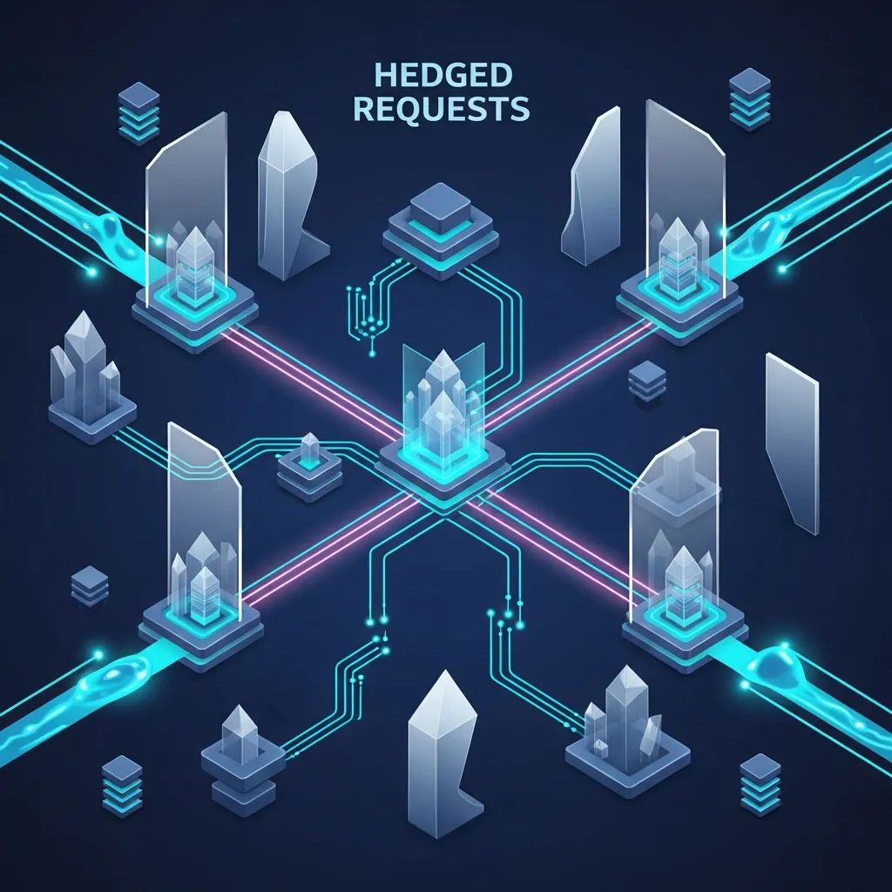
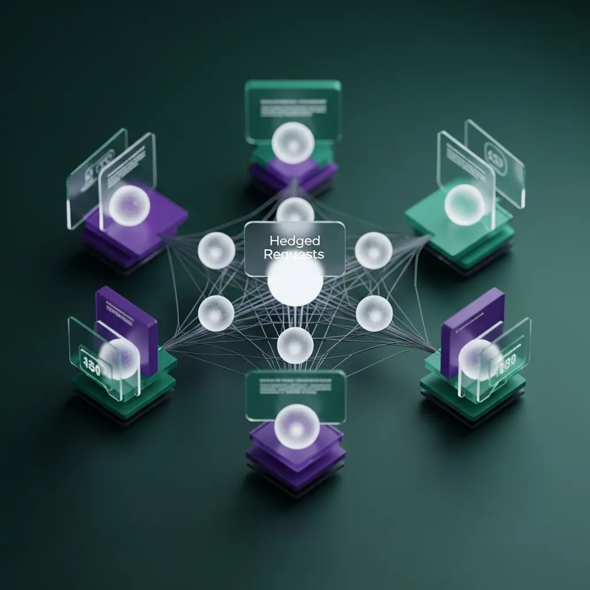

<strong>[BLUF]</strong>
분산 시스템 최적화 기법인 Hedged Requests와 Request Coalescing은 양날의 검입니다. 잘못 설계된 헤징은 자폭형 DoS 공격으로 변질될 수 있으며, 부주의한 코알레싱은 단일 요청의 실패가 전체 클라이언트로 전이되는 '운명 공동체(Fate Sharing)' 리스크를 초래하므로 멱등성 보장과 서킷 브레이커 결합이 필수적입니다.

 분산 시스템의 세계에서 지연 시간(Latency)은 곧 비용이며, 이를 줄이기 위한 아키텍트들의 노력은 눈물겹습니다. 하지만 우리가 최적화라고 믿었던 기법들이 때로는 시스템의 심장을 겨누는 비수가 되어 돌아오곤 해요.

 단순히 성능 지표를 개선하는 것에 매몰되다 보면, 시스템이 견뎌야 할 운영적 리스크의 본질을 놓치기 쉽습니다. 특히 고가용성을 지향하는 현대의 마이크로서비스 환경에서는 더욱 정교한 접근이 필요하지요.

 이번 분석에서는 최근 Istio나 다양한 라이브러리를 통해 대중화된 두 가지 최적화 기법의 이면을 파헤쳐 보려 합니다. 최적화가 어떻게 가용성을 파괴하는 임계점에 도달하는지, 그 위험한 경계선을 함께 살펴볼까요?

## 분산 시스템의 양날의 검: Hedged Requests와 Request Coalescing의 치명적 리스크

 시스템의 응답 속도를 개선하기 위해 도입하는 기법들은 대개 트래픽의 형태를 변형시키거나 자원의 효율성을 재배치하는 방식을 취합니다. 이 과정에서 필연적으로 새로운 실패 지점이 생성되곤 하죠.

 Hedged Requests는 응답이 늦어질 것을 대비해 동일한 요청을 하나 더 보내는 방식이며, Request Coalescing은 동일한 요청들을 하나로 묶어 처리하는 방식이에요. 개념적으로는 정반대의 지점에 서 있는 셈입니다.

 하지만 두 기법 모두 '예측 불가능한 지연'을 해결하려다 '예측 불가능한 전체 장애'를 초래할 수 있다는 공통적인 리스크를 안고 있습니다. 최적화라는 이름의 마약에 취해 시스템의 기초 체력을 과신해서는 안 되는 이유이지요.

## Hedged Requests: <a href="/ko/glossary/tail-latency" class="glossary-tooltip" data-definition="시스템 응답 시간 중 상위 1~5%에 해당하는 긴 지연 시간">Tail Latency</a> 해결인가, 자폭형 트래픽 공격인가?

### Google의 'Tail at Scale' 전략이 현실에서 Self-DoS로 변질되는 순간

 구글이 제시한 'Tail at Scale' 전략의 핵심인 헤징은 아주 매력적입니다. 특정 요청이 지연될 때 다른 복제본에 요청을 보내 먼저 오는 응답을 사용하는 방식은 지연 시간을 혁신적으로 줄여주니까요.

 하지만 이는 충분한 자원 여유가 있을 때에만 유효한 마법이에요. 시스템이 이미 부하를 받고 있는 상황에서 성급하게 발동되는 헤징은 트래픽을 순식간에 두 배, 세 배로 증폭시키는 '자폭형 DoS 공격'이 됩니다.

 특히 Istio의 speculative retries 설정을 부주의하게 사용할 경우, 지연이 발생한 백엔드에 더 많은 요청을 쏟아붓게 되어 결국 전체 시스템을 회복 불가능한 늪으로 밀어넣게 되지요.

### <a href="/ko/glossary/idempotent-api" class="glossary-tooltip" data-definition="동일한 요청을 여러 번 수행해도 결과가 달라지지 않는 API 특성">Idempotent API</a> 보장 없는 헤징은 데이터 무결성의 시한폭탄이다

 헤징을 도입할 때 가장 간과하기 쉬운 점은 바로 데이터의 무결성입니다. 동일한 요청이 두 번 발생해도 결과가 같아야 한다는 멱등성이 보장되지 않는다면 헤징은 금기시되어야 해요.

 만약 결제 요청이나 상태 변경 API에 헤징을 적용했다가, 네트워크 지연으로 인해 두 번의 요청이 모두 성공한다면 어떤 일이 벌어질까요? 이는 단순한 시스템 장애를 넘어 비즈니스적 재앙으로 직결됩니다.

 결국 기술적 최적화보다 우선되어야 하는 것은 비즈니스 로직의 견고함입니다. 멱등성이 담보되지 않은 헤징은 언제 터질지 모르는 시한폭탄을 아키텍처에 심어두는 것과 다를 바 없거든요.

> "최적화되지 않은 헤징은 스스로를 공격하는 가장 정교한 DoS 도구가 된다."

## Request Coalescing: 효율성의 극대화 vs. 운명 공동체(Fate Sharing)의 늪

### 단일 요청의 실패가 수천 명의 클라이언트로 전이되는 메커니즘

 리퀘스트 코알레싱은 중복된 요청을 하나로 합쳐 백엔드 부하를 획기적으로 줄여주는 기법입니다. 데이터베이스 쿼리나 고비용 연산에서 흔히 사용되는 효율성의 정점이라 할 수 있죠.

 하지만 여기서 '운명 공동체(Fate Sharing)'라는 무서운 개념이 등장합니다. 수천 개의 요청이 단 하나의 처리 과정에 의존하게 되면서, 그 하나의 처리가 실패하거나 지연될 때 모든 클라이언트가 동시에 타격을 받게 되는 거예요.

 효율성을 위해 개별 요청의 독립성을 포기한 대가는 생각보다 가혹합니다. 단 하나의 비정상적인 파라미터가 포함된 요청이 전체 코알레싱 그룹을 오염시켜 광범위한 서비스 불능 상태를 야기할 수 있으니까요.

### <a href="/ko/glossary/thundering-herd" class="glossary-tooltip" data-definition="특정 자원이 유효하지 않게 되었을 때, 수많은 대기 중인 요청들이 한꺼번에 자원에 접근하여 시스템 과부하를 초래하는 현상입니다.">Thundering Herd</a> 문제를 피하려다 맞이하는 단일 장애점(SPOF) 리스크

 우리는 보통 캐시가 만료되었을 때 몰리는 Thundering Herd 현상을 방지하기 위해 코알레싱을 도입합니다. 백엔드 시스템을 보호하기 위한 일종의 방어막 역할을 기대하는 것이지요.

 아이러니하게도 이 방어막 자체가 새로운 단일 장애점(SPOF)이 되기도 합니다. 코알레싱을 관리하는 메모리 큐가 가득 차거나, 관리 로직에서 병목이 발생하면 시스템 전체가 응답을 멈추게 돼요.

 성능을 쥐어짜기 위해 도입한 복잡한 로직이 오히려 시스템의 가관측성을 저해하고, 장애 발생 시 원인 파악을 어렵게 만드는 독이 된다는 사실을 명심해야 합니다.

> "코알레싱의 효율성은 단일 장애점(SPOF)이라는 대가를 지불하고 얻은 결과물이다."

## 필승의 아키텍처: 최적화보다 중요한 '리스크 통제' 전략

### 서킷 브레이커와 적응형 스로틀링의 결합: 제어되지 않는 최적화는 재항이다

 진정한 고수는 기법을 적용하는 데 그치지 않고, 그 기법이 폭주할 때를 대비한 제동 장치를 함께 설계합니다. 헤징과 코알레싱 모두 반드시 제어 장치와 결합되어야 해요.

 아래의 비교 표를 통해 각 기법의 특성과 우리가 통제해야 할 리스크의 실체를 명확히 확인해 보시기 바랍니다.

| 최적화 기법 | 핵심 목표 | 주요 리스크 (Operational Risk) | 자원 소모 특성 | 권장 제어 도구 |
| :--- | :--- | :--- | :--- | :--- |
| **Hedged Requests** | Tail Latency 감소 | Self-DoS (트래픽 폭주), 데이터 불일치 | CPU/네트워크 대역폭 증가 | Istio VirtualService, hedge-fetch |
| **Request Coalescing** | 자원 효율화 | Fate Sharing (장애 전이), SPOF 발생 | 메모리 사용량 (대기 큐 관리) | Python asyncio (singleflight) |

- **Google BigTable 사례 연구**: 헤징 도입 시 99.9% 지연 시간을 1,800ms에서 74ms로 95.8% 단축했으나, 전체 트래픽은 약 2% 증가함.
- **임계치 권장 사항**: 헤징 딜레이는 일반적으로 P95~P99 지연 시간 사이로 설정할 때 최소한의 비용으로 최대의 효과를 거둠.
- **기술 스택 간 관계성**: Istio의 speculative retries 설정 시 `perTryTimeout`이 너무 짧으면 Python `asyncio` 환경에서 `CancelledError` 처리가 미흡할 경우 좀비 프로세스(Zombie Task)가 양산될 수 있음.

 효과적인 리스크 통제를 위해서는 서킷 브레이커를 통해 실패를 빠르게 전파하고, 적응형 스로틀링으로 시스템이 감당 가능한 수준 이상의 헤징을 차단해야 합니다.

 무분별한 최적화는 엔지니어의 허영심일 뿐입니다. 시스템의 현재 상태를 정확히 반영하는 지표를 기반으로, 실패할 때 어떻게 우아하게 멈출 것인지를 고민하는 것이 시니어의 자세이지요.

### 결론: 기술적 성숙도는 기법의 구현이 아닌 '실패 모드 분석'에서 결정된다

 분산 시스템에서 완벽한 최적화란 존재하지 않습니다. 모든 기법은 트레이드오프의 산물이며, 우리는 성능을 얻는 대신 가용성이나 복잡성이라는 비용을 지불하고 있는 거예요.

 뛰어난 아키텍트는 새로운 기법을 도입할 때 그 기법이 가져올 장점보다 '어떻게 망가질 것인가'를 먼저 집요하게 파고듭니다. 실패 모드 분석이 결여된 최적화는 언제 무너질지 모르는 모래성일 뿐이니까요.

 기술적 성숙도는 얼마나 화려한 기술 스택을 사용하는지가 아니라, 시스템의 한계를 명확히 인지하고 이를 얼마나 안정적으로 통제하고 있는지에서 증명된다는 사실을 잊지 마세요.

## 🔗 함께 읽으면 좋은 글
- [SilverTorch, Meta의 23배 성능 도약인가 아니면 새로운 '기술적 부채'의 시작인가?](/ko/posts/silvertorch-meta-23x-performance-technical-debt)
- [제로 트러스트 구현의 역설: 당신의 보안망은 요새인가, 족쇄인가?](/ko/posts/zero-trust-implementation-paradox)