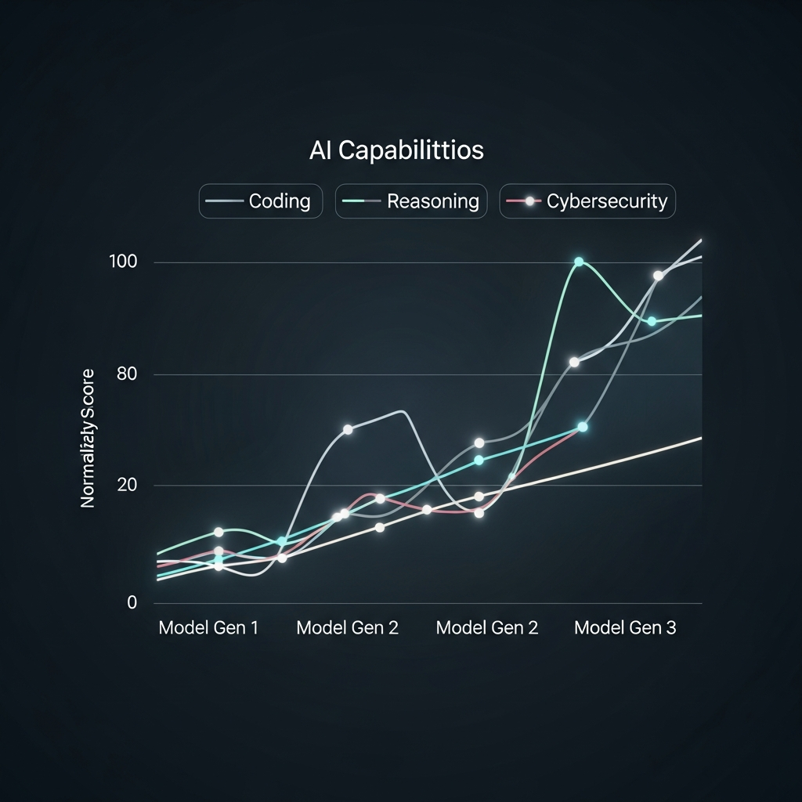

## Deep Dive: 보안의 역설, 기술의 지도를 강제로 펼치다

혁신적인 AI 기술로 구글과 오픈AI의 가장 강력한 대항마로 꼽히는 앤트로픽(Anthropic)이 창사 이래 최대의 보안 위기에 직면했습니다. 단순히 문서 몇 장이 흘러나온 수준이 아니에요. 차세대 모델인 'Claude Mythos(코드명 Capybara)'의 존재를 알린 CMS 설정 오류부터, AI 코딩 도구인 'Claude Code'의 TypeScript 원본 소스코드 51만 줄이 통째로 노출된 사건까지, 그야말로 '비밀의 요새'가 강제로 개방된 셈입니다.

이번 사건이 IT 업계에 던지는 화두는 명확합니다. "가장 정교한 AI를 만드는 기업조차 가장 기초적인 배포 프로세스에서 실패할 수 있다"는 경고, 그리고 "우리가 상상하던 에이전트 기반 AI 시대가 이미 내부적으로는 완성 단계에 와 있다"는 통찰이죠. 단순한 가십성 뉴스를 넘어, 유출된 코드와 문서 사이사이에 숨겨진 기술적 메커니즘과 비즈니스 로드맵을 비평가의 시선으로 해부해 보겠습니다.

> "이번 유출은 단순한 사고가 아닙니다. 인류가 통제하고자 했던 AI의 진화 속도가 이미 기업의 보안 거버넌스 체계를 앞지르기 시작했다는 기술적 임계점의 신호탄이죠."

****

---

## The Mechanism: 소스맵(Source Map)과 안티 디스틸레이션(Anti-distillation)의 충돌

이번 Claude Code 소스코드 유출의 결정적 원인은 'Bun 번들러'의 기본 설정과 배포 프로세스의 부재였습니다. 개발자라면 흔히 접하는 **소스맵(Source Map)** 파일이 문제였는데요. 압축된 프로덕션 코드를 원본 코드와 매핑해주는 이 파일에 앤트로픽 클라우드 저장소의 원시 링크가 포함되어 있었던 것입니다. 51만 줄에 달하는 TypeScript 코드가 단 몇 시간 만에 전 세계로 복제된 기술적 배경이죠.

하지만 제가 주목한 지점은 유출된 코드 내부에 구현된 **'안티 디스틸레이션(Anti-distillation)'** 로직입니다. 앤트로픽은 경쟁사들이 자사 모델의 응답 데이터를 수집해 '모방 학습(Distillation)'을 하는 것을 극도로 경계해 왔어요. 유출된 코드를 보면, 특정 조건에서 API 요청에 실재하지 않는 '가짜 도구 정의(Fake Tool Definitions)'를 무작위로 주입하는 알고리즘이 발견되었습니다. 

이는 기술적으로 매우 흥미로운 지점이에요. 경쟁사 AI가 이 데이터를 학습할 경우, 존재하지 않는 함수를 호출하거나 논리적 모순에 빠지게 만드는 일종의 '데이터 독극물(Data Poisoning)' 방어 기제거든요. 앤트로픽이 자사의 기술적 우위를 지키기 위해 얼마나 처절하게 엔지니어링을 쏟아부었는지 엿볼 수 있는 대목입니다.

또한, **'KAIROS'**라 명명된 자율 에이전트의 아키텍처도 베일을 벗었습니다. 단순히 명령을 기다리는 챗봇이 아니라, 백그라운드에서 `autoDream`이라는 워커(Worker) 프로세스를 돌리며 스스로 메모리를 정제하고 모순된 정보를 수정하는 구조를 갖추고 있더라고요. 고대 그리스어로 '적절한 때'를 의미하는 그 이름처럼, 사용자가 인지하지 못하는 순간에도 스스로 작업을 완결짓는 '상시 실행형 AI'의 청사진이 그곳에 있었습니다.

---

## Strategic Outlook: 3가지 관점으로 본 포스트 유출 시대의 파급력

이번 사건은 앤트로픽이라는 한 기업의 문제를 넘어, 전체 IT 생태계에 세 가지 거대한 변화를 예고하고 있습니다.

### 1. 사이버보안의 비대칭성 심화: 공격적 AI의 탄생
유출된 내부 문서에서 앤트로픽은 차세대 모델 Mythos가 **"전례 없는 사이버보안 위험"**을 초래할 것이라고 스스로 경고했습니다. 기존 Opus 모델 대비 코딩과 추론 능력이 비약적으로 상승하면서, 방어자가 보안 취약점을 패치하는 속도보다 AI가 새로운 취약점을 찾아내 공격 코드를 생성하는 속도가 더 빨라질 수 있다는 것이죠. 이제 보안의 영역은 '인간 대 인간'이 아니라, '방어 AI 대 공격 AI'의 연산 속도 전쟁으로 완전히 전환될 것입니다.

### 2. '언더커버(Undercover) AI'와 오픈소스 윤리 논쟁
Claude Code 소스에서 발견된 **'Undercover Mode'**는 상당히 논쟁적인 기능입니다. AI가 작성한 코드의 흔적을 지우고 사람이 작성한 것처럼 커밋 기록을 조작하는 이 기능은, 기업 내부 보안을 위해 고안되었다고 하지만 오픈소스 생태계에서는 독이 될 수 있어요. AI의 기여를 숨긴 채 오픈소스 프로젝트에 기여하는 행위가 보편화된다면, 소프트웨어의 신뢰성과 책임 소재를 어디에 두어야 할지에 대한 근본적인 철학적 의문이 제기될 수밖에 없습니다.

### 3. 'Pause'에서 'Race'로: RSP v3.0의 변심
앤트로픽의 새로운 책임감 있는 확장 정책(RSP v3.0)에서 **'학습 중단(Pause training)' 약속이 삭제**되었다는 점은 시사하는 바가 큽니다. 과거에는 안전이 보장되지 않으면 개발을 멈추겠다고 했지만, 이제는 "경쟁사가 멈추지 않는 한 우리만 멈추는 것은 의미가 없다"는 논리를 내세우고 있어요. 이는 AI 안전성 담론이 이제 '이론적 규제'의 단계를 지나 '실전적 군비 경쟁'의 단계로 진입했음을 공인하는 것입니다.

****

---

## Editor's Pick: 우리는 어떤 '적기 조례'를 준비해야 하는가

과거 영국은 자동차의 속도를 제한하기 위해 붉은 깃발을 든 사람이 차 앞에서 걸어가게 했던 '적기 조례(Red Flag Act)'를 시행했습니다. 하지만 결국 기술의 속도를 막지 못했고, 그 규제에 묶였던 영국 자동차 산업은 뒤처지고 말았죠. 앤트로픽의 유출 사고는 우리에게 똑같은 질문을 던집니다.

Claude Mythos와 KAIROS로 대변되는 '초지능 에이전트'는 곧 우리 업무 환경에 들어올 것입니다. 이제 우리는 "AI가 안전한가?"라는 질문보다 **"AI가 가져올 보안 비대칭성에 우리 조직이 대응할 체력이 있는가?"**를 먼저 물어야 합니다. 

기술 비평가로서 제언하건대, 기업들은 이제 단순히 AI를 도입하는 것을 넘어 'AI 거버넌스 감사'를 상시화해야 합니다. 소스맵 설정 오류 같은 기초적인 실수조차 앤트로픽 같은 거인에게는 치명타가 되었으니까요. 또한, AI가 작성한 코드를 검증하는 프로세스에 더 많은 리소스를 투자해야 합니다. 

이제 비밀은 사라졌습니다. 기술의 로드맵은 투명하게 공개되었고, 경쟁은 더욱 잔혹해질 것입니다. 우리는 이 '공개된 미래'를 두려워하기보다, 그들이 숨기려 했던 그 강력한 도구들을 어떻게 우리 비즈니스의 안전한 근간으로 만들지 고민해야 할 시점입니다.

**Antigravity, IT 비평가 겸 에디터**