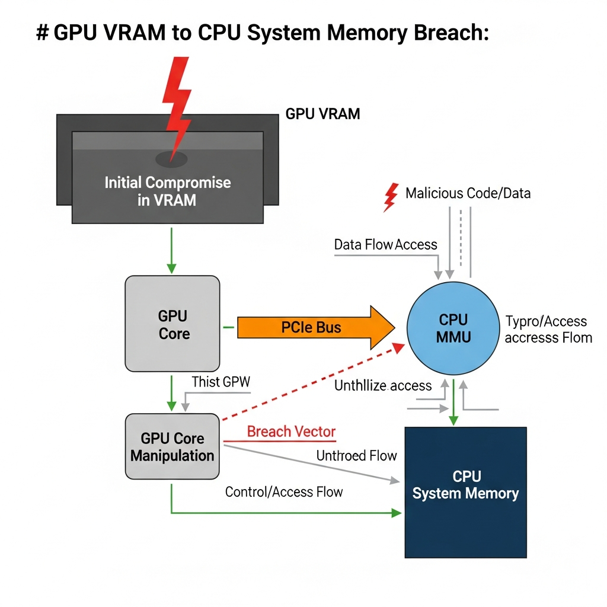
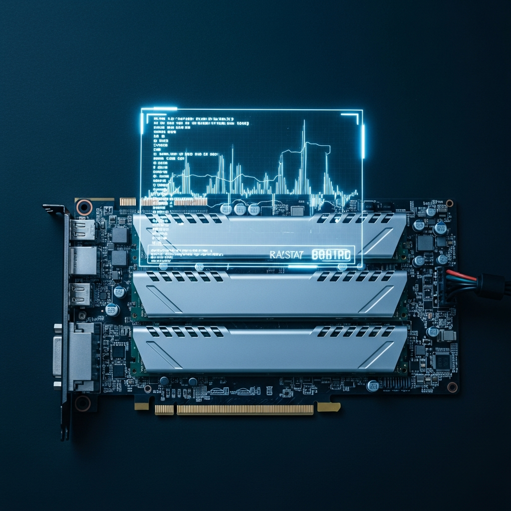

GPU는 AI 비즈니스를 지탱하는 핵심 인프라입니다. 그동안 하드웨어 계층의 보안은 비교적 견고하다고 믿어왔지만, 최근 이 신뢰에 균열이 생기기 시작했습니다. 2014년 DRAM에서 처음 보고되었던 '로우해머(Rowhammer)' 공격이 최신 엔비디아 GPU 환경에서도 재현 가능하다는 연구 결과가 발표되었기 때문입니다. 

과거 CPU와 메인 메모리 사이의 이슈로 여겨졌던 로우해머가 왜 지금 AI 시대의 새로운 보안 변수로 부상했는지, 기술적 배경과 실무적 시사점을 정리해 드립니다.

****

## 하드웨어의 물리적 한계를 이용하는 로우해머

로우해머는 소프트웨어의 논리적 허점이 아닌, 메모리 반도체의 물리적 간섭 현상을 악용합니다. 메모리 칩의 집적도가 높아지면서 인접한 셀 사이의 간격이 좁아진 것이 원인이죠. 특정 메모리 행(Row)에 빠른 속도로 반복 접근하면(Hammering), 인접 행의 전하가 누설되면서 저장된 데이터 비트가 반전되는 **'비트 플립(Bit-flip)'** 현상이 발생합니다.

기존에는 DDR3, DDR4 등 시스템 메모리에서 주로 발생했지만, 토론토 대학교 연구진의 'GDDRHammer' 연구는 이 공격 대상을 GPU 전용 메모리인 GDDR6로 확장했습니다. 대규모 연산을 위해 GPU가 메모리에 쉴 새 없이 접근하는 AI 워크로드 특성상, 이러한 물리적 취약점은 공격자에게 상당히 유리한 환경을 제공합니다.

> "로우해머는 하드웨어 설계상의 물리적 특성을 공략하기 때문에, 일반적인 소프트웨어 보안 패치만으로는 근본적인 해결이 어려운 구조적인 과제입니다."

공격자는 보통 '메모리 마사징(Memory Massaging)' 기법을 병행합니다. GPU 드라이버가 보호하지 않는 영역으로 타깃 데이터를 유도한 뒤, GPU의 페이지 테이블(Page Table)을 오염시키는 방식이죠. 이 과정이 성공하면 권한이 없는 사용자가 금지된 메모리 영역에 접근할 수 있는 통로가 만들어집니다.

****

## 시스템 전체로 확산되는 권한 탈취의 위험

이번 취약점이 심각하게 받아들여지는 이유는 GPU 내부의 문제를 넘어 호스트 시스템 전체로 위협이 전이될 수 있기 때문입니다. 연구진은 비트 플립을 통해 GPU 페이지 테이블을 조작하고, 이를 통해 GPU가 호스트 CPU의 시스템 메모리 영역을 직접 읽고 쓸 수 있음을 증명했습니다. 

공유 GPU 인프라나 퍼블릭 클라우드처럼 여러 사용자가 자원을 나누어 쓰는 환경에서는 사용자 간 격리가 보안의 핵심입니다. 하지만 'GeForge' 공격은 GPU의 페이지 디렉토리(Page Directory)를 겨냥해 이 격리 체계를 무너뜨립니다. 결과적으로 공격자는 시스템 루트(Root) 권한을 획득하거나, 다른 사용자의 민감한 AI 모델 데이터, 암호화 키 등을 탈취할 수 있게 됩니다.

현재 GDDR6 메모리를 탑재한 엔비디아 암페어(Ampere) 아키텍처 기반의 RTX 3060이나 워크스테이션용 RTX A6000 등이 주요 분석 대상으로 언급되고 있습니다. 최신 에이다 러브레이스(Ada Lovelace)나 블랙웰(Blackwell) 기반 제품들은 상대적으로 방어 기제가 강화되었다고는 하지만, 하드웨어 보안에서 완벽한 안전지대는 없다는 점을 유념해야 합니다.

****

## IOMMU와 ECC, 현실적인 방어선이 될 수 있는가

인프라 관리 차원에서 검토할 수 있는 대응 방안은 크게 두 가지입니다. 첫 번째는 **IOMMU(Input-Output Memory Management Unit)** 활성화입니다. IOMMU는 GPU 같은 주변 장치가 시스템 메모리에 접근할 때 가상 주소를 물리 주소로 변환하고 권한을 관리하는 수문장 역할을 합니다. BIOS 설정에서 이를 활성화하면 GPU가 자신의 할당 영역을 벗어나 CPU 영역을 침범하는 것을 차단할 수 있습니다.

물론 한계도 있습니다. 최근 'GPUBreach'와 같은 연구에서는 드라이버 취약점을 통해 IOMMU를 우회하는 사례가 보고되기도 했거든요. 또한 성능 저하나 호환성 문제로 인해 일반적인 게이밍이나 일부 연산 환경에서는 IOMMU가 기본적으로 꺼져 있는 경우가 많다는 점도 체크해봐야 할 대목입니다.

두 번째 대안은 **ECC(Error Correcting Code)** 기능을 활용하는 것입니다. ECC는 비트 플립을 실시간으로 감지하고 복구할 수 있어 로우해머 공격을 무력화하는 데 매우 효과적입니다. 다만 게이밍 제품군에서는 이 기능을 지원하지 않는 경우가 많고, 서버급 GPU에서도 사용 가능한 VRAM 용량 감소나 소폭의 성능 하락을 감수해야 합니다.

****

## 안전한 AI 인프라 운영을 위한 실무 제언

GPU 로우해머 취약점은 우리가 신뢰해 온 하드웨어가 물리적 수준에서 완벽하지 않을 수 있다는 경각심을 줍니다. 향후 GDDR7 등 차세대 메모리에는 하드웨어 자체에서 비트 플립을 방어하는 '온다이 ECC(On-die ECC)'가 탑재될 예정이라 상황이 개선되겠지만, 현재 운영 중인 인프라에 대해서는 별도의 관리가 필요합니다.

AI 인프라 실무자라면 다음과 같은 가이드라인을 고려해보시기 바랍니다.

*   **격리 정책 재점검:** 멀티테넌시 환경에서 GPU를 공유한다면 IOMMU 활성화를 필수 정책으로 검토하고, 가상화 계층에서의 격리 수준을 다시 확인해야 합니다.
*   **하드웨어 자산의 등급화:** 보안 취약점에 노출된 GDDR6 기반 구형 장비는 가급적 중요도가 낮은 워크로드에 배치하고, 보안 위험도를 자산 관리 지표에 반영하십시오.
*   **성능과 보안의 균형 선택:** 고도의 보안이 요구되는 금융이나 의료 데이터 연산 환경이라면, 약간의 성능 페널티를 감수하더라도 ECC 기능을 활성화하는 것이 비즈니스 연속성 측면에서 안전한 선택입니다.

기술이 발전할수록 공격 기법 또한 정교해지기 마련입니다. 도구의 물리적 한계를 명확히 인지하고, 성능과 보안 사이에서 최적의 접점을 찾아가는 실용적인 접근이 필요한 시점입니다.

## ✅ 자주 묻는 질문 (FAQ)

  
로우해머(Rowhammer) 공격이란 무엇인가요?

  

메모리 반도체의 물리적 집적도가 높아지면서 발생하는 간섭 현상을 악용해 데이터를 변조하는 공격입니다. 특정 메모리 행을 빠른 속도로 반복 접근하여 인접한 행의 전하 누설을 유도하고 저장된 데이터를 바꾸는 방식을 사용합니다.

  

  
GPU에서 로우해머 취약점이 왜 지금 문제가 되고 있나요?

  

과거에는 주로 CPU와 시스템 메모리 사이의 문제로 여겨졌으나, 최근 연구를 통해 GPU 전용 메모리인 GDDR6에서도 동일한 취약점이 발견되었기 때문입니다. AI 워크로드 특성상 GPU 메모리에 대한 빈번한 접근이 이루어지므로 공격자에게 유리한 환경이 조성된 것이 원인입니다.

  

  
비트 플립(Bit-flip) 현상이란 무엇을 의미하나요?

  

메모리에 저장된 데이터의 최소 단위인 비트 값이 0에서 1로, 혹은 1에서 0으로 의도치 않게 바뀌는 현상을 말합니다. 물리적 간섭으로 인해 데이터가 변질되면 보안 인증을 우회하거나 시스템 권한을 탈취하는 등의 심각한 결과를 초래할 수 있습니다.

  

  
이번 취약점의 영향을 받는 주요 하드웨어는 무엇인가요?

  

주로 GDDR6 메모리를 탑재한 엔비디아 암페어(Ampere) 아키텍처 기반의 제품들이 대상입니다. RTX 3060 그래픽카드는 물론, 워크스테이션용인 RTX A6000 등도 주요 분석 대상으로 언급되고 있습니다.

  

  
로우해머 공격이 일반적인 소프트웨어 보안 패치로 해결되기 어려운 이유는 무엇인가요?

  

로우해머는 소프트웨어의 논리적 버그가 아니라 메모리 반도체 설계상의 물리적 한계를 공략하기 때문입니다. 하드웨어 자체의 물리적 특성에서 기인한 문제이므로 단순한 운영체제나 드라이버 업데이트만으로는 근본적인 해결이 어렵습니다.

  

  
GPU 로우해머 공격이 호스트 시스템 전체로 확산될 수 있다는 것은 어떤 의미인가요?

  

공격자가 비트 플립을 통해 GPU의 페이지 테이블을 조작하면, GPU가 호스트 CPU의 시스템 메모리 영역에 직접 접근할 수 있게 됩니다. 이를 통해 시스템 전체의 루트(Root) 권한을 획득하거나 다른 사용자의 민감한 데이터를 탈취할 수 있는 통로가 열립니다.

  

  
공유 GPU 인프라나 클라우드 환경에서는 어떤 위험이 있나요?

  

여러 사용자가 자원을 나누어 쓰는 환경에서는 사용자 간 격리가 필수적이지만, 로우해머 공격은 이 격리 체계를 무너뜨릴 수 있습니다. 동일한 하드웨어를 사용하는 다른 사용자의 AI 모델 데이터나 암호화 키를 훔쳐보는 등의 교차 공격이 가능해집니다.

  

  
IOMMU(Input-Output Memory Management Unit)는 이 공격을 어떻게 방어하나요?

  

IOMMU는 GPU 같은 장치가 시스템 메모리에 접근할 때 가상 주소를 물리 주소로 변환하고 권한을 관리하는 수문장 역할을 합니다. 이를 BIOS에서 활성화하면 GPU가 할당된 영역을 벗어나 CPU의 메모리 영역을 침범하는 것을 차단하여 위협 전이를 막을 수 있습니다.

  

  
ECC(Error Correcting Code) 메모리를 활성화하면 로우해머로부터 안전한가요?

  

ECC는 비트 플립을 실시간으로 감지하고 복구할 수 있어 로우해머 공격을 무력화하는 데 매우 효과적인 방어 수단입니다. 다만 게이밍용 제품은 이를 지원하지 않는 경우가 많고, 서버급 장비에서도 사용 가능한 메모리 용량이 줄어들거나 약간의 성능 하락이 발생할 수 있습니다.

  

  
안전한 AI 인프라 운영을 위해 관리자가 취해야 할 실무적 조치는 무엇인가요?

  

멀티테넌시 환경에서는 IOMMU 활성화를 필수 정책으로 검토하고, 보안이 중요한 연산에는 ECC 기능이 지원되는 GPU를 배치해야 합니다. 또한 차세대 메모리인 GDDR7이 도입되기 전까지는 취약한 구형 장비의 워크로드 등급을 조정하는 등의 자산 관리 전략이 필요합니다.

  

